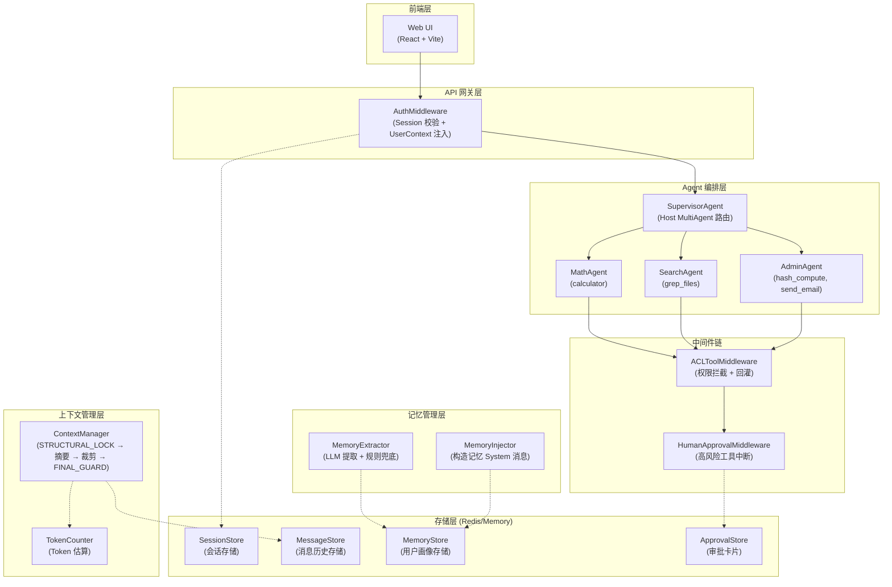

# 通用 Agent 基础框架

## 项目目标

构建通用 Agent 基础框架，为上层业务提供可复用的 Agent 编排、权限控制、人机协同、上下文管理和记忆管理能力。

## 五大核心能力

| # | 能力 | 说明 | 设计文档 |
| - | ---- | ---- | -------- |
| 1 | 登录用户权限管理 | 基于 RBAC 的身份认证、会话管理与工具访问控制，支持多用户数据隔离 | [DOC-01 身份与权限子系统](docs/DOC-01.md) |
| 2 | 多 Agent 与工具调用 | 支持多个 Agent 协作编排（Eino Graph），统一工具注册与调用规范，实现工具热插拔 | [DOC-02 工具与编排子系统](docs/DOC-02.md) |
| 3 | 人机协同 | 在 Agent 执行关键节点暂停等待人类确认/修正，支持中断恢复，确保高风险操作受控 | [DOC-03 中断-恢复子系统](docs/DOC-03.md) |
| 4 | 上下文管理 | 管理 LLM 对话上下文窗口，支持超限裁剪/摘要压缩策略，保障长对话不越界 | [DOC-04 上下文管理子系统](docs/DOC-04.md) |
| 5 | 记忆管理 | 跨会话持久化用户偏好与历史摘要，实现个性化对话与知识积累 | [DOC-05 记忆管理子系统](docs/DOC-05.md) |

## 技术选型

### Agent 框架对比分析

| 维度 | LangGraph (Python) | LangGraph4j (Java) | Eino (Go) ✓ |
| ---- | ------------------ | ------------------ | ------------ |
| **语言与运行时** | Python 3.10+，解释型，GIL 限制多线程并发 | Java 17+，JVM 开销大，启动慢 | Go 1.24+，编译型，goroutine 天然高并发 |
| **Agent 编排模型** | Graph + Node + Edge，状态驱动的声明式图；支持条件分支、循环、子图 | 借鉴 LangGraph 设计，Graph + Node + Edge 模型；社区较新，文档少 | Graph + LambdaNode + ToolsNode + Branch；react.Agent 和 host.MultiAgent 高级封装 |
| **工具调用** | `ToolNode` + `ToolMessage`，动态绑定，支持人工工具 | 类似 LangGraph，Tool 定义需手写 JSON Schema | `utils.InferTool` 自动推断 JSON Schema；`ToolMiddleware` 链式拦截（ACL → HITL） |
| **人机协同 (HITL)** | `interrupt_before/after` + `Command(resume=...)`，原生支持断点恢复 | 无内置 HITL，需自研中断/恢复机制 | `compose.StatefulInterrupt()` 信号机制 + `compose.CheckPointStore` 持久化执行态 |
| **流式输出** | `astream_events` 丰富的流式事件（on_chain_start/end、on_tool_start/end 等） | 无原生流式支持，需自行封装 SSE | Callback 体系（`OnStart`/`OnEnd`/`OnEndWithStreamOutput`），支持自定义 SSE 事件发射 |
| **上下文管理** | `trim_messages()` 内置裁剪；`SummarizationNode` 内置摘要压缩 | 无内置裁剪/摘要，需自研或引用第三方 | `MessageRewriter`/`MessageModifier` 钩子注入裁剪；`adk/middlewares/summarization` 生产级摘要实现 |
| **记忆与持久化** | `SqliteSaver`/`RedisSaver`/`PostgresSaver` 多种 Checkpoint 实现 | 无内置持久化，依赖 JDBC 框架 | `compose.CheckPointStore`（Get/Set/Delete）执行态保存；无内置对话历史查询接口 |
| **并发模型** | `asyncio` 单线程协程，多用户需多进程或线程池 | 虚拟线程（Loom）或协程，JVM 内存开销大 | goroutine（最轻量），单进程即可支撑千级并发 |
| **部署复杂度** | 依赖 Python 环境 + 虚拟环境 + pip，容器镜像大 | JVM + 构建工具 + 依赖管理，镜像大 | 单二进制部署，Alpine 镜像 < 50MB |
| **类型安全** | 动态类型，运行时才发现接口不匹配 | 静态类型，编译期检查 | 静态类型 + 泛型，编译期检查，接口清晰 |
| **生态与社区** | 最丰富，LangChain 全家桶，集成最多模型/工具/向量库 | 较新，社区小，文档少 | 字节跳动开源，Go Agent 领域领先，中文文档友好 |
| **适用场景** | 快速原型、ML 密集型、数据科学、生态依赖强 | 企业 Java 体系、已有 Spring 生态 | 高并发后端服务、单二进制部署、对延迟和资源敏感 |

**选择 Eino 的关键因素**：

1. **并发优势**：Go 的 goroutine 模型天然适合多用户并发 Agent 调用，单进程即可支撑千级并发，无需多进程/线程池
2. **扩展性**：Eino 的 `ToolMiddleware` 链式拦截为 ACL 权限校验和 HITL 人机协同提供了干净的扩展点，无需侵入工具代码
3. **部署简洁**：单二进制 + Alpine 镜像 < 50MB，运维成本远低于 Python/Java 方案
4. **流式支持**：Callback 体系支持自定义 SSE 事件发射，实时推送 Agent 推理步骤和工具执行过程
5. **中文友好**：字节跳动开源，中文文档和社区支持完善

### 其他技术选型

| 维度 | 选择 | 理由 |
| ---- | ---- | ---- |
| Web 框架 | **Gin** | Go 生态最成熟的 HTTP 框架，中间件机制契合认证拦截需求 |
| 前端 | **React + Vite** | 前后端分离，动态页面，组件生态丰富 |
| 持久化 | **Redis** | 支持 TTL 自动过期、高并发读写、分布式部署；不可用时自动降级为内存存储 |
| 容器化 | **Docker + Docker Compose** | 多阶段构建优化镜像体积，Compose 编排 App + Redis |

## 系统架构



**数据流**：请求经 Session 校验 → 注入 UserContext → 加载消息历史 + 记忆注入 → 上下文管理（裁剪/摘要） → Agent 编排执行 → ToolMiddleware 链式拦截（ACL → HITL）→ 执行或回灌 → 保存消息/提取记忆 → 返回结果。

## 角色与权限

### 预置角色与工具范围

| 角色 | 可调用工具 | 不可调用工具 |
| ---- | ---------- | ------------ |
| **admin**（管理员） | calculator, grep_files, hash_compute, send_email | — （超级角色，全部工具可用） |
| **visitor**（访客） | calculator, grep_files | hash_compute, send_email |

### 权限控制机制

- **超级角色**：admin 角色自动拥有所有工具的调用权限，无需逐条授权
- **普通角色**：visitor 角色需要逐条授权，仅可使用 calculator 和 grep_files
- **拦截方式**：ACL 校验统一在 `ACLToolMiddleware`（Eino ToolMiddleware）中拦截，禁止工具内部手写权限校验
- **拒绝处理**：权限不足时不抛异常，而是**回灌**拒绝信息作为 ToolOutput，让 Agent 自行调整策略（如换一个允许的工具）
- **高风险工具**：send_email 即使在权限允许范围内，仍需通过 HITL 人机协同审批

### 预置账号

| 用户名 | 密码 | 角色 |
| ------ | ---- | ---- |
| admin | admin123 | admin |
| visitor | visitor123 | visitor |

## 人机协同（HITL）恢复语义

**本项目的恢复语义属于"节点重跑"，而非"从中断行继续"。**

### 两种恢复语义对比

| 维度 | 从中断行继续 | 节点重跑（本项目 ✅） |
| ---- | ------------ | -------------------- |
| **定义** | 中断前已执行的节点结果**保留**，仅从中断点之后的节点继续执行 | 中断前后的节点**全部重跑**，LLM 从头重新推理 |
| **Eino 原生支持** | `compose.ResumeWithData()` + `CheckPointStore` 序列化完整图状态 | — |
| **本项目实现** | — | 注入审批决策 + 构造引导消息 + 重调 `supervisor.Generate()` |
| **中断前节点结果** | 保留（不重跑） | 不保留（整个图重新执行） |
| **恢复后行为** | 从中断点之后的节点继续 | 引导提示让 LLM 重新走到同一工具 |
| **Token 开销** | 低——只重跑中断点之后的节点，已执行节点的 LLM 调用不重复 | 高——整条链路重新推理，中断前的 LLM 调用全部重做 |
| **延迟** | 低——跳过已执行节点，仅执行中断点之后的部分 | 较高——从头执行整条链路，包含中断前已完成的推理 |
| **状态依赖** | 强——依赖 `CheckPointStore` 完整序列化/反序列化图中间状态 | 无——不需要持久化图执行态，仅需 `ApprovalStore` 管理审批卡片 |
| **幂等性风险** | 低——中断前的工具调用结果已保留，不会重新执行 | 高——中断前的工具调用可能被重新执行，需要审批卡片一次性消费 + 工具自身幂等保障 |
| **拒绝处理灵活性** | 差——只能重跑中断点处的工具，难以让 Agent 调整到完全不同的策略 | 好——LLM 全链路重推理，可根据拒绝提示自由调整策略（如换工具、换方案） |
| **实现复杂度** | 高——需实现 `CheckPointStore` 的完整序列化/反序列化，处理 gob 注册、状态版本兼容等 | 低——仅需 `ApprovalStore` + 引导消息，不涉及图内部状态持久化 |
| **LLM 不确定性** | 低——中断前的推理结果已固化，不受 LLM 非确定性影响 | 存在——LLM 重推理可能走不同路径（引导提示可大幅降低此风险） |

### 为什么是"节点重跑"

本项目恢复时**重新调用** `supervisor.Generate()`，整个 Supervisor Graph 从头开始执行，LLM 重新推理，通过引导提示（如"用户已批准对工具 send_email 的调用，请继续执行"）确保 LLM 再次走到同一工具。中断前已经执行过的节点（如路由决策、工具调用等）不会保留结果，而是全部重跑。

**尽管"从中断行继续"在 Token 开销、延迟和幂等性上更优，但由于 Eino 框架限制，本项目只能采用"节点重跑"。**

Eino 原生的"从中断行继续"依赖 `CheckPointStore`，它需要在 `Graph.Compile()` 时通过 `compose.WithCheckPointStore(store)` 注入。然而 Eino 的 `react.NewAgent()` 和 `host.NewMultiAgent()` 在内部编译图时**不暴露 `WithCheckPointStore` 编译选项**——硬编码了 `WithMaxRunSteps`、`WithNodeTriggerMode`、`WithGraphName` 三个选项，不接受外部传入 CheckPointStore。这意味着即使我们实现了 `MemoryCheckpointStore`，也无法将其注入到 Supervisor 或 Specialist 的图编译过程中。没有 `CheckPointStore`，`compose.ResumeWithData()` 无法恢复中断前的图执行状态，"从中断行继续"无从谈起。

在框架约束下，"节点重跑"是最优解，其代价通过以下措施弥补：

1. **引导提示**：在用户消息后追加审批决策提示，明确告知 LLM 审批结果，确保 LLM 再次走到同一工具，降低 LLM 不确定性
2. **三层幂等性保证**：弥补"节点重跑"带来的幂等性风险（详见下方「业务幂等性保证」章节）
3. **拒绝处理灵活性**：审批拒绝时 LLM 可自由调整策略，而非被锁定在中断点重跑同一工具
4. **实现简洁**：无需处理图内部状态持久化、gob 注册、状态版本兼容等复杂问题

### 恢复流程

```
用户提交审批决策
  → ApprovalStore.RemoveApproval(threadID)    // 取出审批卡片，避免重入
  → WithApprovalDecision(ctx, decision)       // 注入审批决策到 context
  → 构造引导消息（OriginalMessage + 审批提示）
  → supervisor.Generate(resumeCtx, messages)  // 重新调用，节点全部重跑
  → [批准] → LLM 再次推理到同一工具 → HumanApprovalMiddleware 放行 → 执行工具
  → [拒绝] → LLM 再次推理到同一工具 → HumanApprovalMiddleware 回灌拒绝 → Agent 调整策略
```

### 业务幂等性保证

节点重跑意味着整个 Graph 从头执行，如果不加防护，同一个审批可能被多次消费，导致同一工具（如发邮件）被执行多次。本项目通过以下三层机制保证业务幂等性：

| 层级 | 机制 | 说明 |
| ---- | ---- | ---- |
| **1. 审批卡片一次性消费** | `ApprovalStore.RemoveApproval(threadID)` 在恢复**之前**调用 | 审批卡片取出即删除。即使前端重复提交审批请求，第二次调用时 `GetApproval` 返回 nil，直接返回错误，不会触发第二次重跑 |
| **2. 审批决策单次注入** | `WithApprovalDecision(ctx, decision)` 绑定到本次请求的 `context.Context` | 决策仅在当前这一次 `supervisor.Generate()` 调用中有效，不会残留到后续请求。`HumanApprovalMiddleware` 通过 `GetApprovalDecision(ctx)` 读取决策，读不到则视为首次调用，再次触发中断 |
| **3. 高风险工具自身防护** | 工具实现层面应保证幂等（如 send_email 基于 `callID` 去重） | 即使极端情况下 LLM 在同一次重跑中多次调用同一工具，工具自身的幂等设计可防止重复执行副作用 |

**关键设计原则**：`ApprovalStore.RemoveApproval` 在 `supervisor.Generate` **之前**执行（而非之后），确保审批卡片的删除和 Generate 的调用是**原子性的先删后跑**——无论 Generate 成功还是失败，审批卡片都不会被二次消费。

```
// 伪代码：恢复流程中的幂等性保障
card := approvalStore.GetApproval(threadID)         // 取出审批卡片
approvalStore.RemoveApproval(threadID)               // 先删除，保证一次性消费
if card == nil {
    return error("无待审批操作或审批已处理")            // 重复提交直接拒绝
}
resumeCtx := WithApprovalDecision(ctx, decision)     // 决策仅注入本次请求 context
result, err := supervisor.Generate(resumeCtx, msgs)  // 重跑——无论成功失败，卡片已删除
```

## 核心存储接口定义

### 1. 会话存储接口（SessionStore）

```go
// SessionStore 会话存储抽象接口
// 实现类：MemorySessionStore（sync.Map）、RedisSessionStore（Redis String + Sorted Set）
type SessionStore interface {
    // Create 创建新会话，若用户活跃会话数已达上限则自动淘汰最早的
    Create(ctx context.Context, session *model.Session) error

    // Get 根据 sessionID 获取会话，若已过期自动标记为 expired 并返回 ErrSessionExpired
    Get(ctx context.Context, sessionID string) (*model.Session, error)

    // Delete 删除会话（主动登出时调用）
    Delete(ctx context.Context, sessionID string) error

    // Renew 续期会话，将 expires_at 延长一个 TTL（不超过最大生命周期）
    Renew(ctx context.Context, sessionID string) error

    // Close 停止后台清理协程
    Close()
}
```

**Redis 实现要点**：
- 会话数据以 JSON 存储在 `session:{sessionID}`（String，带 TTL = 最大生命周期 2h）
- 用户会话索引用 `user_sessions:{userID}`（Sorted Set，score = 创建时间戳），支持 O(logN) 淘汰最旧会话
- Redis TTL 自动过期，无需后台清理协程

### 2. 消息历史存储接口（MessageStore）

```go
// MessageStore 消息历史存储接口
// 始终存储完整原始历史，裁剪版 Prompt 仅用于本次 LLM 调用，不回写 Store
// 实现类：MemoryMessageStore（sync.RWMutex + map）、RedisMessageStore（Redis List + String）
type MessageStore interface {
    // Get 获取指定线程的消息历史（返回防御性副本）
    // 未知 threadID 返回 nil, nil（空历史不是错误）
    Get(ctx context.Context, threadID string) ([]*schema.Message, error)

    // Append 追加消息到指定线程（存储完整原始消息）
    Append(ctx context.Context, threadID string, msg *schema.Message) error

    // Clear 清除指定线程的消息历史
    Clear(ctx context.Context, threadID string) error

    // SetOwner 设置线程所属用户（首次写入时调用，用于数据隔离校验）
    SetOwner(ctx context.Context, threadID string, userID int64) error

    // GetOwner 获取线程所属用户 ID，未设置返回 (0, false)
    GetOwner(ctx context.Context, threadID string) (int64, bool)
}
```

**Redis 实现要点**：
- 消息列表存储在 `msg:{threadID}`（List，每条消息 JSON 序列化后 RPUSH）
- 线程所有者存储在 `msg_owner:{threadID}`（String，值为 userID）
- `Get` 用 `LRANGE 0 -1` 读取全部消息，逐条 JSON 反序列化；单条损坏不影响其他条目

### 3. 用户画像存储接口（MemoryStore）

```go
// MemoryEntry 长期记忆条目
type MemoryEntry struct {
    ID        int64     `json:"id"`         // 条目 ID（自增）
    UserID    int64     `json:"user_id"`    // 归属用户 ID（命名空间）
    Key       string    `json:"key"`        // 条目键（如 "preference_language"）
    Value     string    `json:"value"`      // 条目值（如 "Python"）
    Category  string    `json:"category"`   // 分类（preference / fact / rule）
    CreatedAt time.Time `json:"created_at"`
    UpdatedAt time.Time `json:"updated_at"`
}

// MemoryStore 长期记忆存储接口
// 按 userId 隔离，存储用户画像、偏好和事实
// 实现类：InMemoryMemoryStore（sync.RWMutex + map）、RedisMemoryStore（Redis Hash）
type MemoryStore interface {
    // Put 写入或更新一条长期记忆（同一 userId + key 下，新值覆盖旧值）
    Put(ctx context.Context, userID int64, entry *MemoryEntry) error

    // Get 获取指定用户的指定 key 的长期记忆（不存在返回 nil, nil）
    Get(ctx context.Context, userID int64, key string) (*MemoryEntry, error)

    // List 列出指定用户的所有长期记忆条目（按 category 过滤，空字符串表示不过滤）
    List(ctx context.Context, userID int64, category string) ([]*MemoryEntry, error)

    // Delete 删除指定用户的指定 key 的长期记忆
    Delete(ctx context.Context, userID int64, key string) error
}
```

**Redis 实现要点**：
- 用户记忆以 Hash 存储在 `memory:{userID}`（field = entryKey, value = JSON 序列化的 MemoryEntry）
- 自增 ID 计数器存储在 `memory:next_id`（String，INCR 原子递增）
- `HGetAll` 获取全部条目后在应用层按 category 过滤

### 存储降级策略

| Redis 状态 | 存储选择 | 说明 |
| ---------- | -------- | ---- |
| 连接成功 | RedisSessionStore / RedisMessageStore / RedisMemoryStore | 数据持久化，重启不丢失 |
| 连接失败 | MemorySessionStore / MemoryMessageStore / InMemoryMemoryStore | 自动降级为内存存储，打印 warning 日志 |

启动时通过 `rdb.Ping()` 检测 Redis 可用性，无需手动配置存储类型。

## 项目目录结构

```
kingsoft-agent/
├── cmd/
│   └── server/
│       └── main.go              # 程序入口（Redis 初始化 + 降级 + 组件组装）
├── api/
│   └── router.go                # HTTP 路由定义（Gin）
├── internal/
│   ├── agent/                   # Agent 编排层
│   │   ├── handler.go           # AgentHandler（Chat/Resume/ChatStream）
│   │   ├── stream.go            # SSE 流式输出 + Callback 事件发射
│   │   ├── supervisor.go        # Supervisor 多 Agent 构建 + StreamToolCallChecker
│   │   ├── react.go             # ReAct Agent 构建 + MessageModifier 注入
│   │   ├── callback.go          # 调试/审计 Callback
│   │   ├── collector.go         # 流式结果收集器
│   │   ├── llm.go               # ChatModel 工厂（OpenAI / Mock）
│   │   └── mock_llm.go          # 确定性 Mock ChatModel
│   ├── auth/                    # 身份与权限
│   │   ├── handler.go           # 登录/登出/会话查询 HTTP Handler
│   │   ├── middleware.go        # Auth 中间件（Session 校验 + UserContext 注入）
│   │   ├── session.go           # SessionStore 接口 + Memory/Redis 实现
│   │   ├── store.go             # UserStore + MemoryUserStore
│   │   ├── acl.go               # ACLChecker 接口 + MemoryACLChecker
│   │   ├── crypto.go            # bcrypt 密码哈希
│   │   └── interceptor.go       # ToolInterceptor（回灌逻辑，已被 ToolMiddleware 取代）
│   ├── hitl/                    # 人机协同（中断-恢复）
│   │   ├── middleware.go        # HumanApprovalMiddleware（StatefulInterrupt + 审批决策注入）
│   │   ├── store.go             # ApprovalStore + MemoryCheckpointStore
│   │   ├── types.go             # InterruptCard / ApprovalInfo / ApprovalDecisionCtx
│   │   └── risk.go              # RiskChecker 接口 + MemoryRiskChecker
│   ├── toolreg/                 # 工具注册与调度
│   │   ├── registry.go          # ToolRegistry（注册/过滤/列表）
│   │   ├── middleware.go        # ACLToolMiddleware（权限拦截 + 回灌）
│   │   └── tools/               # 具体工具实现
│   │       ├── calculator.go    # 计算器工具（低风险）
│   │       ├── grep.go          # 文件搜索工具（低风险）
│   │       ├── hash_compute.go  # 哈希计算工具（管理员专属）
│   │       └── send_email.go    # 邮件发送工具（管理员专属 + 高风险，需 HITL 审批）
│   ├── context/                 # 上下文窗口管理
│   │   ├── manager.go           # ContextManager + ContextHandler（五步流程 + HTTP Handler）
│   │   ├── store.go             # MessageStore 接口 + Memory/Redis 实现
│   │   ├── structure.go         # STRUCTURAL_LOCK（标记 system/ToolCall 配对边界）
│   │   ├── trim.go              # TrimByToken（以完整消息对为最小丢弃单位）
│   │   ├── summarizer.go        # Summarize（LLM 摘要压缩旧消息）
│   │   └── counter.go           # TokenCounter 接口 + DefaultTokenCounter（字符数/4 估算）
│   ├── memory/                  # 长期记忆
│   │   ├── store.go             # MemoryStore 接口 + Memory/Redis 实现
│   │   ├── handler.go           # 记忆 HTTP Handler + BuildMemoryInjectionForUser
│   │   └── inject.go            # LLM 提取器 + 规则提取器 + 记忆注入 + 触发检测
│   └── settings/                # LLM 配置管理
│       ├── store.go             # SettingsStore（JSON 文件持久化）
│       └── handler.go           # 配置 CRUD + 测试连接 + Supervisor 重建回调
├── pkg/
│   └── model/                   # 公共数据模型
│       ├── user.go              # User / Role / UserContext
│       ├── session.go           # Session / SessionStatus / 过期策略常量
│       └── permission.go        # Permission
├── web/                         # 前端工程
│   ├── src/
│   │   ├── api.ts               # API 客户端 + SSE 流式客户端
│   │   └── components/
│   │       └── ChatPage.tsx     # 聊天页面（SSE 事件处理 + 审批卡片）
│   ├── package.json
│   └── vite.config.ts
├── docs/                        # 设计文档
│   ├── DOC-01.md                # 身份与权限子系统
│   ├── DOC-02.md                # 工具与编排子系统
│   ├── DOC-03.md                # 中断-恢复子系统
│   └── DOC-04.md                # 上下文管理子系统
├── data/                        # 运行时数据（gitignore）
│   └── settings.json            # LLM 配置
├── docker-compose.yml           # Docker Compose（App + Redis）
├── Dockerfile                   # 多阶段构建（前端 + 后端 + 最小运行时）
├── go.mod
└── go.sum
```

## 安全与隐私设计

### 多用户隔离保障
- 会话与记忆数据按 `userId/thread_id` 隔离，切换用户不会串读数据
- 身份信息仅通过服务端 `context.Context` 传递，禁止前端直传 userId
- 框架层统一拦截越权，不在工具内部手写校验

### 敏感数据处理
- 日志脱敏：密码、Session Token 不入日志，Token 以 `abc***xyz` 格式脱敏
- Session 过期策略：TTL 30 分钟 + 滑动续期，最长 2 小时，同一用户最多 3 个活跃会话
- 密码存储：bcrypt 哈希（cost=12），禁止明文
- 上下文管理日志不记录被裁剪消息的完整内容，仅记录裁剪条数和摘要 Token 数

详见 [DOC-01 安全设计](docs/DOC-01.md)。

## 交付物清单与验收标准

### 1. 可运行 Demo

Web 页面演示以下核心场景：

| 场景 | 验收标准 |
| ---- | -------- |
| 权限差异 | admin 可调用所有工具（含 send_email 需审批）；visitor 调用管理员工具时收到 ACL 回灌拒绝提示 |
| 中断恢复 | Agent 调用 send_email 时暂停等待确认，用户批准后继续执行（重调 Generate + 引导提示），拒绝时 Agent 调整策略 |
| 上下文超限 | 长对话超过上下文窗口时自动裁剪/摘要，对话不中断，SSE 事件通知前端裁剪状态 |
| 跨会话记忆 | 新会话中 Agent 能回忆之前对话的偏好和关键信息（LLM 提取 + 规则兜底） |
| 持久化 | Redis 可用时重启服务不丢失会话/消息/记忆；Redis 不可用时自动降级为内存模式 |
| 流式输出 | SSE 实时推送 Agent 推理步骤（thinking/tool_call/tool_result/answer），前端逐步渲染 |

### 2. 设计文档

| 文档 | 内容 | 状态 |
| ---- | ---- | ---- |
| DOC-01 | 身份与权限子系统 | [已完成](docs/DOC-01.md) |
| DOC-02 | 工具与编排子系统 | [已完成](docs/DOC-02.md) |
| DOC-03 | 中断-恢复子系统 | [已完成](docs/DOC-03.md) |
| DOC-04 | 上下文管理子系统 | [已完成](docs/DOC-04.md) |
| DOC-05 | 记忆管理 | [已完成](docs/DOC-05.md) |

### 3. 代码结构要求

- **接口抽象**：`SessionStore`、`MessageStore`、`MemoryStore`、`ACLChecker`、`TokenCounter`、`ContextManager` 均为接口，内存版与 Redis 版可替换
- **降级策略**：Redis 不可用时自动降级为内存存储，无需手动配置
- **ACL 校验位置**：统一在 `ACLToolMiddleware`（Eino ToolMiddleware）中拦截，禁止工具内部手写权限校验
- **身份上下文**：通过 `context.Context` 透传，不出现在 LLM Prompt 中
- **恢复语义**：重调 `supervisor.Generate()` + 引导提示，非 Eino 原生"从中断行继续"
- **上下文管理**：Handler 层介入，对 Agent 编排层透明；MessageStore 存全量，裁剪版仅用于 LLM 调用
