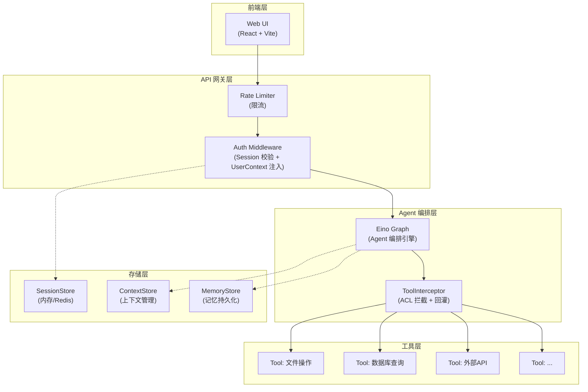

# 通用 Agent 基础框架

## 项目目标

构建通用 Agent 基础框架，为上层业务提供可复用的 Agent 编排、权限控制、人机协同、上下文管理和记忆管理能力。

## 五大核心能力

| # | 能力 | 说明 | 设计文档 |
| - | ---- | ---- | -------- |
| 1 | 登录用户权限管理 | 基于 RBAC 的身份认证、会话管理与工具访问控制，支持多用户数据隔离 | [DOC-01 身份与权限子系统](docs/DOC-01.md) |
| 2 | 多 Agent 与工具调用 | 支持多个 Agent 协作编排（Eino Graph），统一工具注册与调用规范，实现工具热插拔 | [DOC-02 工具与编排子系统](docs/DOC-02.md) |
| 3 | 人机协同 | 在 Agent 执行关键节点暂停等待人类确认/修正，支持中断恢复，确保高风险操作受控 | [DOC-03 中断-恢复子系统](docs/DOC-03.md) |
| 4 | 上下文管理 | 管理 LLM 对话上下文窗口，支持超限截断/摘要压缩策略，保障长对话不越界 | [DOC-04 上下文管理子系统](docs/DOC-04.md) |
| 5 | 记忆管理 | 跨会话持久化用户偏好与历史摘要，实现个性化对话与知识积累 | DOC-05（待建） |

## 技术选型

### 选型决策

| 维度 | 选择 | 理由 |
| ---- | ---- | ---- |
| 编程语言 | **Go** | 高并发性能、静态类型安全、编译部署简单、适合后端服务 |
| Agent 框架 | **Eino** | 字节跳动开源、原生 Go 实现、Graph 编排模型、完善的 Callback 机制 |
| Web 框架 | **Gin** | Go 生态最成熟的 HTTP 框架，中间件机制契合认证拦截需求 |
| 前端 | **React + Vite** | 前后端分离，动态页面，组件生态丰富 |

### 备选方案对比

| 维度 | LangGraph (Python) | LangGraph4j (Java) | Eino (Go) ✓ |
| ---- | ------------------ | ------------------ | ------------ |
| 语言性能 | 解释型，GIL 限制 | JVM 开销大 | 编译型，低延迟 |
| 部署复杂度 | 依赖环境多 | JVM + 构建工具 | 单二进制部署 |
| 并发模型 | asyncio | 虚拟线程/协程 | goroutine（最轻量） |
| Agent 编排 | 成熟，生态最丰富 | 较新，社区小 | Graph + Callback，扩展性好 |
| 类型安全 | 动态类型 | 静态类型 | 静态类型 |
| 适用场景 | 快速原型、ML 密集 | 企业 Java 体系 | 高并发后端服务 |

**选择 Eino 的关键因素**：Go 的 goroutine 模型天然适合多用户并发 Agent 调用；Eino 的 Callback 机制为身份上下文透传和 ToolInterceptor 提供了扩展点；单二进制部署降低运维成本。

## 系统架构



**数据流**：请求经限流 → Session 校验 → 注入 UserContext → Agent 编排执行 → ToolInterceptor 拦截 → ACL 校验 → 执行或回灌 → 返回结果。

## 项目目录结构

```
kingsoft-agent/
├── cmd/
│   └── server/
│       └── main.go              # 程序入口
├── internal/
│   ├── auth/                    # 认证与权限
│   │   ├── handler.go           # 登录/登出 HTTP Handler
│   │   ├── middleware.go        # Auth 中间件
│   │   ├── session.go           # SessionStore 接口及内存实现
│   │   ├── acl.go               # ACL 检查器
│   │   └── interceptor.go       # ToolInterceptor（回灌逻辑）
│   ├── agent/                   # Agent 编排
│   │   ├── graph.go             # Eino Graph 定义
│   │   └── callback.go          # 身份上下文透传 Callback
│   ├── tool/                    # 工具注册与调用
│   │   ├── registry.go          # 工具注册中心
│   │   ├── middleware.go        # ACLToolMiddleware 权限拦截
│   │   └── tools/               # 具体工具实现
│   │       ├── calculator.go    # 计算器工具
│   │       ├── grep.go          # 文件搜索工具
│   │       └── hash_compute.go  # 哈希计算工具
│   ├── context/                 # 上下文管理
│   │   └── manager.go           # 上下文截断/摘要策略
│   └── memory/                  # 记忆管理
│       └── store.go             # 记忆存储与检索
├── api/
│   └── router.go                # HTTP 路由定义
├── pkg/
│   └── model/                   # 公共数据模型
│       ├── user.go
│       ├── session.go
│       └── permission.go
├── web/                         # 前端工程
│   ├── src/
│   ├── package.json
│   └── vite.config.ts
├── docs/                        # 设计文档
│   └── DOC-01.md
├── go.mod
└── go.sum
```

## 安全与隐私设计

### 多用户隔离保障
- 会话与记忆数据按 `userId/thread_id` 隔离
- 身份信息仅通过服务端 `context.Context` 传递，禁止前端直传 userId
- 框架层统一拦截越权，不在工具内部手写校验

### 敏感数据处理
- 日志脱敏：密码、Session Token 不入日志，Token 以 `abc***xyz` 格式脱敏
- Session 过期策略：TTL 30 分钟 + 滑动续期，最长 2 小时
- 密码存储：bcrypt 哈希（cost=12），禁止明文

详见 [DOC-01 安全设计](docs/DOC-01.md#安全设计)。

## 交付物清单与验收标准

### 1. 可运行 Demo

Web 页面演示以下核心场景：

| 场景 | 验收标准 |
| ---- | -------- |
| 权限差异 | admin 用户可调用所有工具（含管理员专属工具），visitor 调用管理员工具时收到 ACL 回灌拒绝提示 |
| 中断恢复 | Agent 在关键节点暂停等待确认，用户确认后继续执行 |
| 上下文超限 | 长对话超过上下文窗口时自动截断/摘要，对话不中断 |
| 跨会话记忆 | 新会话中 Agent 能回忆之前对话的偏好和关键信息 |

### 2. 设计文档

| 文档 | 内容 | 状态 |
| ---- | ---- | ---- |
| DOC-01 | 身份与权限子系统 | [DOC-01 身份与权限子系统](docs/DOC-01.md)  |
| DOC-02 | 多 Agent 与工具调用 | [DOC-02 工具与编排子系统](docs/DOC-02.md) |
| DOC-03 | 人机协同 | [DOC-03 中断-恢复子系统](docs/DOC-03.md) |
| DOC-04 | 上下文管理 | [DOC-04 上下文管理子系统](docs/DOC-04.md) |
| DOC-05 | 记忆管理 | 待建 |

### 3. 代码结构

- 接口抽象要求：`SessionStore`、`ACLChecker`、`ContextManager`、`MemoryStore` 均为接口，内存版与持久化版可替换
- ACL 校验位置：统一在 `ToolInterceptor`（Eino Callback）中拦截，禁止工具内部手写权限校验
- 身份上下文：通过 `context.Context` 透传，不出现在 LLM Prompt 中
