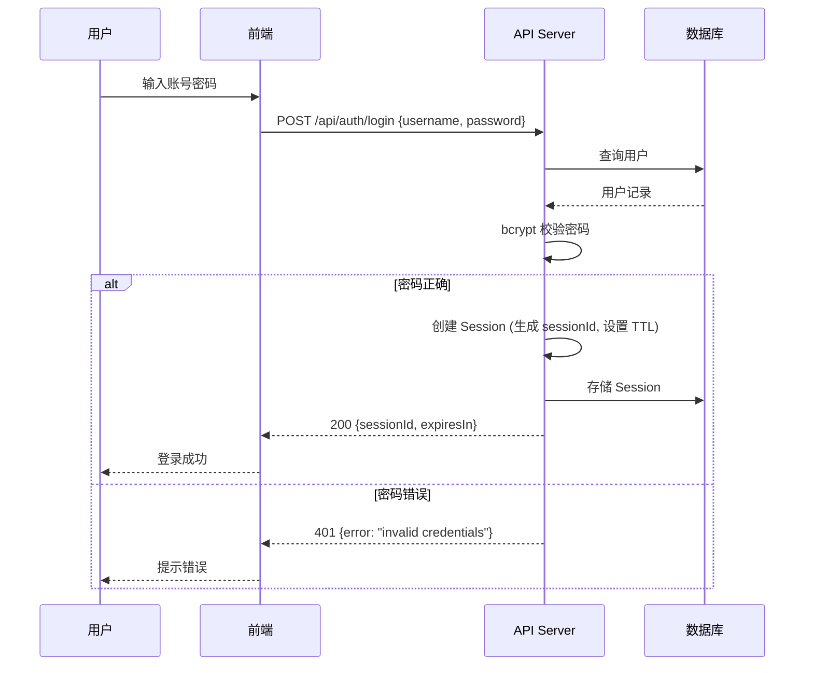
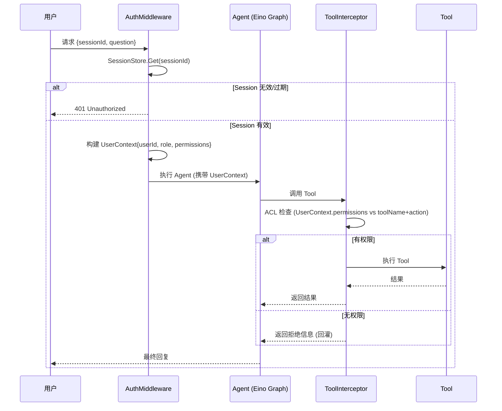
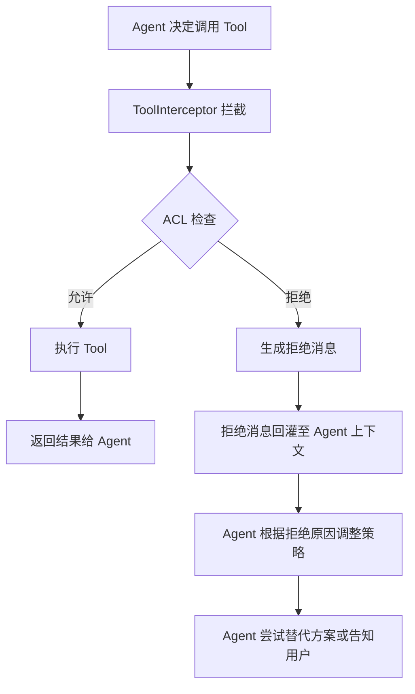
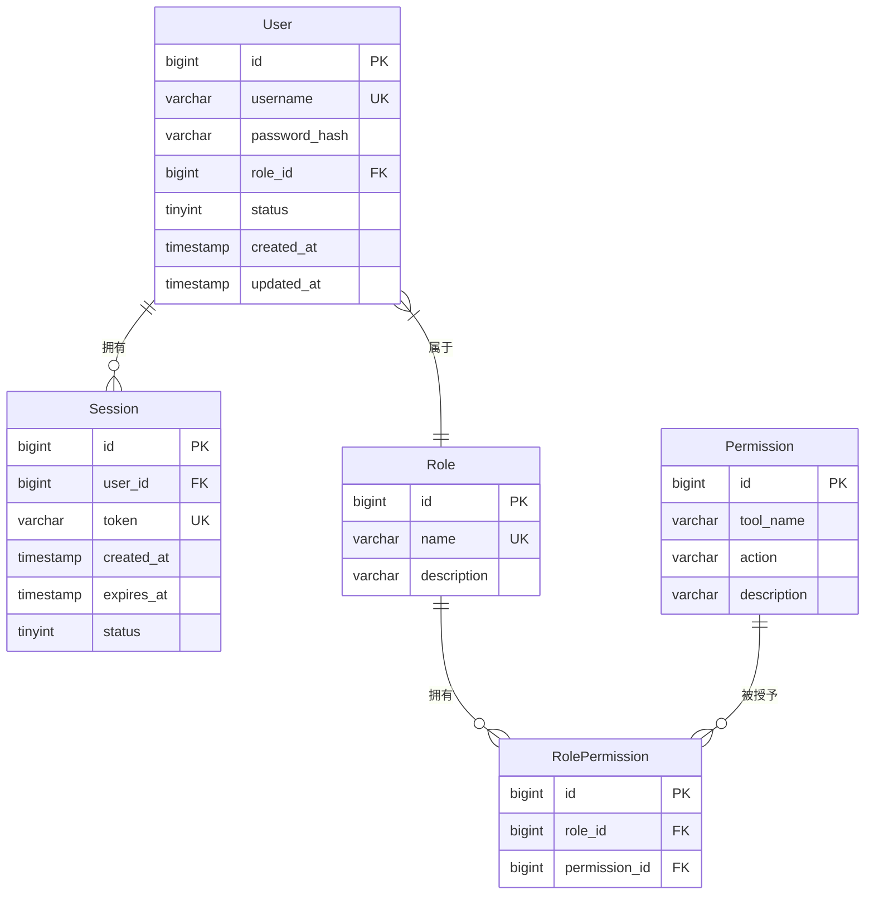

# 身份与权限子系统

## 模块概述

本模块为通用 Agent 框架提供身份认证、会话管理、角色权限控制以及工具调用访问控制能力。通过身份上下文贯穿 Agent 调用链，实现多用户环境下的数据隔离和工具安全调用。

## 建设目标

| 目标 | 说明 |
| ---- | ---- |
| 身份认证 | 确认调用 Agent 的用户身份，防止未授权访问 |
| Session 管理 | 维护用户会话生命周期，支持创建、续期、销毁 |
| 权限控制 | 基于 RBAC 模型限制工具调用，框架统一拦截 |
| 数据隔离 | 会话与记忆按 userId/thread_id 隔离，杜绝串读 |
| 上下文传递 | 身份上下文沿 Agent 调用链透传，对 LLM 隐藏，对工具与节点可见 |

**多用户隔离设计**：会话与记忆数据按 `userId/thread_id` 隔离，切换用户不会串读数据。身份上下文沿调用链透传，对 LLM 隐藏，对工具与节点可见。

## 系统整体链路设计

```
登录拿 sessionId → 每次校验合法性 → 凭角色定工具权限 → 框架统一拦截越权 → 回灌拒绝信息 → 多用户隔离不串
```

**关键原则**：
1. 用户在 Web 前端登录获取 Session
2. Agent 调用携带 sessionId
3. Middleware 验证身份（每次调用均校验 sessionId 合法性，当存储中查无该会话时即判定非法，直接返回 401，请求不进入 Agent 执行）
4. 生成 UserContext
5. Agent 执行
6. Tool 调用经过 ACL 检查（框架统一拦截，禁止在每个工具内部手写校验）

## 业务流程设计

### 1. 用户登录



### 2. Agent 调用



### 3. 越权访问与回灌



**回灌机制说明**：当 ToolInterceptor 拦截到越权调用时，不抛异常中断流程，而是将拒绝信息以结构化消息注入 Agent 当前上下文，使 Agent 能理解拒绝原因并自主调整后续行为（如换用允许的工具、请求用户授权等），而非直接报错终止。

## 数据存储

必须交付会话存储抽象接口 `SessionStore`，并至少提供内存版默认实现；持久化存储后端属于进阶档。详见 [数据模型设计 - SessionStore 接口](#sessionstore-接口)。

## 数据库设计

### ER 关系图



### 表结构定义

#### User 用户表

| 字段 | 类型 | 约束 | 说明 |
| ---- | ---- | ---- | ---- |
| id | bigint | PK, AUTO_INCREMENT | 主键 |
| username | varchar(64) | UK, NOT NULL | 用户名 |
| password_hash | varchar(128) | NOT NULL | bcrypt 哈希后的密码 |
| role_id | bigint | FK → Role.id, NOT NULL | 关联角色 |
| status | tinyint | NOT NULL, DEFAULT 1 | 1=启用, 0=禁用 |
| created_at | timestamp | NOT NULL | 创建时间 |
| updated_at | timestamp | NOT NULL | 更新时间 |

#### Role 角色表

| 字段 | 类型 | 约束 | 说明 |
| ---- | ---- | ---- | ---- |
| id | bigint | PK, AUTO_INCREMENT | 主键 |
| name | varchar(32) | UK, NOT NULL | 角色名（如 admin, user） |
| description | varchar(256) | | 角色描述 |

**预置角色**：
- `admin`：可调用所有工具
- `visitor`：仅可调用基础工具（查询类）

#### Permission 权限表

| 字段 | 类型 | 约束 | 说明 |
| ---- | ---- | ---- | ---- |
| id | bigint | PK, AUTO_INCREMENT | 主键 |
| tool_name | varchar(64) | NOT NULL | 工具名称（如 `file_delete`, `db_query`） |
| action | varchar(32) | NOT NULL | 动作类型（如 `execute`, `read`） |
| description | varchar(256) | | 权限描述 |

#### RolePermission 角色权限关联表

| 字段 | 类型 | 约束 | 说明 |
| ---- | ---- | ---- | ---- |
| id | bigint | PK, AUTO_INCREMENT | 主键 |
| role_id | bigint | FK → Role.id, NOT NULL | 角色ID |
| permission_id | bigint | FK → Permission.id, NOT NULL | 权限ID |

> UK(role_id, permission_id) 联合唯一，防止重复授权。

#### Session 会话表

| 字段 | 类型 | 约束 | 说明 |
| ---- | ---- | ---- | ---- |
| id | bigint | PK, AUTO_INCREMENT | 主键 |
| user_id | bigint | FK → User.id, NOT NULL | 关联用户 |
| token | varchar(128) | UK, NOT NULL | Session Token（UUID v4） |
| created_at | timestamp | NOT NULL | 创建时间 |
| expires_at | timestamp | NOT NULL | 过期时间 |
| status | tinyint | NOT NULL, DEFAULT 1 | 1=active, 2=expired, 3=revoked |

## 数据模型设计

### Session 模型

```go
// SessionStatus 会话状态枚举
type SessionStatus int

const (
    SessionActive  SessionStatus = 1 // 活跃
    SessionExpired SessionStatus = 2 // 已过期
    SessionRevoked SessionStatus = 3 // 已撤销（主动登出）
)

// Session 会话实体
type Session struct {
    UserID    int64         `json:"user_id"`
    SessionID string        `json:"session_id"`
    Status    SessionStatus `json:"status"`
    CreatedAt time.Time     `json:"created_at"`
    UpdatedAt time.Time     `json:"updated_at"`
    ExpiresAt time.Time     `json:"expires_at"`
}

// 过期策略
const (
    DefaultSessionTTL = 30 * time.Minute // 默认 Session 有效期
    SessionRenewDelta = 5  * time.Minute // 距过期不足此时间时自动续期
)
```

### UserContext 模型

```go
// UserContext 身份上下文，沿 Agent 调用链透传
// 设计原则：对 LLM 不可见（不出现在 prompt 中），对 Tool 和节点可见（通过 context.Context 传递）
type UserContext struct {
    UserID      int64          // 用户ID
    Role        string         // 角色名（admin / user）
    Permissions []Permission   // 当前用户拥有的权限列表
    SessionID   string         // 会话 Token
}

// permissionKey 用于从 context.Context 中存取 UserContext
type permissionKey struct{}

// WithUserContext 将 UserContext 注入 context.Context
func WithUserContext(ctx context.Context, uc *UserContext) context.Context {
    return context.WithValue(ctx, permissionKey{}, uc)
}

// UserContextFromCtx 从 context.Context 提取 UserContext
func UserContextFromCtx(ctx context.Context) (*UserContext, bool) {
    uc, ok := ctx.Value(permissionKey{}).(*UserContext)
    return uc, ok
}
```

### RBAC 权限模型

```go
// ACLChecker 访问控制检查器
type ACLChecker interface {
    // Allowed 判断指定角色是否允许对某工具执行某动作
    Allowed(ctx context.Context, role string, toolName string, action string) (bool, error)
}

// 默认实现基于内存 map 的 ACL 检查
type memoryACLChecker struct {
    // rolePermissions: map[role] -> map[toolName] -> map[action] -> bool
    rolePermissions map[string]map[string]map[string]bool
}
```

**ACL 检查逻辑**：
1. 从 `UserContext` 获取用户角色 `role`
2. 以 `role + toolName + action` 为 key 查找权限表
3. 存在且为 `true` → 允许；否则 → 拒绝
4. `admin` 角色默认拥有所有权限（可配置超级角色白名单）

### SessionStore 接口

```go
// SessionStore 会话存储抽象接口
type SessionStore interface {
    // Create 创建新会话
    Create(ctx context.Context, session *Session) error

    // Get 根据 token 获取会话，若已过期自动标记为 expired 并返回 ErrSessionExpired
    Get(ctx context.Context, token string) (*Session, error)

    // Delete 删除会话（主动登出时调用）
    Delete(ctx context.Context, token string) error

    // Renew 续期会话，将 expires_at 延长一个 TTL
    Renew(ctx context.Context, token string) error
}

// 错误定义
var (
    ErrSessionNotFound = errors.New("session not found")
    ErrSessionExpired  = errors.New("session expired")
)
```

**实现层级**：

| 层级 | 实现 | 说明 |
| ---- | ---- | ---- |
| 基础档 | `MemorySessionStore` | 基于 `sync.Map`，进程内存储，重启丢失 |
| 进阶档 | `RedisSessionStore` | 基于 Redis，支持分布式部署和持久化 |

## API 接口设计

### 认证相关接口

| 方法 | 路径 | 请求体 | 响应体 | 说明 |
| ---- | ---- | ------ | ------ | ---- |
| POST | `/api/auth/login` | `{"username":"xxx","password":"xxx"}` | `{"session_id":"xxx","expires_in":1800}` | 用户登录 |
| POST | `/api/auth/logout` | _(Header: Authorization: Bearer {sessionId})_ | `{"message":"ok"}` | 用户登出 |
| GET | `/api/auth/session` | _(Header: Authorization: Bearer {sessionId})_ | `{"user_id":1,"role":"admin","expires_at":"..."}` | 校验/查询当前会话 |

### 权限相关接口

| 方法 | 路径 | 请求体 | 响应体 | 说明 |
| ---- | ---- | ------ | ------ | ---- |
| GET | `/api/permissions/tools` | _(Header: Authorization: Bearer {sessionId})_ | `{"tools":["file_read","db_query"]}` | 查询当前用户可调用工具列表 |

### Agent 调用接口

| 方法 | 路径 | 请求体 | 响应体 | 说明 |
| ---- | ---- | ------ | ------ | ---- |
| POST | `/api/agent/chat` | `{"session_id":"xxx","message":"xxx","thread_id":"xxx"}` | `{"reply":"xxx","thread_id":"xxx"}` | 与 Agent 对话（流式响应可选） |

### 错误响应格式

```json
{
  "error": {
    "code": "UNAUTHORIZED",
    "message": "session invalid or expired"
  }
}
```

**常用错误码**：

| HTTP 状态码 | code | 说明 |
| ----------- | ---- | ---- |
| 401 | UNAUTHORIZED | Session 无效/过期 |
| 403 | FORBIDDEN | 无权限调用该工具 |
| 400 | BAD_REQUEST | 请求参数错误 |
| 429 | TOO_MANY_REQUESTS | 请求过于频繁 |

## 安全设计

### 密码安全
- **存储**：使用 bcrypt 哈希（cost=12），禁止明文存储或 MD5/SHA256
- **传输**：HTTPS 强制，前端登录请求走 TLS
- **校验**：登录失败不区分"用户不存在"和"密码错误"，统一返回 `invalid credentials`

### Session 安全
- **Token 生成**：使用 `crypto/rand` 生成 UUID v4，不可预测
- **TTL 策略**：默认 30 分钟有效期
- **滑动续期**：距过期不足 5 分钟时自动续期（续期不延长总有效期上限，最长 2 小时）
- **主动失效**：登出时立即删除 Session，防止重放
- **单设备限制**：同一用户同时最多 3 个活跃 Session（可配置），超出时淘汰最早创建的

### 日志脱敏
- 密码、password_hash、sessionId **不入日志**
- 请求日志中 sessionId 以 `abc***xyz` 形式脱敏输出
- 错误日志不暴露内部实现细节（如 SQL 语句、堆栈）

### 防御措施
- **限流**：登录接口限制同一 IP 每分钟 10 次，同一账号每分钟 5 次
- **CSRF**：API 层使用 Bearer Token 认证，天然防 CSRF
- **输入校验**：所有接口参数做白名单校验，防止注入

## ToolInterceptor 实现

```go
// ToolInterceptor 工具调用拦截器
// 作为 Eino Graph 的 Callback 注入，在 Tool 执行前统一拦截
func ToolInterceptor(acl ACLChecker) func(ctx context.Context, toolCall *ToolCall) (*ToolResult, error) {
    return func(ctx context.Context, toolCall *ToolCall) (*ToolResult, error) {
        uc, ok := UserContextFromCtx(ctx)
        if !ok {
            return nil, errors.New("user context not found in request")
        }

        allowed, err := acl.Allowed(ctx, uc.Role, toolCall.Name, "execute")
        if err != nil {
            return nil, fmt.Errorf("ACL check failed: %w", err)
        }

        if !allowed {
            // 回灌：不抛异常中断，而是返回结构化拒绝信息
            return &ToolResult{
                Content: fmt.Sprintf(
                    "权限不足：当前角色[%s]无权调用工具[%s]。请使用其他方式完成任务或请求管理员授权。",
                    uc.Role, toolCall.Name,
                ),
                IsError: true,
            }, nil
        }

        // 有权限，继续执行
        return nil, nil // 返回 nil 表示放行
    }
}
```
