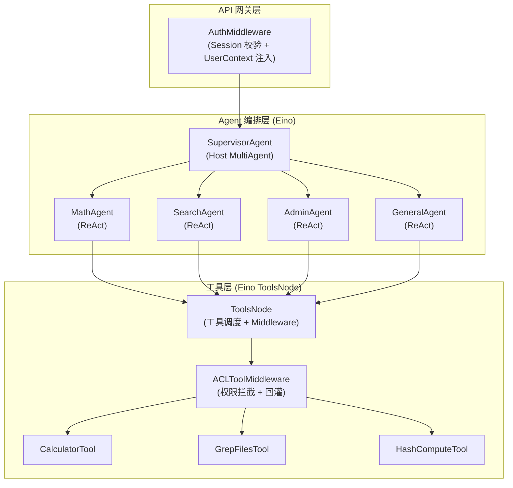
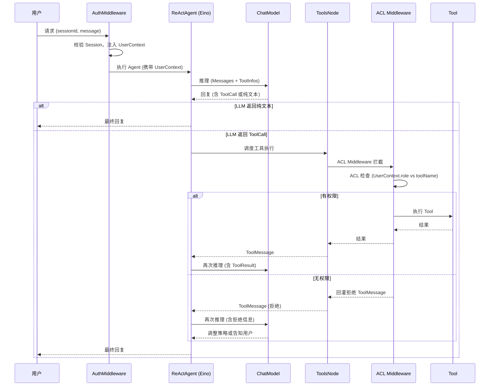
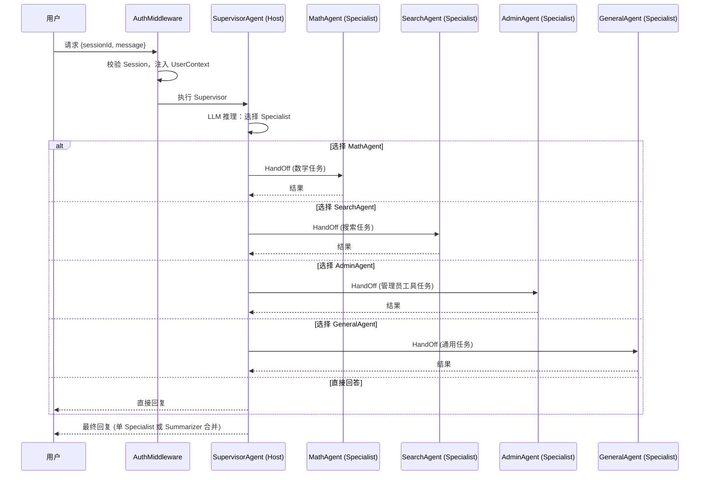
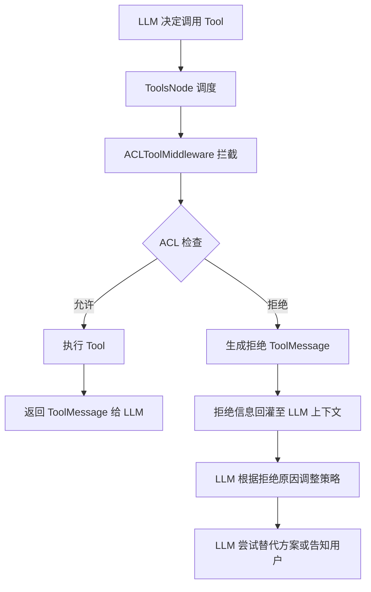
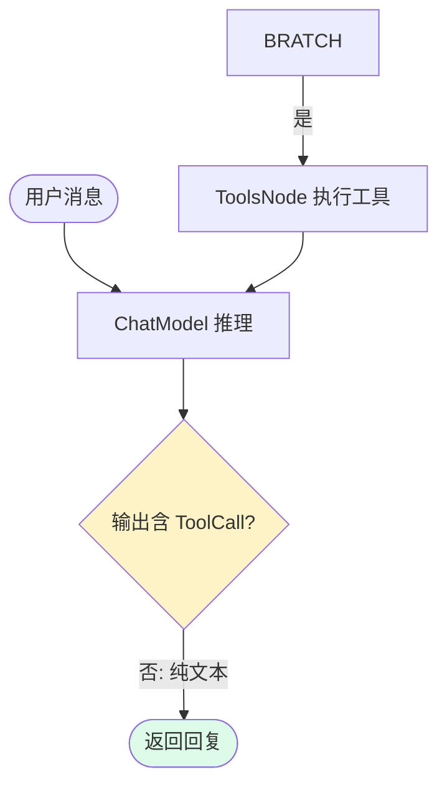
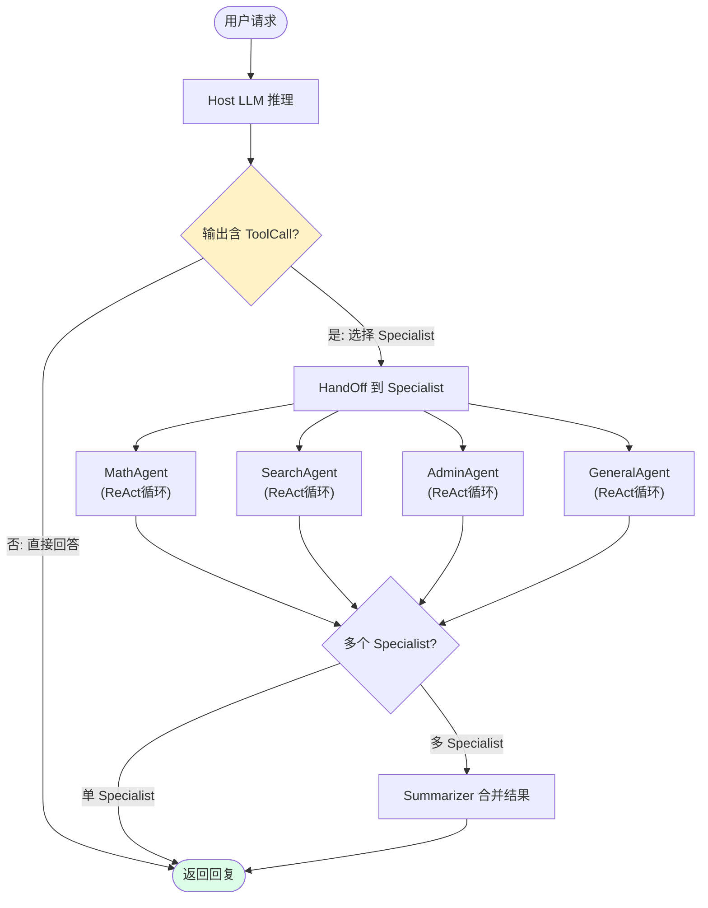

# 工具与编排子系统

## 模块概述

多 Agent 与工具调用子系统是通用 Agent 框架的执行核心，负责实现 Agent 自主推理、工具调用、多 Agent 协作编排能力。

本模块基于 Eino 框架的 `flow/agent/react` 实现 ReAct 循环，采用 `flow/agent/multiagent/host` 实现 Supervisor 多 Agent 协作编排，通过 `ToolsNode` + `ToolMiddleware` 机制实现统一工具注册、调度与权限拦截。

**设计原则**：
1. **基于 Eino，不重复造轮子** — 复用 Eino 的 Graph、ReAct、MultiAgent、ToolsNode、Callback 等核心抽象
2. **权限拦截嵌入工具层** — 通过 `ToolMiddleware` 集成 DOC-01 的 ACL 检查，框架统一拦截越权
3. **身份上下文透传** — UserContext 沿 Eino 调用链通过 `context.Context` 透传，对 LLM 不可见

## 建设目标

| 目标 | 说明 |
| ---- | ---- |
| 统一工具抽象 | 基于 Eino `InvokableTool` 接口，所有工具采用统一签名 |
| 支持工具动态注册 | 运行时通过 `ToolsNodeConfig` 加载工具，支持热插拔 |
| 支持 Agent 自主调用工具 | LLM 根据 ToolInfo 选择工具，Eino ReAct 循环驱动 |
| 支持 ReAct 循环 | 基于 Eino `flow/agent/react`，推理-行动-观察 |
| 支持多 Agent 协作 | 基于 Eino `flow/agent/multiagent/host`，Supervisor 路由 |
| 支持工具权限拦截 | 通过 `ToolMiddleware` 集成 ACL，回灌拒绝信息 |
| 支持后续模块扩展 | 人机协同（Callback 扩展）、记忆（消息注入）、上下文管理 |

## 系统整体链路设计

```
用户请求 → AuthMiddleware(身份校验) → SupervisorAgent(任务路由) → SpecialistAgent(ReAct循环) → ToolsNode(工具调度) → ToolMiddleware(ACL拦截) → Tool执行 → 结果回传
```

**关键原则**：
1. 用户请求经 DOC-01 的 AuthMiddleware 校验身份后，UserContext 注入 `context.Context`
2. Supervisor 根据 LLM 推理选择 Specialist，HandOff 通过 Eino `MultiAgentCallback` 可观测
3. Specialist 内部运行 ReAct 循环，LLM 自主决定是否调用工具
4. 工具调用经过 `ToolsNode` 调度，`ToolMiddleware` 执行 ACL 检查
5. 越权调用不抛异常，而是回灌拒绝信息，Agent 可自主调整策略

## 整体架构设计



## 业务流程设计

### 1. 单 Agent 工具调用（ReAct 循环）



### 2. 多 Agent 协作（Supervisor 路由）



### 3. 越权调用与回灌



**回灌机制说明**：与 DOC-01 中 `ToolInterceptor` 的回灌逻辑一致。当 `ACLToolMiddleware` 拦截到越权调用时，不抛异常中断流程，而是构造 `ToolMessage`（content 为拒绝原因，标记 isError）返回给 ReAct 循环，LLM 能理解拒绝原因并自主调整后续行为。

## 数据模型设计

### ToolInfo 工具元信息

工具元信息由 Eino `BaseTool.Info()` 返回，用于注册到 ChatModel 和展示给 LLM。

```go
// Eino 内置 schema.ToolInfo
type ToolInfo struct {
    Name        string
    Desc        string
    Extra       map[string]any
    *ParamsOneOf  // 参数 JSON Schema（由 InferTool 自动推断）
}
```

### ToolCall 工具调用请求

Eino 内置 `schema.ToolCall`，由 ChatModel 输出。

```go
// Eino 内置 schema.ToolCall
type ToolCall struct {
    Index    *int
    ID       string
    Type     string
    Function FunctionCall
    Extra    map[string]any
}

type FunctionCall struct {
    Name      string
    Arguments string  // JSON string
}
```

### ToolResult 工具执行结果

```go
// Eino 内置 schema.ToolResult (EnhancedInvokableTool 使用)
type ToolResult struct {
    Content     []*Message
    IsError     bool
    ArtifactKey string
    Extra       map[string]any
}
```

### SpecialistAgent 定义

```go
// SpecialistAgent 专家 Agent 定义（注册到 Supervisor）
type SpecialistAgent struct {
    Name        string                    // Agent 名称，同时作为 Host 侧的工具名
    IntendedUse string                    // 用途描述，作为 Host 侧的工具描述
    Agent       compose.Invoke[[]*schema.Message, *schema.Message, agent.AgentOption]
    SystemPrompt string                   // Agent 系统提示词
}
```

### ChatRequest / ChatResponse 对话请求响应

```go
// ChatRequest Agent 对话请求
type ChatRequest struct {
    ThreadID string `json:"thread_id" binding:"required"` // 会话线程 ID
    Message  string `json:"message" binding:"required"`  // 用户消息
}

// ChatResponse Agent 对话响应
type ChatResponse struct {
    Reply    string `json:"reply"`     // Agent 回复
    ThreadID string `json:"thread_id"` // 会话线程 ID
}
```

## 工具设计

### 工具接口（基于 Eino InvokableTool）

本项目的所有工具均实现 Eino 的 `InvokableTool` 接口，使用 `utils.InferTool` 自动推断参数 Schema：

```go
// Eino InvokableTool 接口
type InvokableTool interface {
    BaseTool
    InvokableRun(ctx context.Context, argumentsInJSON string, opts ...tool.Option) (string, error)
}

// BaseTool 提供 ToolInfo（供 ChatModel 了解可用工具）
type BaseTool interface {
    Info(ctx context.Context) (*schema.ToolInfo, error)
}
```

**推荐使用 `InferTool` 从 Go 函数自动创建工具**：

```go
type CalculatorInput struct {
    Expression string `json:"expression" jsonschema:"description=数学表达式，如 2+3*4"`
}

type CalculatorOutput struct {
    Result string `json:"result"`
}

calculatorTool, err := utils.InferTool[CalculatorInput, CalculatorOutput](
    "calculator",
    "执行数学计算，支持加减乘除等基本运算",
    func(ctx context.Context, input CalculatorInput) (CalculatorOutput, error) {
        // 实现计算逻辑
        return CalculatorOutput{Result: "42"}, nil
    },
)
```

### 内置示例工具

| 工具名 | 类别 | 说明 | visitor 可用 |
| ------ | ---- | ---- | ------------ |
| `calculator` | 查询类 | 执行数学计算 | ✅ |
| `grep_files` | 查询类 | 文件内容搜索 | ✅ |
| `hash_compute` | 管理员类 | 哈希值计算 | 🚫 |

### ToolsNode 工具调度节点

Eino 的 `ToolsNode` 负责从 LLM 输出的 `ToolCall` 中提取工具名和参数，调度到对应的 `InvokableTool` 执行，并将结果包装为 `ToolMessage` 返回。

```go
// ToolsNodeConfig 工具节点配置
type ToolsNodeConfig struct {
    Tools               []tool.BaseTool                    // 注册的工具列表
    ToolAliases         map[string]ToolAliasConfig          // 工具别名
    UnknownToolsHandler func(ctx, name, input string) (string, error) // 未知工具处理
    ExecuteSequentially bool                                // 是否顺序执行（默认并行）
    ToolCallMiddlewares []ToolMiddleware                    // 工具中间件链
}
```

### ACLToolMiddleware 权限拦截中间件

通过 Eino `ToolMiddleware` 机制实现，在工具执行前统一拦截，与 DOC-01 的 `ToolInterceptor` 逻辑等价，但嵌入 Eino 的 `ToolsNode` 调度链。

```go
// ACLToolMiddleware 创建 ACL 拦截中间件
// 在 ToolsNode 调度工具前检查用户权限，无权限时回灌拒绝信息
func ACLToolMiddleware(aclChecker auth.ACLChecker) compose.ToolMiddleware {
    return compose.ToolMiddleware{
        Invokable: func(next compose.InvokableToolEndpoint) compose.InvokableToolEndpoint {
            return func(ctx context.Context, input *compose.ToolInput) (*compose.ToolOutput, error) {
                // 从 context.Context 提取 UserContext
                uc, ok := model.UserContextFromCtx(ctx)
                if !ok {
                    return nil, fmt.Errorf("user context not found in request")
                }

                // ACL 检查
                allowed, err := aclChecker.Allowed(ctx, uc.Role, input.Name, "execute")
                if err != nil {
                    return nil, fmt.Errorf("ACL check failed: %w", err)
                }

                if !allowed {
                    // 回灌：返回拒绝信息，不抛异常中断流程
                    denyMsg := fmt.Sprintf(
                        "权限不足：当前角色[%s]无权调用工具[%s]。请使用其他方式完成任务或请求管理员授权。",
                        uc.Role, input.Name,
                    )
                    return &compose.ToolOutput{Result: denyMsg}, nil
                }

                // 有权限，继续执行
                return next(ctx, input)
            }
        },
    }
}
```

**与 DOC-01 ToolInterceptor 的关系**：

| 维度 | DOC-01 ToolInterceptor | DOC-02 ACLToolMiddleware |
| ---- | ---------------------- | ------------------------ |
| 接入位置 | Eino Callback（OnToolCallStart） | Eino ToolMiddleware（ToolsNode 调度链） |
| 执行时机 | Tool 执行前 | Tool 执行前 |
| 拦截方式 | 返回 `(*ToolResult, nil)` 表示拦截 | 返回 `(*ToolOutput, nil)` 表示拦截 |
| 放行方式 | 返回 `(nil, nil)` | 调用 `next(ctx, input)` |
| 推荐使用 | 简单场景、Callback 链 | 复杂场景、需要与 ToolsNode 编排 |

> **建议**：DOC-02 实现后，`ACLToolMiddleware` 替代 DOC-01 的 `ToolInterceptor` 作为主要的权限拦截机制。`ToolInterceptor` 保留作为 Callback 层的补充观测点（如日志、审计），不再承担拦截职责。

## ReAct Agent 设计

### 基于 Eino `flow/agent/react`

本项目的 ReAct Agent 直接使用 Eino 内置的 `react.Agent`，不自定义实现。

```go
// Eino ReAct Agent 配置
type AgentConfig struct {
    ToolCallingModel   model.ToolCallingChatModel  // 支持工具调用的 ChatModel
    ToolsConfig        compose.ToolsNodeConfig      // 工具节点配置
    MaxStep            int                          // 最大迭代步数
    ToolReturnDirectly map[string]struct{}           // 直接返回结果的工具名
    MessageModifier    MessageModifier               // 消息修饰器（可注入记忆等）
    GraphName          string
    ModelNodeName      string
    ToolsNodeName      string
}
```

### ReAct 循环流程



**内部机制**：Eino 的 `react.Agent` 内部构建 `Graph[[]*Message, *Message]`，包含 `chat` 和 `tools` 两个节点。`chat` 节点后通过 `GraphBranch` 检查输出是否包含 `ToolCall`：有则路由到 `tools` 节点，执行后循环回 `chat`；无则路由到 END。

### MaxIterations 设计

```go
const DefaultMaxIterations = 20
```

超限则终止循环并返回"已达迭代上限"的合理提示，杜绝死循环。通过 `AgentConfig.MaxStep` 配置。

### 创建 ReAct Agent 示例

```go
func createReActAgent(
    ctx context.Context,
    chatModel model.ToolCallingChatModel,
    tools []tool.BaseTool,
    aclMiddleware compose.ToolMiddleware,
    maxSteps int,
) (*react.Agent, error) {
    return react.NewAgent(ctx, &react.AgentConfig{
        ToolCallingModel: chatModel,
        ToolsConfig: compose.ToolsNodeConfig{
            Tools:               tools,
            ToolCallMiddlewares: []compose.ToolMiddleware{aclMiddleware},
        },
        MaxStep: maxSteps,
    })
}
```

## Supervisor 多 Agent 设计

### 基于 Eino `flow/agent/multiagent/host`

本项目的 Supervisor 模式直接使用 Eino 内置的 `host.MultiAgent`，不自定义实现。

```go
// Eino Host MultiAgent 配置
type MultiAgentConfig struct {
    Host        Host           // Supervisor/编排者
    Specialists []*Specialist  // 专家 Agent 列表
    Name        string
    Summarizer  *Summarizer    // 多 Specialist 结果合并器
}

// Host 编排者
type Host struct {
    ToolCallingModel model.ToolCallingChatModel  // LLM 通过工具调用选择 Specialist
    SystemPrompt     string
}

// Specialist 专家 Agent
type Specialist struct {
    AgentMeta                      // Name + IntendedUse
    ChatModel    model.BaseChatModel  // ChatModel（与 Agent 二选一）
    SystemPrompt string
    Invokable    compose.Invoke[[]*schema.Message, *schema.Message, agent.AgentOption]
}
```

### Agent 角色设计

| Agent | 职责 | 可用工具 | IntendedUse |
| ----- | ---- | -------- | ----------- |
| MathAgent | 数学计算 | Calculator | 处理数学计算、算术运算、公式求解等任务 |
| SearchAgent | 信息查询 | GrepFiles | 处理文件内容搜索、模式匹配等任务 |
| AdminAgent | 管理员工具 | HashCompute | 处理哈希计算等管理员工具任务 |
| GeneralAgent | 普通问答 | 无 | 处理日常对话、知识问答等通用任务 |

### Supervisor 路由流程



**路由机制**：每个 Specialist 在 Host 侧注册为一个"工具"（工具名 = Agent 名称，工具描述 = IntendedUse）。Host 的 LLM 通过工具调用选择 Specialist，Eino 将此映射为 Agent HandOff。

### 创建 Supervisor Agent 示例

```go
func createSupervisorAgent(
    ctx context.Context,
    hostModel model.ToolCallingChatModel,
    specialistModel model.ToolCallingChatModel,
    tools []tool.BaseTool,
    aclMiddleware compose.ToolMiddleware,
) (*host.MultiAgent, error) {
    // 1. 创建各 Specialist 的 ReAct Agent
    mathAgent, err := createReActAgent(ctx, specialistModel,
        []tool.BaseTool{calculatorTool}, aclMiddleware, DefaultMaxIterations)
    searchAgent, err := createReActAgent(ctx, specialistModel,
        []tool.BaseTool{grepFilesTool}, aclMiddleware, DefaultMaxIterations)
    adminAgent, err := createReActAgent(ctx, specialistModel,
        []tool.BaseTool{hashComputeTool}, aclMiddleware, DefaultMaxIterations)
    generalAgent, err := createReActAgent(ctx, specialistModel,
        nil, aclMiddleware, DefaultMaxIterations)

    // 2. 构建 MultiAgent
    return host.NewMultiAgent(ctx, &host.MultiAgentConfig{
        Host: host.Host{
            ToolCallingModel: hostModel,
            SystemPrompt:     "你是一个任务路由助手，根据用户请求选择合适的专家Agent来处理。",
        },
        Specialists: []*host.Specialist{
            {
                AgentMeta:   host.AgentMeta{Name: "MathAgent", IntendedUse: "处理数学计算任务"},
                Invokable:   mathAgent.Generate,
                SystemPrompt: "你是一个数学计算助手，使用计算器工具完成计算任务。",
            },
            {
                AgentMeta:   host.AgentMeta{Name: "SearchAgent", IntendedUse: "处理文件内容搜索任务"},
                Invokable:   searchAgent.Generate,
                SystemPrompt: "你是一个文件搜索助手，使用 grep_files 工具搜索文件内容。",
            },
            {
                AgentMeta:   host.AgentMeta{Name: "AdminAgent", IntendedUse: "处理哈希计算等管理员工具任务"},
                Invokable:   adminAgent.Generate,
                SystemPrompt: "你是一个管理员工具助手，可以使用哈希计算工具完成任务。",
            },
            {
                AgentMeta:   host.AgentMeta{Name: "GeneralAgent", IntendedUse: "处理通用问答任务"},
                Invokable:   generalAgent.Generate,
                SystemPrompt: "你是一个通用问答助手，直接回答用户问题。",
            },
        },
        Summarizer: &host.Summarizer{
            ChatModel:    hostModel,
            SystemPrompt: "将多个专家的回复合并为一段连贯的最终回复。",
        },
    })
}
```

## 消息协议设计

### 基于 Eino schema.Message

所有 Agent 间通信和 LLM 交互均使用 Eino 的 `schema.Message`：

```go
// Eino 统一消息结构
type Message struct {
    Role                     RoleType              // user / assistant / system / tool
    Content                  string                // 文本内容
    ToolCalls                []ToolCall            // LLM 发起的工具调用
    ToolCallID               string                // 工具结果对应的调用 ID
    ToolName                 string                // 工具名
    ResponseMeta             *ResponseMeta         // 含 FinishReason, TokenUsage
    ReasoningContent         string                // 推理内容（思维链）
    Extra                    map[string]any        // 扩展字段
}

// 消息构造
schema.UserMessage("请帮我计算 2+3*4")
schema.AssistantMessage("计算结果是14", nil)
schema.ToolMessage("权限不足：当前角色[visitor]无权调用工具[hash_compute]", toolCallID)
```

### 消息流转示例

```
UserMessage("帮我计算 2+3*4")
  → [Host LLM] → AssistantMessage(ToolCall: MathAgent)
    → [MathAgent ReAct]
      → [ChatModel] → AssistantMessage(ToolCall: calculator)
        → [ToolsNode] → ToolMessage("14", callID)
      → [ChatModel] → AssistantMessage("计算结果是14")
    → [Host] → AssistantMessage("2+3*4 的计算结果是14")

UserMessage("计算hello的SHA256")
  → [Host LLM] → AssistantMessage(ToolCall: AdminAgent)
    → [AdminAgent ReAct]
      → [ChatModel] → AssistantMessage(ToolCall: hash_compute)
        → [ACLToolMiddleware] → 允许(admin) → [ToolsNode] → ToolMessage("sha256 hash result", callID)
      → [ChatModel] → AssistantMessage("hello的SHA256哈希值是...")
    → [Host] → AssistantMessage("hello的SHA256哈希值是...")

UserMessage("计算hello的SHA256") (visitor角色)
  → [Host LLM] → AssistantMessage(ToolCall: AdminAgent)
    → [AdminAgent ReAct]
      → [ChatModel] → AssistantMessage(ToolCall: hash_compute)
        → [ACLToolMiddleware] → 拒绝(visitor) → ToolMessage("权限不足：当前角色[visitor]无权调用工具[hash_compute]")
      → [ChatModel] → AssistantMessage("抱歉，您当前角色无权使用哈希计算工具，请联系管理员授权。")
    → [Host] → AssistantMessage("抱歉，您当前角色无权使用哈希计算工具，请联系管理员授权。")
```

### 消息中禁止携带身份信息

**安全约束**：`UserContext` 不得出现在 `schema.Message` 的 `Content`、`ToolCalls`、`Extra` 中。身份上下文仅通过 `context.Context` 透传，对 LLM 不可见，防止提示注入攻击。

## API 接口设计

### Agent 调用接口

| 方法 | 路径 | 请求体 | 响应体 | 说明 |
| ---- | ---- | ------ | ------ | ---- |
| POST | `/api/agent/chat` | `{"message":"xxx","thread_id":"xxx"}` | `{"reply":"xxx","thread_id":"xxx"}` | 与 Agent 对话 |
| POST | `/api/agent/chat/stream` | `{"message":"xxx","thread_id":"xxx"}` | `SSE: data: {"delta":"..."}` | 与 Agent 对话（流式） |

> 请求头需携带 `Authorization: Bearer {sessionId}`，经 AuthMiddleware 校验后 UserContext 注入 context.Context。

### 工具管理接口（管理端）

| 方法 | 路径 | 请求体 | 响应体 | 说明 |
| ---- | ---- | ------ | ------ | ---- |
| GET | `/api/tools` | _(需 admin 角色)_ | `{"tools":[{"name":"calculator","desc":"..."}]}` | 列出所有已注册工具 |
| GET | `/api/agents` | _(需 admin 角色)_ | `{"agents":[{"name":"MathAgent","intended_use":"..."}]}` | 列出所有已注册 Agent |

### 错误响应格式

沿用 DOC-01 的统一错误格式：

```json
{
  "error": {
    "code": "FORBIDDEN",
    "message": "insufficient permissions"
  }
}
```

**常用错误码**：

| HTTP 状态码 | code | 说明 |
| ----------- | ---- | ---- |
| 401 | UNAUTHORIZED | Session 无效/过期 |
| 403 | FORBIDDEN | 无权限（如非 admin 调用管理接口） |
| 400 | BAD_REQUEST | 请求参数错误 |
| 429 | TOO_MANY_REQUESTS | 请求过于频繁 |
| 500 | AGENT_ERROR | Agent 执行异常 |
| 504 | AGENT_TIMEOUT | Agent 执行超时 |

## 身份上下文透传设计

### UserContext 沿 Eino 调用链传递

UserContext 通过 `context.Context` 在 Eino 调用链中透传，无需显式传递：

```
HTTP Request (UserContext in ctx)
  → AuthMiddleware (注入 ctx)
    → SupervisorAgent.Generate(ctx, messages) (ctx 透传)
      → Host ChatModel.Generate(ctx, ...) (ctx 透传)
        → SpecialistAgent.Generate(ctx, ...) (ctx 透传)
          → ToolsNode.Invoke(ctx, ...) (ctx 透传)
            → ACLToolMiddleware (从 ctx 提取 UserContext)
              → Tool.InvokableRun(ctx, ...) (ctx 透传)
```

### Callback 观测点

通过 Eino Callback 机制在不侵入业务逻辑的前提下观测调用链：

```go
// 创建 Agent Callback（用于日志、审计、指标采集）
agentCallback := utils.NewHandlerHelper().
    Tool(&callbacks.ToolCallbackHandler{
        OnStart: func(ctx context.Context, info *callbacks.RunInfo, input *tool.CallbackInput) context.Context {
            log.Printf("[ToolCall] tool=%s", input.Extra["name"])
            return ctx
        }, // 组件开始处理前	
        OnEnd: func(ctx context.Context, info *callbacks.RunInfo, output *tool.CallbackOutput) context.Context {
            log.Printf("[ToolResult] response=%s", output.Response)
            return ctx
        }, // 组件成功返回后	
    }).
    Agent(&callbacks.AgentCallbackHandler{
        OnHandOff: func(ctx context.Context, info *host.HandOffInfo) context.Context {
            log.Printf("[HandOff] to=%s", info.ToAgentName)
            return ctx
        },
    }).
    Handler()

// 注册到 Graph 编译选项
runnable, err := graph.Compile(ctx, compose.WithCallbacks(agentCallback))
```

## 异常处理设计

### 异常分类与处理策略

| 异常类型 | 触发场景 | 处理策略 | 返回给用户 |
| -------- | -------- | -------- | ---------- |
| 工具不存在 | LLM 调用未注册的工具 | `UnknownToolsHandler` 返回提示 | Agent 告知用户工具不可用 |
| 参数校验失败 | 工具入参不匹配 Schema | `InvokableRun` 返回错误描述 | Agent 理解参数错误并重试 |
| 权限不足 | 角色无权调用工具 | `ACLToolMiddleware` 回灌拒绝 | Agent 调整策略或告知用户 |
| 工具执行失败 | 工具内部运行时错误 | `ToolResult.IsError=true` | Agent 理解失败原因并处理 |
| 迭代超限 | ReAct 循环超过 MaxStep | 终止循环，返回已达上限提示 | Agent 告知用户无法完成 |
| Agent 超时 | Context 取消（用户取消或超时） | 返回 AGENT_TIMEOUT 错误 | 提示用户请求超时 |
| LLM 调用失败 | ChatModel 返回错误 | Agent 返回错误信息 | 提示用户服务暂不可用 |
| HandOff 失败 | Specialist 不存在或异常 | Supervisor 捕获异常并告知 | Agent 告知用户无法处理 |

### 回灌 vs 中断策略

```
工具不存在   → 回灌（返回 ToolMessage 提示，LLM 可换工具）
参数错误     → 回灌（返回 ToolMessage 描述错误，LLM 可修正参数）
权限不足     → 回灌（返回拒绝 ToolMessage，LLM 可调整策略）
工具执行失败 → 回灌（返回 ToolMessage 含错误信息，LLM 可重试或换方案）
系统级错误   → 中断（返回 error，向上传播，HTTP 层返回 5xx）
Context 取消 → 中断（返回 AGENT_TIMEOUT，HTTP 层返回 504）
```

**设计原则**：尽量回灌，让 Agent 自主决策；仅系统级错误和超时才中断流程。

## 项目目录结构（新增/变更）

```
kingsoft-agent/
├── internal/
│   ├── agent/                       # Agent 编排
│   │   ├── react.go                 # ReAct Agent 工厂（封装 Eino react.Agent）
│   │   ├── supervisor.go            # Supervisor Agent 工厂（封装 Eino host.MultiAgent）
│   │   └── callback.go              # 身份上下文透传 + 观测 Callback
│   ├── toolreg/                      # 工具注册与调用
│   │   ├── registry.go              # 工具注册中心
│   │   ├── middleware.go            # ACLToolMiddleware 权限拦截中间件
│   │   └── tools/                   # 具体工具实现
│   │       ├── calculator.go        # 计算器工具
│   │       ├── grep.go              # 文件搜索工具
│   │       └── hash_compute.go      # 哈希计算工具
│   ├── auth/                        # [DOC-01] 认证与权限
│   │   └── ...
│   ├── context/                     # [DOC-04] 上下文管理（待建）
│   └── memory/                      # [DOC-05] 记忆管理（待建）
├── api/
│   └── router.go                    # HTTP 路由（新增 /api/agent/* 路由）
└── pkg/
    └── model/
        └── ...
```

## 与 DOC-01 的集成关系

| 集成点 | DOC-01 提供 | DOC-02 使用 |
| ------ | ----------- | ----------- |
| 身份校验 | `AuthMiddleware` | 所有 Agent 接口前置校验 |
| 身份上下文 | `UserContext` + `context.Context` | 沿 Eino 调用链透传 |
| 权限检查 | `ACLChecker.Allowed()` | `ACLToolMiddleware` 调用 |
| 会话管理 | `SessionStore` | Agent 对话关联 Session |
| 回灌机制 | `ToolInterceptor` | `ACLToolMiddleware` 替代，ToolInterceptor 降级为 Callback 观测 |

## 安全设计

### 身份上下文隔离
- `UserContext` 仅通过 `context.Context` 透传，禁止出现在 LLM 的 `schema.Message` 中
- 每个 HTTP 请求的 `context.Context` 独立，不同用户的 Agent 调用天然隔离
- Eino 的 goroutine 调度模型下 `context.Context` 正确传递，无串读风险

### 工具调用安全
- 所有工具调用必须经过 `ACLToolMiddleware`，禁止绕过中间件直接调用工具
- 工具执行结果经 `ToolMessage` 返回，不直接写入 HTTP 响应
- 模拟工具不连接真实外部服务，不存在数据泄露风险

### 日志脱敏
- 延续 DOC-01 的脱敏策略：sessionId 脱敏、密码不入日志
- 工具调用日志中参数和结果做截断处理（超过 200 字符截断，防止敏感信息泄露）
- LLM 的 `ToolCalls` 和 `ToolMessage` 内容不入审计日志

### 限流与超时
- Agent 对话接口限流：同一用户每分钟 20 次请求
- 单次 Agent 执行超时：60 秒（通过 `context.WithTimeout` 控制）
- 单次 ReAct 循环最大步数：20 步（`DefaultMaxIterations`）

## 交付物清单与验收标准

### 可运行 Demo 验收场景

| 场景 | 验收标准 |
| ---- | -------- |
| 工具调用 | admin 用户通过 Agent 成功调用 Calculator 工具并返回计算结果 |
| 权限差异 | visitor 用户尝试调用 hash_compute，ACLToolMiddleware 回灌拒绝信息，Agent 告知用户权限不足 |
| Supervisor 路由 | 用户提问"2+3等于多少"，Supervisor 正确路由到 MathAgent |
| 多 Agent 路由 | 不同类型问题被路由到不同 Specialist（数学 → MathAgent，搜索 → SearchAgent，哈希 → AdminAgent） |
| 迭代保护 | 构造触发无限循环的场景，Agent 在 20 步后返回"已达迭代上限" |
| 超时保护 | 长时间运行的 Agent 在 60 秒后返回超时提示 |

### 代码结构要求

- ReAct Agent 和 Supervisor 均基于 Eino 内置实现，不自定义 Graph 循环
- ACL 权限拦截通过 `ToolMiddleware` 实现，不在工具内部手写校验
- 工具使用 `InferTool` 创建，自动推断 JSON Schema
- 身份上下文通过 `context.Context` 透传，不出现在 `schema.Message` 中
