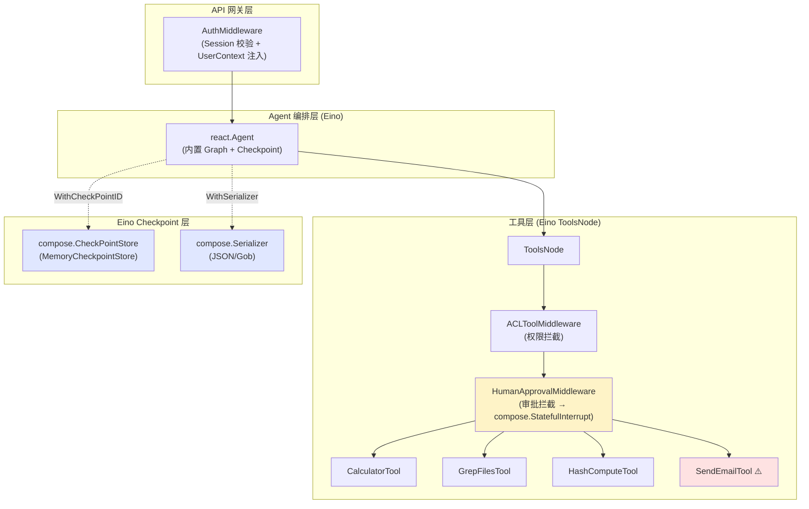
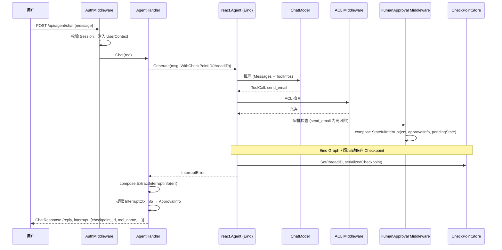
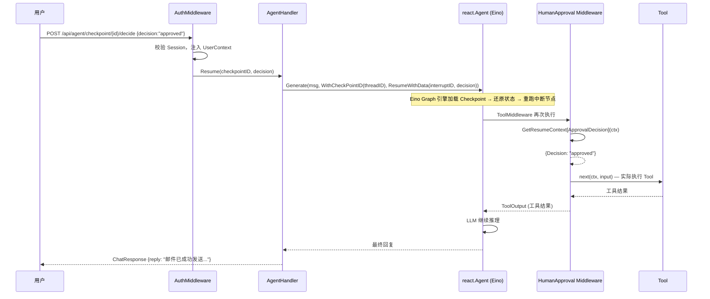
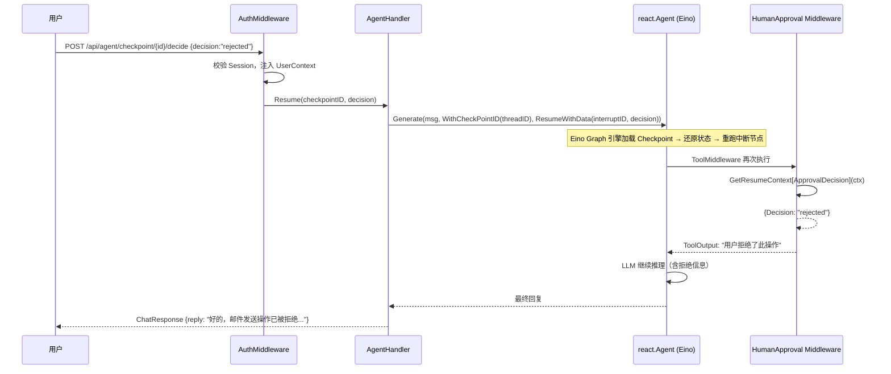

# 中断-恢复子系统

## 模块概述

中断-恢复子系统为通用 Agent 框架提供人机协同（Human-in-the-Loop, HITL）能力。自主执行的 Agent 通常一气呵成地调用工具、完成动作，但在生产环境中，某些操作（如删除数据、发送邮件、转账、提交订单、调用计费 API 等）具有危险性、不可逆性或高代价，不能由 Agent 自行决断。

本模块基于 Eino 框架已有的 interrupt/resume/checkpoint 机制（`compose` 包 v0.9.12），在 ToolMiddleware 中调用 `compose.StatefulInterrupt()` 实现高风险工具调用前主动中断；用户审批后通过 `compose.ResumeWithData()` 从中断点恢复执行，无需从头重跑。中断时的完整运行状态由 Eino Graph 引擎自动持久化至 `compose.CheckPointStore`。

**设计原则**：
1. **复用 Eino interrupt/resume 机制** — 使用 `compose.StatefulInterrupt()` 发起中断、`compose.ResumeWithData()` 恢复执行
2. **复用 Eino CheckPointStore 抽象** — 直接实现 `compose.CheckPointStore`（Get/Set）和 `compose.CheckPointDeleter`（Delete）接口
3. **复用 Eino State 机制** — 通过 `compose.GenLocalState` + `GetInterruptState`/`GetResumeContext` 管理审批状态，不手动序列化消息历史
4. **复用 DOC-01/DOC-02 成果** — 身份校验、会话管理、ACL 拦截、工具注册等直接沿用，避免重复建设

### 与旧方案的核心差异

| 维度 | 旧方案（自研） | 新方案（复用 Eino） |
| ---- | -------------- | ------------------- |
| 中断机制 | 自研"回灌" ToolOutput + 自定义 Checkpoint 保存 | `compose.StatefulInterrupt()` + Eino Graph 引擎自动保存 |
| 恢复机制 | 自研 skipApproval context 标记 + 手动重建消息历史 | `compose.ResumeWithData()` + `GetResumeContext[T]()` 框架自动还原 |
| 状态存储 | 自研 `CheckpointStore`（save/load/delete/list） | 实现 Eino `compose.CheckPointStore`（Get/Set）+ `CheckPointDeleter`（Delete） |
| 恢复语义 | 自定义"节点重跑" | Eino 原生"从中断行继续"——中断点之后的节点重跑，之前的结果保留 |
| 中断信息传递 | 自研 InterruptInfo 附加在 ChatResponse | Eino `InterruptCtx`（含 ID、Address、Info）由 Graph 引擎管理 |
| 风险标记 | 自研 RiskChecker 接口 | 复用 RiskChecker，但中断信号走 Eino 标准路径 |

## 建设目标

| 目标 | 说明 |
| ---- | ---- |
| 统一中断入口 | 框架提供在任意工具调用处主动中断的统一机制，高风险工具调用前自动挂起 |
| 状态持久化 | 实现 Eino `compose.CheckPointStore` 接口（Get/Set）和 `CheckPointDeleter`（Delete），并提供内存版默认实现 |
| 审批交互 | Web 页面展示待审批操作详情，支持批准/拒绝决策提交 |
| 恢复执行 | 基于同一 Checkpoint ID，通过 `compose.ResumeWithData()` 从中断点继续执行 |
| 恢复语义明确 | Eino 原生语义：中断点之前的节点结果保留，中断点本身重跑；业务需保证幂等性 |
| 复用现有模块 | 身份校验、会话管理、ACL 拦截直接沿用 DOC-01/DOC-02，中断/恢复机制直接沿用 Eino |

## Eino Interrupt/Resume 机制概述

Eino v0.9.12 的 `compose` 包提供了完整的中断-恢复-检查点体系，本项目直接复用而非自研。

### 核心原语

```go
// === 中断（compose/interrupt.go）===

// Interrupt 发起无状态中断——仅携带面向用户的信息，不持久化组件内部状态
compose.Interrupt(ctx, info)

// StatefulInterrupt 发起有状态中断——同时持久化组件内部状态，恢复时通过 GetInterruptState 取回
compose.StatefulInterrupt(ctx, info, state)

// === 恢复（compose/resume.go）===

// Resume 隐式"全部恢复"——所有中断点同时恢复，不携带数据
compose.Resume(ctx, interruptIDs...)

// ResumeWithData 定向恢复——向指定中断点注入结构化数据
compose.ResumeWithData(ctx, interruptID, data)

// GetResumeContext[T] 组件在恢复时调用，获取用户注入的决策数据
isResume, hasData, data := compose.GetResumeContext[T](ctx)

// GetInterruptState[T] 组件在恢复时调用，取回中断时持久化的内部状态
wasInterrupted, hasState, state := compose.GetInterruptState[T](ctx)

// === 检查点（compose/checkpoint.go）===

// CheckPointStore Eino 原生检查点存储接口
type CheckPointStore interface {
    Get(ctx context.Context, id string) (data []byte, existed bool, err error)
    Set(ctx context.Context, id string, data []byte) error
}

// CheckPointDeleter 可选的删除接口（不实现则不自动清理过期检查点）
type CheckPointDeleter interface {
    Delete(ctx context.Context, id string) error
}

// 编译选项：注册 CheckPointStore
compose.WithCheckPointStore(store)

// 运行选项：指定 Checkpoint ID（加载 + 写入同一 ID）
compose.WithCheckPointID(checkPointID)
```

### 中断信息结构

```go
// InterruptCtx Eino 原生中断上下文（由 Graph 引擎自动生成和管理）
type InterruptCtx struct {
    ID          string    // 中断点唯一标识
    Address     Address   // 在 Graph 中的层级地址
    Info        any       // 面向用户的中断信息（HumanApprovalMiddleware 注入）
    IsRootCause bool
    Parent      *InterruptCtx
}

// InterruptInfo Eino 原生中断聚合信息（从错误中提取）
type InterruptInfo struct {
    State            any                // 图级别的状态快照
    BeforeNodes      []string           // 执行前中断的节点列表
    AfterNodes       []string           // 执行后中断的节点列表
    RerunNodes       []string           // 需要重跑的节点列表
    SubGraphs        map[string]*InterruptInfo
    InterruptContexts []*InterruptCtx   // 所有中断点的上下文
}
```

### 恢复语义

Eino 的原生恢复语义为**"从中断行继续"**：

| 阶段 | 行为 |
| ---- | ---- |
| 中断前已完成的节点 | 结果保留在 Channel 中，**不重跑** |
| 中断点本身 | **重跑**（重新执行该节点） |
| 中断点之后的节点 | 正常执行 |

与旧方案"节点重跑"的差异：旧方案认为工具在中断时未执行、恢复时才执行；Eino 原生语义认为中断发生在节点执行**内部**（ToolMiddleware 拦截点），恢复时从该节点重新开始执行。对于 HITL 场景，**两者行为等价**——因为工具实际执行发生在 ToolMiddleware 放行之后，中断在放行前，恢复时从放行点重跑，工具同样是在批准时才执行。

**幂等性要求**：由于恢复时中断点节点重跑，若工具在恢复过程中因异常导致部分执行，重试时可能重复调用。业务需保证工具幂等性（本项目的演示工具为模拟操作，无此问题）。

## 系统整体链路设计

```
首次请求 → AuthMiddleware → AgentHandler.Chat()
  → react.Agent.Generate(input, WithCheckPointID(threadID))
  → [ReAct 循环] → [ToolsNode] → [ACLToolMiddleware] → [HumanApprovalMiddleware]
  → [高风险?] → compose.StatefulInterrupt(ctx, approvalInfo, pendingState)
  → [Eino Graph 引擎自动保存 Checkpoint] → 返回 InterruptError
  → AgentHandler 提取 InterruptInfo → 返回 ChatResponse{interrupt}

审批恢复 → AuthMiddleware → AgentHandler.Resume()
  → react.Agent.Generate(input, WithCheckPointID(threadID), compose.ResumeWithData(interruptID, decision))
  → [Eino Graph 引擎加载 Checkpoint] → [还原状态] → [重跑中断节点]
  → [HumanApprovalMiddleware] → GetResumeContext[ApprovalDecision]() → 获取决策
  → [批准] → next(ctx, input) → 执行 Tool → 继续推理
  → [拒绝] → 返回拒绝 ToolOutput → Agent 调整策略
```

**关键原则**：
1. `HumanApprovalMiddleware` 位于 `ACLToolMiddleware` 之后，先过权限关再过审批关
2. 中断通过 `compose.StatefulInterrupt()` 发起，Eino Graph 引擎自动保存完整运行状态
3. 恢复通过 `compose.ResumeWithData()` 注入用户决策，Eino Graph 引擎自动还原状态并重跑中断节点
4. `HumanApprovalMiddleware` 通过 `GetResumeContext[ApprovalDecision]()` 获取用户决策，无需自研 skipApproval
5. Checkpoint 按 `threadID`（即 Checkpoint ID）存取，由 Eino 引擎管理；身份隔离在 API 层校验
6. 恢复时 ACL 检查自动重跑（因为中断节点重跑），无需额外处理

## 整体架构设计



## 业务流程设计

### 1. 中断流程



### 2. 审批流程（批准）



### 3. 审批流程（拒绝）



### 4. 完整流程总览

```mermaid
flowchart TD
    START([用户请求]) --> CHAT[Agent.Generate WithCheckPointID]
    CHAT --> TOOL{LLM 决定调用 Tool?}
    TOOL -->|否| END([返回回复])
    TOOL -->|是| ACL{ACL 检查}
    ACL -->|拒绝| DENY[回灌拒绝 ToolMessage]
    DENY --> CHAT
    ACL -->|允许| RISK{高风险工具?}
    RISK -->|否| EXEC[执行 Tool]
    EXEC --> CHAT
    RISK -->|是| INT[compose.StatefulInterrupt]
    INT --> SAVE[Eino 引擎自动保存 Checkpoint]
    SAVE --> RET[返回 InterruptError → ChatResponse{interrupt}]
    RET --> WAIT{{等待用户决策}}
    WAIT -->|批准| RES_A[ResumeWithData + WithCheckPointID]
    WAIT -->|拒绝| RES_R[ResumeWithData + WithCheckPointID]
    WAIT -->|超时| EXPIRE[Checkpoint 过期清理]
    RES_A --> LOAD[Eino 引擎加载 Checkpoint → 重跑中断节点]
    RES_R --> LOAD
    LOAD --> HITL2[HumanApprovalMiddleware: GetResumeContext]
    HITL2 -->|批准 → next| EXEC2[执行 Tool]
    HITL2 -->|拒绝 → ToolOutput| DENY2[回灌拒绝 ToolMessage]
    EXEC2 --> CHAT
    DENY2 --> CHAT
    EXPIRE --> END

    style RISK fill:#fef3c7
    style INT fill:#fee2e2
    style SAVE fill:#e0e7ff
    style LOAD fill:#e0e7ff
    style HITL2 fill:#fef3c7
```

## 数据模型设计

### ApprovalInfo 审批信息（注入 InterruptCtx.Info）

```go
// ApprovalInfo 面向用户的审批信息，通过 compose.StatefulInterrupt 的 info 参数注入
// 前端通过 InterruptCtx.Info 获取此信息展示审批 UI
type ApprovalInfo struct {
    ToolName string `json:"tool_name"` // 待审批工具名
    ToolArgs string `json:"tool_args"` // 工具参数 JSON（前端展示用）
    Summary  string `json:"summary"`   // 人类可读的操作摘要
}
```

### PendingApprovalState 审批状态（注入 InterruptCtx.State）

```go
// PendingApprovalState 审批等待时的内部状态，通过 compose.StatefulInterrupt 的 state 参数持久化
// 恢复时通过 GetInterruptState[PendingApprovalState]() 取回
type PendingApprovalState struct {
    ToolName string `json:"tool_name"` // 待审批工具名
    ToolArgs string `json:"tool_args"` // 工具参数 JSON
    CallID   string `json:"call_id"`   // Eino ToolCall ID
    UserID   int64  `json:"user_id"`   // 发起用户 ID（安全校验用）
}
```

### ApprovalDecision 审批决策（通过 ResumeWithData 注入）

```go
// ApprovalDecision 用户审批决策，通过 compose.ResumeWithData 注入
// HumanApprovalMiddleware 通过 GetResumeContext[ApprovalDecision]() 获取
type ApprovalDecision struct {
    Decision string `json:"decision"` // "approved" 或 "rejected"
    Reason   string `json:"reason"`  // 拒绝原因（可选）
}
```

### InterruptInfo 中断响应（API 层返回给前端）

```go
// InterruptInfo 中断响应，由 AgentHandler 从 Eino InterruptCtx 中提取，附加在 ChatResponse 中
type InterruptInfo struct {
    CheckpointID string `json:"checkpoint_id"` // Eino Checkpoint ID（= threadID）
    InterruptID  string `json:"interrupt_id"`  // Eino 中断点 ID（用于 ResumeWithData）
    ToolName     string `json:"tool_name"`     // 待审批工具名
    ToolArgs     string `json:"tool_args"`     // 工具参数 JSON
    Summary      string `json:"summary"`       // 人类可读的操作摘要
    ExpiresAt    string `json:"expires_at"`    // 过期时间
}
```

### ChatResponse 变更

在 DOC-02 的 `ChatResponse` 基础上扩展 `Interrupt` 字段：

```go
// ChatResponse Agent 对话响应（扩展 DOC-02）
type ChatResponse struct {
    Reply    string        `json:"reply"`               // Agent 回复
    ThreadID string        `json:"thread_id"`           // 会话线程 ID（= Checkpoint ID）
    Interrupt *InterruptInfo `json:"interrupt,omitempty"` // 非 nil 表示执行被中断
}
```

## CheckPointStore 实现

Eino 定义了 `compose.CheckPointStore`（Get/Set）和可选的 `compose.CheckPointDeleter`（Delete）接口。本项目实现内存版，并扩展 `List` 能力供前端查询。

### Eino 原生接口

```go
// Eino 原生接口（compose/checkpoint.go）—— 本项目直接实现，不自研
type CheckPointStore interface {
    Get(ctx context.Context, id string) (data []byte, existed bool, err error)
    Set(ctx context.Context, id string, data []byte) error
}

type CheckPointDeleter interface {
    Delete(ctx context.Context, id string) error
}
```

### MemoryCheckpointStore 实现

```go
// MemoryCheckpointStore 实现 Eino CheckPointStore + CheckPointDeleter
// 并扩展 ListPending 方法供 API 层查询
type MemoryCheckpointStore struct {
    mu        sync.RWMutex
    data      map[string][]byte          // Eino Checkpoint 序列化数据
    meta      map[string]*CheckpointMeta // 业务元数据（不在 Eino Checkpoint 内）
}

// CheckpointMeta 业务元数据（与 Eino Checkpoint 平行存储）
type CheckpointMeta struct {
    ThreadID  string    `json:"thread_id"`
    UserID    int64     `json:"user_id"`
    Status    string    `json:"status"`    // pending / approved / rejected / expired
    ToolName  string    `json:"tool_name"`
    CreatedAt time.Time `json:"created_at"`
    ExpiresAt time.Time `json:"expires_at"`
}

func NewMemoryCheckpointStore() *MemoryCheckpointStore {
    store := &MemoryCheckpointStore{
        data: make(map[string][]byte),
        meta: make(map[string]*CheckpointMeta),
    }
    go store.cleanupExpired() // 后台清理过期检查点
    return store
}

// === 实现 Eino CheckPointStore 接口 ===

func (s *MemoryCheckpointStore) Get(ctx context.Context, id string) ([]byte, bool, error) {
    s.mu.RLock()
    defer s.mu.RUnlock()
    data, ok := s.data[id]
    return data, ok, nil
}

func (s *MemoryCheckpointStore) Set(ctx context.Context, id string, data []byte) error {
    s.mu.Lock()
    defer s.mu.Unlock()
    s.data[id] = data
    return nil
}

// === 实现 Eino CheckPointDeleter 接口 ===

func (s *MemoryCheckpointStore) Delete(ctx context.Context, id string) error {
    s.mu.Lock()
    defer s.mu.Unlock()
    delete(s.data, id)
    delete(s.meta, id)
    return nil
}

// === 扩展方法（API 层使用） ===

// SaveMeta 保存业务元数据（与 Eino Checkpoint 平行存储）
func (s *MemoryCheckpointStore) SaveMeta(ctx context.Context, id string, meta *CheckpointMeta) error

// GetMeta 获取业务元数据
func (s *MemoryCheckpointStore) GetMeta(ctx context.Context, id string) (*CheckpointMeta, error)

// ListPending 列出指定线程的待审批检查点
func (s *MemoryCheckpointStore) ListPending(ctx context.Context, threadID string, userID int64) ([]*CheckpointMeta, error)
```

**设计说明**：
- `Get`/`Set` 满足 Eino `CheckPointStore` 接口，Graph 引擎自动调用
- `Delete` 满足 Eino `CheckPointDeleter` 接口，支持过期清理
- `meta` 平行存储业务元数据（userID、status 等），这些信息不应进入 Eino Checkpoint 的序列化数据
- `ListPending` 为 API 层扩展方法，供前端查询待审批列表

### 编译时注册

```go
// 在创建 react.Agent 时注入 CheckPointStore
agent, err := react.NewAgent(ctx, &react.AgentConfig{
    ToolCallingModel: chatModel,
    ToolsConfig: compose.ToolsNodeConfig{
        Tools:               tools,
        ToolCallMiddlewares: []compose.ToolMiddleware{aclMiddleware, hitlMiddleware},
    },
    MaxStep: DefaultMaxIterations,
},
    // 通过 AgentOption 注入 compose 编译选项
    agent.WithComposeOptions(
        compose.WithCheckPointStore(checkpointStore),
        compose.WithSerializer(jsonSerializer), // JSON 序列化（便于调试）
    ),
)
```

**类型注册**：Eino Checkpoint 序列化需要注册自定义类型：

```go
func init() {
    // 注册 HITL 相关类型，确保 Checkpoint 序列化/反序列化正常
    schema.RegisterName[ApprovalInfo]("hitl.ApprovalInfo")
    schema.RegisterName[PendingApprovalState]("hitl.PendingApprovalState")
    schema.RegisterName[ApprovalDecision]("hitl.ApprovalDecision")
}
```

## HumanApprovalMiddleware 设计

### 中间件实现

```go
// HumanApprovalMiddleware 创建人工审批中间件
// 基于 Eino compose.StatefulInterrupt / GetResumeContext 实现中断与恢复
func HumanApprovalMiddleware(store *MemoryCheckpointStore, riskChecker RiskChecker) compose.ToolMiddleware {
    return compose.ToolMiddleware{
        Invokable: func(next compose.InvokableToolEndpoint) compose.InvokableToolEndpoint {
            return func(ctx context.Context, input *compose.ToolInput) (*compose.ToolOutput, error) {
                // 1. 恢复场景：获取用户审批决策
                isResume, hasData, decision := compose.GetResumeContext[ApprovalDecision](ctx)
                if isResume && hasData {
                    // 用户已做决策
                    if decision.Decision == "approved" {
                        return next(ctx, input) // 批准 → 执行工具
                    }
                    // 拒绝 → 回灌拒绝信息（与 ACLToolMiddleware 回灌模式一致）
                    return &compose.ToolOutput{
                        Result: fmt.Sprintf("用户拒绝了此操作。原因：%s", decision.Reason),
                    }, nil
                }

                // 2. 首次调用：检查是否高风险
                if !riskChecker.IsHighRisk(input.Name) {
                    return next(ctx, input) // 非高风险，直接执行
                }

                // 3. 高风险工具：发起有状态中断
                uc, ok := model.UserContextFromCtx(ctx)
                if !ok {
                    return nil, fmt.Errorf("user context not found in request")
                }

                summary := riskChecker.ToolSummary(input.Name, input.Arguments)
                approvalInfo := ApprovalInfo{
                    ToolName: input.Name,
                    ToolArgs: input.Arguments,
                    Summary:  summary,
                }
                pendingState := PendingApprovalState{
                    ToolName: input.Name,
                    ToolArgs: input.Arguments,
                    CallID:   input.CallID,
                    UserID:   uc.UserID,
                }

                // 保存业务元数据（与 Eino Checkpoint 平行）
                threadID := getThreadID(ctx)
                store.SaveMeta(ctx, threadID, &CheckpointMeta{
                    ThreadID:  threadID,
                    UserID:    uc.UserID,
                    Status:    "pending",
                    ToolName:  input.Name,
                    CreatedAt: time.Now(),
                    ExpiresAt: time.Now().Add(DefaultCheckpointTTL),
                })

                // 发起有状态中断——Eino 引擎自动保存 Checkpoint
                compose.StatefulInterrupt(ctx, approvalInfo, pendingState)

                // 不会执行到这里——StatefulInterrupt 会触发 error 返回
                return nil, nil
            }
        },
    }
}
```

### 中间件链顺序

```
ToolCall
  → [ToolsNode 调度]
    → [ACLToolMiddleware]           ← DOC-02 提供
      → 权限不足 → 回灌拒绝 ToolOutput
      → 权限允许 ↓
    → [HumanApprovalMiddleware]     ← DOC-03 新增
      → 非高风险 → next(ctx, input) 直接执行
      → 高风险 → compose.StatefulInterrupt → Eino 引擎保存 Checkpoint → 返回 InterruptError
      → 恢复 + 批准 → next(ctx, input) 执行工具
      → 恢复 + 拒绝 → 回灌拒绝 ToolOutput
    → [Tool 执行]
```

**ACL 不会在恢复时被绕过**：恢复时 Eino 重跑中断节点（即 ToolsNode → ACLToolMiddleware → HumanApprovalMiddleware），ACL 检查会自动再次执行。若用户权限在等待期间被撤销，ACL 仍会拦截。

## 高风险工具标记设计

### RiskChecker 接口

```go
// RiskChecker 工具风险评估器
type RiskChecker interface {
    // IsHighRisk 判断工具是否需要人工审批
    IsHighRisk(toolName string) bool

    // ToolSummary 生成工具调用的人类可读摘要（用于前端展示）
    ToolSummary(toolName string, argsJSON string) string
}
```

### MemoryRiskChecker 实现

```go
// ToolRiskConfig 工具风险配置
type ToolRiskConfig struct {
    HighRisk   bool   // 是否高风险
    SummaryTpl string // 操作摘要模板，支持 {args} 占位符
}

// MemoryRiskChecker 基于配置的风险检查器
type MemoryRiskChecker struct {
    configs map[string]ToolRiskConfig
}

func NewMemoryRiskChecker() *MemoryRiskChecker {
    return &MemoryRiskChecker{
        configs: map[string]ToolRiskConfig{
            "send_email": {
                HighRisk:   true,
                SummaryTpl: "发送邮件：{args}",
            },
            // 其他工具默认不配置，视为低风险
        },
    }
}
```

## AgentHandler 变更

### Chat() 方法变更

```go
func (h *AgentHandler) Chat(c *gin.Context) {
    // ... 现有逻辑：绑定请求、校验身份 ...

    // 调用 Agent（注入 Checkpoint ID）
    result, err := h.supervisor.Generate(ctx, messages,
        agent.WithComposeOptions(
            compose.WithCheckPointID(req.ThreadID),
        ),
    )

    if err != nil {
        // 检测是否为中断错误
        if compose.IsInterruptRerunError(err) {
            interruptInfo := compose.ExtractInterruptInfo(err)
            return h.handleInterrupt(c, req, interruptInfo)
        }
        // ... 现有错误处理 ...
    }

    // 正常回复
    c.JSON(http.StatusOK, ChatResponse{Reply: result.Content, ThreadID: req.ThreadID})
}

// handleInterrupt 处理中断响应
func (h *AgentHandler) handleInterrupt(c *gin.Context, req ChatRequest, info *compose.InterruptInfo) {
    // 从 InterruptContexts 中提取审批信息
    for _, ic := range info.InterruptContexts {
        approvalInfo, ok := ic.Info.(ApprovalInfo)
        if !ok {
            continue
        }

        meta, _ := h.checkpointStore.GetMeta(c.Request.Context(), req.ThreadID)

        c.JSON(http.StatusOK, ChatResponse{
            Reply:    "我需要您的审批才能执行此操作，请在审批面板中确认。",
            ThreadID: req.ThreadID,
            Interrupt: &InterruptInfo{
                CheckpointID: req.ThreadID,
                InterruptID:  ic.ID,
                ToolName:     approvalInfo.ToolName,
                ToolArgs:     approvalInfo.ToolArgs,
                Summary:      approvalInfo.Summary,
                ExpiresAt:    meta.ExpiresAt.Format(time.RFC3339),
            },
        })
        return
    }
}
```

### 新增 Resume() 方法

```go
func (h *AgentHandler) Resume(c *gin.Context) {
    checkpointID := c.Param("id")
    var req ApprovalDecision
    if err := c.ShouldBindJSON(&req); err != nil {
        c.JSON(http.StatusBadRequest, gin.H{"error": "invalid request"})
        return
    }

    // 身份校验
    uc, ok := model.UserContextFromCtx(c.Request.Context())
    if !ok {
        c.JSON(http.StatusUnauthorized, gin.H{"error": "unauthorized"})
        return
    }

    // 校验 CheckpointMeta 归属
    meta, err := h.checkpointStore.GetMeta(c.Request.Context(), checkpointID)
    if err != nil || meta == nil {
        c.JSON(http.StatusNotFound, gin.H{"error": "checkpoint not found"})
        return
    }
    if meta.UserID != uc.UserID {
        c.JSON(http.StatusForbidden, gin.H{"error": "forbidden"})
        return
    }
    if meta.Status != "pending" {
        c.JSON(http.StatusConflict, gin.H{"error": "checkpoint not pending"})
        return
    }
    if time.Now().After(meta.ExpiresAt) {
        c.JSON(http.StatusGone, gin.H{"error": "checkpoint expired"})
        return
    }

    // 通过 Eino 原生恢复机制继续执行
    // 关键：WithCheckPointID 加载 Checkpoint + ResumeWithData 注入决策
    result, err := h.supervisor.Generate(c.Request.Context(), []*schema.Message{},
        agent.WithComposeOptions(
            compose.WithCheckPointID(checkpointID),
        ),
        compose.ResumeWithData(meta.InterruptID, req),
    )

    if err != nil {
        c.JSON(http.StatusInternalServerError, gin.H{"error": "resume failed"})
        return
    }

    // 更新元数据状态
    meta.Status = req.Decision
    h.checkpointStore.SaveMeta(c.Request.Context(), checkpointID, meta)

    c.JSON(http.StatusOK, ChatResponse{
        Reply:    result.Content,
        ThreadID: checkpointID,
    })
}
```

## 示例工具：send_email

为演示人机协同流程，新增一个模拟发送邮件的高风险工具。此工具仅 AdminAgent 可用，且需要人工审批。

### 工具定义

```go
type SendEmailInput struct {
    To      string `json:"to"      jsonschema:"description=收件人邮箱地址"`
    Subject string `json:"subject" jsonschema:"description=邮件主题"`
    Body    string `json:"body"    jsonschema:"description=邮件正文"`
}

type SendEmailOutput struct {
    Success bool   `json:"success"`
    Message string `json:"message"`
    Summary string `json:"summary"`
}

func NewSendEmailTool() (tool.InvokableTool, error) {
    return utils.InferTool[SendEmailInput, SendEmailOutput](
        "send_email",
        "发送邮件到指定邮箱地址（模拟，需人工审批）",
        func(ctx context.Context, input SendEmailInput) (SendEmailOutput, error) {
            summary := fmt.Sprintf("邮件已发送至 %s，主题：%s", input.To, input.Subject)
            return SendEmailOutput{
                Success: true,
                Message: summary,
                Summary: summary,
            }, nil
        },
    )
}
```

### 工具注册与 Agent 分配

在 `main.go` 中注册 `send_email` 工具并分配给 AdminAgent：

```go
// registerTools
creators := []toolCreator{
    {"calculator", tools.NewCalculatorTool},
    {"grep_files", tools.NewGrepFilesTool},
    {"hash_compute", tools.NewHashComputeTool},
    {"send_email", tools.NewSendEmailTool},
}

// AdminAgent 定义
{
    Name:         "AdminAgent",
    IntendedUse:  "处理哈希计算、发送邮件等管理员工具任务",
    SystemPrompt: "你是一个管理员工具助手。可以使用哈希计算和发送邮件工具完成任务。发送邮件前需要获得人工审批。",
    ToolNames:    []string{"hash_compute", "send_email"},
}
```

## API 接口设计

### 新增接口

| 方法 | 路径 | 请求体 | 响应体 | 说明 |
| ---- | ---- | ------ | ------ | ---- |
| POST | `/api/agent/checkpoint/{id}/decide` | `{"decision":"approved/rejected","reason":"..."}` | `{"reply":"xxx","thread_id":"xxx"}` | 提交审批决策（Eino ResumeWithData） |
| GET | `/api/agent/checkpoints` | _(Query: thread_id)_ | `{"checkpoints":[...]}` | 查询待审批检查点（基于 CheckpointMeta） |

### 变更接口

| 方法 | 路径 | 变更说明 |
| ---- | ---- | -------- |
| POST | `/api/agent/chat` | 响应体新增 `interrupt` 字段（从 Eino InterruptCtx 提取） |

### 审批决策请求

```json
{
    "decision": "approved",
    "reason": ""
}
```

或：

```json
{
    "decision": "rejected",
    "reason": "收件人地址有误，请确认后重试"
}
```

### 错误响应

| HTTP 状态码 | code | 说明 |
| ----------- | ---- | ---- |
| 401 | UNAUTHORIZED | Session 无效/过期 |
| 403 | FORBIDDEN | 审批人与中断用户不一致 |
| 404 | CHECKPOINT_NOT_FOUND | Checkpoint 不存在（Eino CheckPointStore.Get 返回不存在） |
| 409 | CHECKPOINT_NOT_PENDING | Checkpoint 已审批 |
| 410 | CHECKPOINT_EXPIRED | Checkpoint 已过期 |

## 前端交互设计

### ChatPage 扩展

在现有对话页面基础上，增加中断审批交互：

1. **消息气泡**：当 `ChatResponse` 包含 `interrupt` 字段时，在 Agent 回复下方显示审批卡片
2. **审批卡片**：展示操作摘要、工具参数、批准/拒绝按钮、倒计时提示
3. **决策提交**：点击批准/拒绝后调用 `/api/agent/checkpoint/{id}/decide`，将恢复结果追加为新消息

### 消息类型扩展

```typescript
interface Message {
    id: string
    role: 'user' | 'assistant'
    content: string
    isError?: boolean
    interrupt?: InterruptInfo  // [新增] 中断信息
}

interface InterruptInfo {
    checkpoint_id: string
    interrupt_id: string   // [新增] Eino 中断点 ID
    tool_name: string
    tool_args: string
    summary: string
    expires_at: string
}
```

### 审批卡片 UI 交互

```
┌──────────────────────────────────────────────────┐
│ 🤖 Agent                                         │
│ 我需要您的审批才能发送邮件，请在审批面板中确认。    │
│                                                  │
│ ┌──────────────────────────────────────────────┐ │
│ │ ⚠️ 操作审批                                   │ │
│ │                                              │ │
│ │ 工具：send_email                              │ │
│ │ 摘要：发送邮件：收件人 alice@example.com，     │ │
│ │       主题：项目进展                           │ │
│ │                                              │ │
│ │ 详细参数：                                    │ │
│ │   收件人：alice@example.com                   │ │
│ │   主题：项目进展                               │ │
│ │   正文：本周完成了人机协同模块...               │ │
│ │                                              │ │
│ │ ⏳ 剩余审批时间：25:30                         │ │
│ │                                              │ │
│ │ [✅ 批准]              [❌ 拒绝]              │ │
│ └──────────────────────────────────────────────┘ │
└──────────────────────────────────────────────────┘
```

### 快捷提问扩展

新增一条触发审批流程的快捷提问：

```typescript
{ label: '📧 发送邮件', message: '发送邮件给 alice@example.com，主题是项目进展' }
```

## 身份上下文与安全设计

### 中断状态隔离

- CheckpointMeta 按 `userID` 隔离：恢复时校验 `meta.UserID == uc.UserID`，杜绝越权审批
- Eino Checkpoint 按 `threadID`（即 Checkpoint ID）存取，不同会话线程的中断互不干扰
- 用户只能审批自己触发的中断，不能审批其他用户的

### ACL 不会在恢复时被绕过

恢复时 Eino 重跑中断节点，`ACLToolMiddleware` 会再次执行权限检查。若用户权限在等待期间被撤销，ACL 仍会拦截。这是 Eino "从中断行继续"语义的自然保障，无需额外代码。

### 安全约束

- `UserContext` 仍然仅通过 `context.Context` 透传，不出现在 LLM Prompt 中
- `ApprovalInfo`（面向用户）和 `PendingApprovalState`（内部状态）通过 Eino InterruptCtx 分离存储，不进入 `schema.Message`
- `ApprovalDecision`（用户决策）通过 `compose.ResumeWithData` 注入，在 `GetResumeContext` 中获取，不经过 LLM

## 与 DOC-01/DOC-02 的集成关系

| 集成点 | DOC-01/DOC-02 提供 | DOC-03 使用 |
| ------ | ------------------- | ----------- |
| 身份校验 | `AuthMiddleware` + `UserContext` | CheckpointMeta 按 userID 隔离，恢复时校验身份 |
| 权限检查 | `ACLToolMiddleware` + `ACLChecker` | 中间件链：先 ACL 后审批；恢复时 ACL 自动重跑 |
| 工具调度 | `ToolsNode` + `ToolMiddleware` | `HumanApprovalMiddleware` 作为新中间件嵌入链 |
| 工具注册 | `ToolRegistry` + `InferTool` | `send_email` 工具按相同规范注册 |
| ReAct 循环 | `react.Agent` + `AgentConfig` | 通过 `agent.WithComposeOptions` 注入 Checkpoint 和 Interrupt 配置 |
| 会话管理 | `SessionStore` | CheckpointMeta 与 Session 关联，共享 session 校验 |
| 前端架构 | `ChatPage` + `Dashboard` | 扩展消息类型和审批 UI，复用现有组件框架 |

### Eino 生态复用清单

| Eino 能力 | 包路径 | 本项目使用方式 |
| --------- | ------ | -------------- |
| `StatefulInterrupt` | `compose/interrupt.go` | HumanApprovalMiddleware 中发起有状态中断 |
| `ResumeWithData` | `compose/resume.go` | 恢复时注入用户审批决策 |
| `GetResumeContext[T]` | `compose/resume.go` | HumanApprovalMiddleware 中获取用户决策 |
| `GetInterruptState[T]` | `compose/resume.go` | HumanApprovalMiddleware 中取回中断时的内部状态 |
| `ExtractInterruptInfo` | `compose/interrupt.go` | AgentHandler 中从错误提取中断信息 |
| `IsInterruptRerunError` | `compose/interrupt.go` | AgentHandler 中判断是否为中断错误 |
| `CheckPointStore` 接口 | `compose/checkpoint.go` | MemoryCheckpointStore 实现 Get/Set |
| `CheckPointDeleter` 接口 | `compose/checkpoint.go` | MemoryCheckpointStore 实现 Delete |
| `WithCheckPointStore` | `compose/checkpoint.go` | 编译时注册 Checkpoint 存储 |
| `WithCheckPointID` | `compose/checkpoint.go` | 运行时指定 Checkpoint ID |
| `WithSerializer` | `compose/checkpoint.go` | 编译时注册序列化器 |
| `schema.RegisterName[T]` | `schema/` | 注册 HITL 类型以支持 Checkpoint 序列化 |
| `agent.WithComposeOptions` | `flow/agent/react` | 将 compose 编译选项传递给 react.Agent |

## 异常处理设计

### 异常分类与处理策略

| 异常类型 | 触发场景 | 处理策略 | 返回给用户 |
| -------- | -------- | -------- | ---------- |
| 高风险工具中断 | `compose.StatefulInterrupt` 触发 | 返回 ChatResponse{interrupt} | 前端展示审批卡片 |
| 检查点不存在 | 审批 ID 无效或未注册 | 返回 404 错误 | 提示检查点不存在 |
| 检查点已审批 | 重复审批同一检查点 | 返回 409 错误 | 提示已审批 |
| 检查点已过期 | 审批超时（默认 30 分钟） | 返回 410 错误 | 提示已过期 |
| 越权审批 | 审批人与中断用户不一致 | 返回 403 错误 | 提示无权审批 |
| 权限在等待期被撤销 | 恢复时 ACL 再次检查不通过 | ACLToolMiddleware 回灌拒绝 | Agent 告知用户权限不足 |
| 工具执行失败 | 恢复批准后工具运行时错误 | 回灌工具错误信息 | Agent 调整策略或告知用户 |
| Checkpoint 加载失败 | Eino CheckPointStore.Get 出错 | 返回 500 错误 | 提示系统异常 |

### 中断 vs 回灌 vs 中断策略

```
权限不足            → 回灌（ACLToolMiddleware 返回拒绝 ToolOutput，Agent 调整策略）
高风险工具          → 中断（compose.StatefulInterrupt → Eino 保存 Checkpoint → 等人工决策）
工具执行失败        → 回灌（返回错误 ToolOutput，Agent 调整策略）
Checkpoint 过期     → 中断（不可恢复，用户需重新发起操作）
Checkpoint 加载失败 → 中断（系统级错误，返回 5xx）
```

## 项目目录结构（新增/变更）

```
kingsoft-agent/
├── internal/
│   ├── agent/                       # Agent 编排
│   │   ├── react.go                 # ReAct Agent 工厂（扩展 WithComposeOptions）
│   │   ├── supervisor.go            # Supervisor Agent 工厂
│   │   ├── handler.go               # Agent HTTP Handler（新增 Resume + 中断处理）
│   │   ├── callback.go              # 身份上下文透传 Callback
│   │   ├── llm.go                   # LLM 配置
│   │   └── mock_llm.go              # Mock ChatModel（新增 send_email 路由）
│   ├── hitl/                        # [新增] 中断-恢复子系统
│   │   ├── types.go                 # ApprovalInfo / PendingApprovalState / ApprovalDecision / InterruptInfo
│   │   ├── store.go                 # MemoryCheckpointStore（实现 Eino CheckPointStore + CheckPointDeleter）
│   │   ├── middleware.go            # HumanApprovalMiddleware（基于 compose.StatefulInterrupt / GetResumeContext）
│   │   └── risk.go                  # RiskChecker 接口 + MemoryRiskChecker 实现
│   ├── toolreg/                      # 工具注册与调用
│   │   ├── registry.go              # 工具注册中心
│   │   ├── middleware.go            # ACLToolMiddleware
│   │   └── tools/                   # 具体工具实现
│   │       ├── calculator.go        # 计算器工具
│   │       ├── grep.go              # 文件搜索工具
│   │       ├── hash_compute.go      # 哈希计算工具
│   │       └── send_email.go        # [新增] 发送邮件工具（高风险，需审批）
│   ├── auth/                        # [DOC-01] 认证与权限
│   ├── settings/                    # LLM 配置管理
│   ├── context/                     # [DOC-04] 上下文管理（待建）
│   └── memory/                      # [DOC-05] 记忆管理（待建）
├── api/
│   └── router.go                    # HTTP 路由（新增审批相关路由）
└── pkg/
    └── model/
        └── ...
```

## 交付物清单与验收标准

### 可运行 Demo 验收场景

| 场景 | 验收标准 |
| ---- | -------- |
| 高风险工具中断 | admin 用户触发 `send_email` 工具调用，`compose.StatefulInterrupt` 触发，Eino 保存 Checkpoint，前端展示审批卡片 |
| 审批批准 | 用户点击"批准"，`compose.ResumeWithData` 注入决策，`GetResumeContext` 获取批准，工具执行，Agent 回复"邮件已成功发送" |
| 审批拒绝 | 用户点击"拒绝"，`compose.ResumeWithData` 注入拒绝，`GetResumeContext` 获取拒绝，回灌拒绝 ToolOutput，Agent 回复"邮件发送被拒绝" |
| 权限拦截优先 | visitor 用户触发 `send_email`，ACL 拦截在审批之前（`ACLToolMiddleware` 在 `HumanApprovalMiddleware` 之前） |
| 恢复时 ACL 自动重跑 | 恢复时 Eino 重跑中断节点，ACLToolMiddleware 再次执行，若权限已撤销则拦截 |
| 中断状态持久化 | 中断后 Eino 自动保存 Checkpoint 至 MemoryCheckpointStore，基于同一 threadID 能加载并恢复 |
| 中断超时 | 检查点超过 30 分钟未审批自动过期，再次审批返回过期提示 |
| 越权审批 | 用户 A 的中断 Checkpoint，用户 B 无法审批（CheckpointMeta.UserID 校验） |
| 低风险工具不受影响 | `calculator`、`grep_files`、`hash_compute` 调用流程与 DOC-02 完全一致，无中断 |
| CheckPointStore 接口 | 实现 Eino `compose.CheckPointStore`（Get/Set）+ `compose.CheckPointDeleter`（Delete），可替换为 Redis 等持久化实现 |

### 代码结构要求

- `HumanApprovalMiddleware` 基于 `compose.StatefulInterrupt`/`GetResumeContext` 实现，不自研中断/恢复机制
- `MemoryCheckpointStore` 实现 Eino `compose.CheckPointStore` + `CheckPointDeleter` 接口，不自研存储抽象
- 中断/恢复对现有工具（calculator、grep_files、hash_compute）无侵入性改动
- 身份上下文通过 `context.Context` 透传，不出现在 `schema.Message` 中
- 恢复语义为 Eino 原生"从中断行继续"：中断前节点结果保留，中断点重跑
- HITL 自定义类型通过 `schema.RegisterName[T]` 注册，确保 Checkpoint 序列化/反序列化正常
