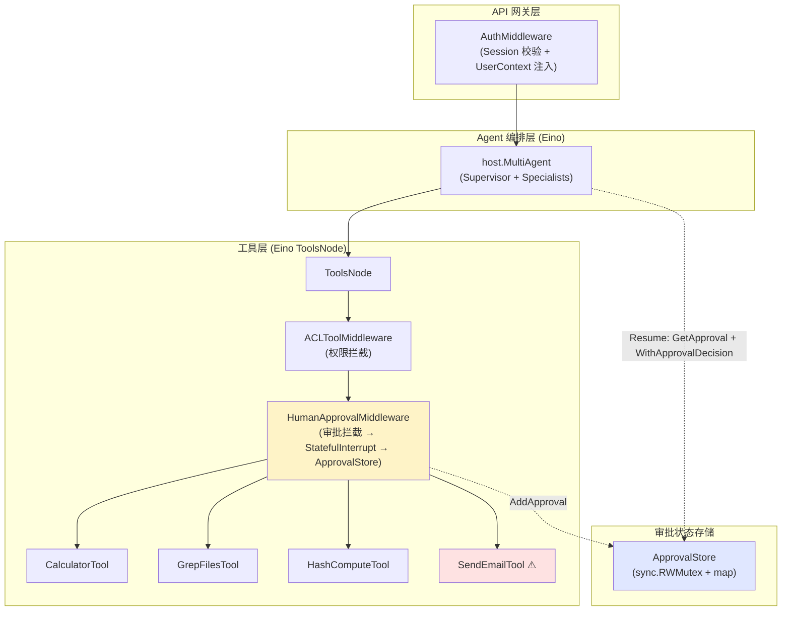
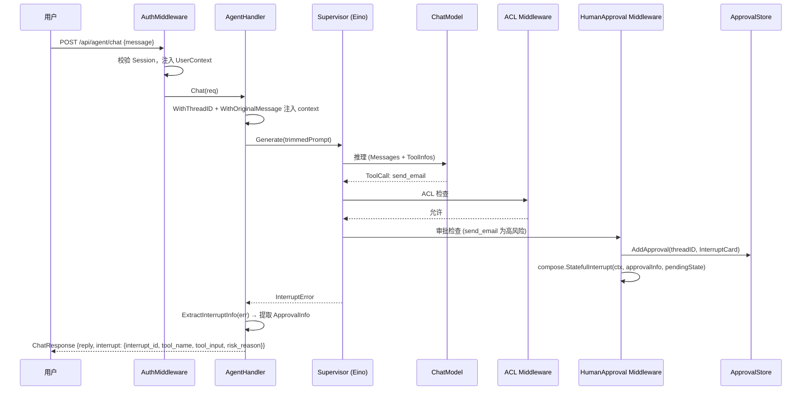
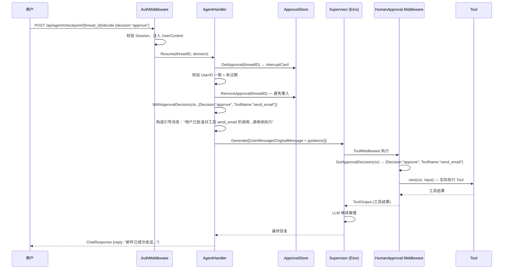
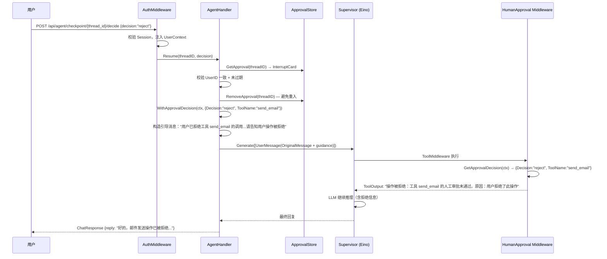

# 中断-恢复子系统

## 模块概述

中断-恢复子系统为通用 Agent 框架提供人机协同（Human-in-the-Loop, HITL）能力。自主执行的 Agent 通常一气呵成地调用工具、完成动作，但在生产环境中，某些操作（如删除数据、发送邮件、转账、提交订单、调用计费 API 等）具有危险性、不可逆性或高代价，不能由 Agent 自行决断。

本模块基于 Eino 框架的 `compose.StatefulInterrupt()` 信号机制发起中断，自研 `ApprovalStore` 管理待审批状态，恢复时通过自定义 context key 注入审批决策并重调 `supervisor.Generate`，以引导提示确保 LLM 继续执行原操作。

**设计原则**：
1. **信号中断复用 Eino** — 使用 `compose.StatefulInterrupt()` 作为中断信号，由 Eino Graph 引擎传播到 handler
2. **自研 ApprovalStore** — 因 Eino `react.NewAgent`/`host.NewMultiAgent` 不暴露 `WithCheckPointStore` 编译选项，无法使用原生 Checkpoint 恢复机制，改为自研审批状态存储
3. **Context Key 注入决策** — 恢复时通过 `WithApprovalDecision()` 注入审批决策，中间件通过 `GetApprovalDecision()` 读取后放行或拒绝
4. **引导提示确保一致性** — 恢复时在用户消息后追加引导提示，明确告知 LLM 已获批准/被拒绝，确保高概率再次调用同一工具
5. **复用 DOC-01/DOC-02 成果** — 身份校验、会话管理、ACL 拦截、工具注册等直接沿用，避免重复建设

### 为什么不使用 Eino 原生 Checkpoint 恢复

经研究 Eino v0.9.12 源码，`react.NewAgent` 和 `host.NewMultiAgent` 在内部编译 Graph，**不接受外部 compose 编译选项**（`WithCheckPointStore` 是 `GraphCompileOption`，但 agent 工厂方法不暴露它）。Checkpoint 从 host graph 向 specialist Lambda 的传播也被 `extractOption` 类型过滤阻断。

**替代方案**：
1. `compose.StatefulInterrupt()` 作为**信号机制**——中断 Agent 流程并携带 `ApprovalInfo` 到 handler
2. 自研 `ApprovalStore` 管理待审批状态（按 threadID 索引）
3. 恢复时通过自定义 context key 注入审批决策，中间件读取后放行或拒绝
4. handler 重新调用 `supervisor.Generate`，LLM 再次推理，中间件拦截到审批决策后执行工具

### 与纯 Eino 方案的对比

| 维度 | Eino 原生 Checkpoint（不可用） | 本方案（自研 ApprovalStore + Context Key） |
| ---- | ------------------------------ | ------------------------------------------ |
| 中断机制 | `compose.StatefulInterrupt()` + Eino Graph 引擎自动保存 | `compose.StatefulInterrupt()` 作为信号 + 自研 `ApprovalStore` 保存审批卡片 |
| 恢复机制 | `compose.ResumeWithData()` + `GetResumeContext[T]()` | `WithApprovalDecision()` context key + 重调 `supervisor.Generate` + 引导提示 |
| 状态存储 | 实现 Eino `compose.CheckPointStore`（Get/Set） | 自研 `ApprovalStore`（Add/Get/Remove/List）+ `InterruptCard` |
| 恢复语义 | Eino 原生"从中断行继续"——中断点之后的节点重跑，之前的结果保留 | 重新调用 `supervisor.Generate`——LLM 重新推理，通过引导提示确保调用同一工具 |
| 审批信息传递 | `InterruptCtx.Info` 由 Graph 引擎管理 | `InterruptCtx.Info` 提取后构造 `InterruptInfo` 返回前端；`InterruptCard` 存 `ApprovalStore` |
| 风险标记 | `RiskChecker` 接口 | 复用 `RiskChecker` + 新增 `IntentRiskChecker` 意图兜底 |

## 建设目标

| 目标 | 说明 |
| ---- | ---- |
| 统一中断入口 | 框架提供在任意工具调用处主动中断的统一机制，高风险工具调用前自动挂起 |
| 审批状态持久化 | 自研 `ApprovalStore` 管理待审批状态，支持按 threadID 索引、过期清理、列表查询 |
| 审批交互 | Web 页面展示待审批操作详情，支持批准/拒绝决策提交 |
| 恢复执行 | 恢复时注入审批决策 + 引导提示，重调 `supervisor.Generate` 继续执行 |
| 意图兜底 | 新增 `IntentRiskChecker`，当 LLM 未调用高风险工具但用户意图匹配时，强制触发审批 |
| 流式支持 | SSE 流式对话和流式审批恢复，前端可实时观察 Agent 推理步骤和工具执行过程 |
| 复用现有模块 | 身份校验、会话管理、ACL 拦截直接沿用 DOC-01/DOC-02 |

## Eino Interrupt 机制概述

本模块使用 Eino v0.9.12 `compose` 包的 `StatefulInterrupt` 作为中断信号，但**不使用**其原生 Checkpoint 恢复机制。

### 使用到的核心原语

```go
// === 中断信号 ===

// StatefulInterrupt 发起有状态中断——本模块用作信号机制
// 中断时携带 ApprovalInfo（面向用户）和 PendingApprovalState（内部状态）
compose.StatefulInterrupt(ctx, approvalInfo, pendingState)

// === 中断信息提取 ===

// ExtractInterruptInfo 从错误中提取中断信息（handler 使用）
info, existed := compose.ExtractInterruptInfo(err)

// InterruptCtx 中断上下文（由 Graph 引擎自动生成）
type InterruptCtx struct {
    ID          string    // 中断点唯一标识
    Address     Address   // 在 Graph 中的层级地址
    Info        any       // 面向用户的中断信息（ApprovalInfo）
    IsRootCause bool
    Parent      *InterruptCtx
}

// InterruptInfo 中断聚合信息
type InterruptInfo struct {
    InterruptContexts []*InterruptCtx   // 所有中断点的上下文
    // ... 其他字段
}
```

### 未使用的 Eino 原语（及原因）

| 原语 | 不使用原因 |
| ---- | ---------- |
| `compose.ResumeWithData()` | 需要 `WithCheckPointStore` 编译选项，`react.NewAgent` 不暴露 |
| `compose.GetResumeContext[T]()` | 依赖 `ResumeWithData` 注入的数据，本方案无法使用 |
| `compose.WithCheckPointStore()` | `react.NewAgent`/`host.NewMultiAgent` 不暴露编译选项 |
| `compose.WithCheckPointID()` | 同上，无法在 agent 工厂方法中传入 |

## 系统整体链路设计

```
首次请求 → AuthMiddleware → AgentHandler.Chat()
  → supervisor.Generate(trimmedPrompt)
  → [ReAct 循环] → [ToolsNode] → [ACLToolMiddleware] → [HumanApprovalMiddleware]
  → [高风险?] → compose.StatefulInterrupt(ctx, approvalInfo, pendingState)
  → [ApprovalStore.AddApproval(threadID, card)] → 返回 InterruptError
  → AgentHandler 提取 InterruptInfo → 返回 ChatResponse{interrupt}

审批恢复 → AuthMiddleware → AgentHandler.Resume()
  → ApprovalStore.GetApproval(threadID) → 校验身份 + 过期
  → ApprovalStore.RemoveApproval(threadID) → 避免重入
  → WithApprovalDecision(ctx, decision) + WithThreadID + WithOriginalMessage
  → 构造引导消息（OriginalMessage + 审批提示）
  → supervisor.Generate(guidedPrompt)
  → [HumanApprovalMiddleware] → GetApprovalDecision(ctx) → 获取决策
  → [批准] → next(ctx, input) → 执行 Tool → 继续推理
  → [拒绝] → 回灌拒绝 ToolOutput → Agent 调整策略
```

**关键原则**：
1. `HumanApprovalMiddleware` 位于 `ACLToolMiddleware` 之后，先过权限关再过审批关
2. 中断通过 `compose.StatefulInterrupt()` 发起，Eino Graph 引擎传播 InterruptError
3. 审批状态由 `ApprovalStore` 管理（使用 `context.Background()`，独立于请求 context 生命周期）
4. 恢复时重调 `supervisor.Generate`，通过引导提示确保 LLM 再次调用同一工具
5. 恢复时 ACL 不会绕过——中间件链完整执行，`ACLToolMiddleware` 仍会检查权限

## 整体架构设计



## 业务流程设计

### 1. 中断流程



### 2. 审批流程（批准）



### 3. 审批流程（拒绝）



### 4. 完整流程总览

```mermaid
flowchart TD
    START([用户请求]) --> CHAT[Agent.Generate]
    CHAT --> TOOL{LLM 决定调用 Tool?}
    TOOL -->|否| END([返回回复])
    TOOL -->|是| ACL{ACL 检查}
    ACL -->|拒绝| DENY[回灌拒绝 ToolMessage]
    DENY --> CHAT
    ACL -->|允许| RISK{高风险工具?}
    RISK -->|否| EXEC[执行 Tool]
    EXEC --> CHAT
    RISK -->|是| INT[compose.StatefulInterrupt]
    INT --> SAVE[ApprovalStore.AddApproval]
    SAVE --> RET[返回 InterruptError → ChatResponse{interrupt}]
    RET --> WAIT{{等待用户决策}}
    WAIT -->|批准| RES_A[RemoveApproval + WithApprovalDecision + 引导提示]
    WAIT -->|拒绝| RES_R[RemoveApproval + WithApprovalDecision + 引导提示]
    WAIT -->|超时| EXPIRE[ApprovalStore 过期清理]
    RES_A --> LOAD[supervisor.Generate 引导消息]
    RES_R --> LOAD
    LOAD --> HITL2[HumanApprovalMiddleware: GetApprovalDecision]
    HITL2 -->|批准 + ToolName匹配 → next| EXEC2[执行 Tool]
    HITL2 -->|拒绝 → 回灌拒绝 ToolOutput| DENY2[回灌拒绝 ToolMessage]
    EXEC2 --> CHAT
    DENY2 --> CHAT
    EXPIRE --> END

    style RISK fill:#fef3c7
    style INT fill:#fee2e2
    style SAVE fill:#e0e7ff
    style LOAD fill:#e0e7ff
    style HITL2 fill:#fef3c7
```

## 数据模型设计

### ApprovalInfo 审批信息（注入 StatefulInterrupt 的 info 参数）

```go
// ApprovalInfo 面向用户的审批信息
// 通过 compose.StatefulInterrupt 的 info 参数传递，由 handler 提取后返回给前端
type ApprovalInfo struct {
    ToolName   string `json:"tool_name"`   // 待审批工具名
    ToolInput  string `json:"tool_input"`  // 工具参数 JSON
    RiskReason string `json:"risk_reason"` // 高风险原因
    CallID     string `json:"call_id"`     // Eino ToolCall ID
    ThreadID   string `json:"thread_id"`   // 会话线程 ID
    UserID     int64  `json:"user_id"`     // 发起用户 ID（安全校验用）
}
```

### PendingApprovalState 审批状态（注入 StatefulInterrupt 的 state 参数）

```go
// PendingApprovalState 审批等待时的内部状态
// 通过 compose.StatefulInterrupt 的 state 参数持久化
type PendingApprovalState struct {
    ToolName  string `json:"tool_name"`
    ToolInput string `json:"tool_input"`
    CallID    string `json:"call_id"`
    ThreadID  string `json:"thread_id"`
}
```

### ApprovalDecisionCtx 审批决策（恢复时通过 context key 注入）

```go
// ApprovalDecisionCtx 审批决策上下文
// 恢复时由 handler 注入 context，中间件读取后放行或拒绝
// 不同于 Eino 原生的 ResumeWithData，本方案通过 context.WithValue 传递
type ApprovalDecisionCtx struct {
    ThreadID string // 会话线程 ID
    ToolName string // 目标工具名（匹配当前工具调用才生效）
    Decision string // approve / reject
    Comment  string // 拒绝原因
}
```

### InterruptCard 待审批卡片（存储在 ApprovalStore 中）

```go
// InterruptCard 待审批检查点卡片
// 存储在 ApprovalStore 中，供 API 查询和前端展示
type InterruptCard struct {
    InterruptID     string       `json:"interrupt_id"`     // 中断点 ID
    ApprovalInfo    ApprovalInfo `json:"approval_info"`    // 审批信息
    OriginalMessage string       `json:"original_message"` // 触发中断的用户原始消息
    CreatedAt       time.Time    `json:"created_at"`       // 创建时间
    ExpiresAt       time.Time    `json:"expires_at"`       // 过期时间
}
```

### InterruptInfo 中断响应（API 层返回给前端）

```go
// InterruptInfo 中断响应，由 AgentHandler 从 Eino InterruptCtx 中提取
type InterruptInfo struct {
    InterruptID string `json:"interrupt_id"` // 中断点 ID
    ToolName    string `json:"tool_name"`    // 待审批工具名
    ToolInput   string `json:"tool_input"`   // 工具参数 JSON
    RiskReason  string `json:"risk_reason"`  // 高风险原因
}
```

### ChatResponse 变更

在 DOC-02 的 `ChatResponse` 基础上扩展 `Interrupt` 字段：

```go
type ChatResponse struct {
    Reply    string            `json:"reply"`
    ThreadID string            `json:"thread_id"`
    Interrupt *hitl.InterruptInfo `json:"interrupt,omitempty"` // 非 nil 表示执行被中断
}
```

## ApprovalStore 设计

因 Eino `react.NewAgent`/`host.NewMultiAgent` 不暴露 `WithCheckPointStore` 编译选项，本项目自研 `ApprovalStore` 管理待审批状态。

### 核心实现

```go
// ApprovalStore 待审批状态存储
// 独立于请求 context 生命周期，数据操作不受 context 取消影响
type ApprovalStore struct {
    mu       sync.RWMutex
    cards    map[string]*InterruptCard // key: threadID
    stopCh   chan struct{}
}

func NewApprovalStore() *ApprovalStore {
    s := &ApprovalStore{
        cards:  make(map[string]*InterruptCard),
        stopCh: make(chan struct{}),
    }
    go s.cleanupExpired() // 后台清理过期审批卡片
    return s
}
```

### 方法列表

| 方法 | 说明 |
| ---- | ---- |
| `AddApproval(ctx, threadID, card)` | 添加待审批卡片（使用 `context.Background()`，不依赖请求 context） |
| `GetApproval(ctx, threadID)` | 获取待审批卡片；过期则自动删除并返回 nil |
| `RemoveApproval(ctx, threadID)` | 移除审批卡片 |
| `ListApprovals(ctx)` | 列出所有未过期的待审批卡片 |
| `Close()` | 停止后台清理 goroutine |

### 过期清理机制

1. `InterruptCard` 的 `ExpiresAt` 字段默认为创建时间 + 30 分钟（`DefaultApprovalTTL`）
2. `ApprovalStore` 启动后台 `cleanupExpired` goroutine（每 5 分钟扫描，`CleanupInterval`）
3. `GetApproval()` 检查过期，过期则删除并返回 `nil`
4. `ListApprovals()` 过滤掉已过期条目
5. `Resume()` 检查过期，过期返回 410 Gone

### Context 生命周期独立性

审批状态独立于 HTTP 请求 context：

1. `AddApproval/GetApproval/RemoveApproval` 方法签名接收 `context.Context` 但**仅用于签名一致性**，数据操作不受 context 取消影响
2. `cleanupExpired` 使用 `time.Ticker` 驱动，独立于任何请求 context
3. `Resume()` 使用 `context.Background()` + `WithTimeout` 而非请求 context 派生
4. 用户在审批期间断开连接，审批状态仍保留在 `ApprovalStore` 中

### MemoryCheckpointStore（预留）

`ApprovalStore` 所在文件同时包含 `MemoryCheckpointStore`，实现了 Eino `compose.CheckPointStore`（Get/Set）和 `CheckPointDeleter`（Delete）接口。当前此实现未被激活使用，预留给未来 Eino 暴露编译选项后切换为原生 Checkpoint 恢复。

## HumanApprovalMiddleware 设计

### 中间件实现

```go
func HumanApprovalMiddleware(riskChecker RiskChecker, approvalStore *ApprovalStore) compose.ToolMiddleware {
    return compose.ToolMiddleware{
        Invokable: func(next compose.InvokableToolEndpoint) compose.InvokableToolEndpoint {
            return func(ctx context.Context, input *compose.ToolInput) (*compose.ToolOutput, error) {
                // 1. 非高风险工具，直接放行
                if !riskChecker.IsHighRisk(input.Name) {
                    return next(ctx, input)
                }

                // 2. 恢复场景：检查 context 中是否已有审批决策
                if decision, ok := GetApprovalDecision(ctx); ok && decision.ToolName == input.Name {
                    if decision.Decision == DecisionApprove {
                        return next(ctx, input) // 批准 → 执行工具
                    }
                    // 拒绝 → 回灌拒绝信息
                    return &compose.ToolOutput{
                        Result: fmt.Sprintf("操作被拒绝：工具 %s 的人工审批未通过。原因：%s",
                            input.Name, reason),
                    }, nil
                }

                // 3. 无审批决策：高风险工具首次调用，发起中断
                approvalInfo := ApprovalInfo{...}
                pendingState := PendingApprovalState{...}

                // 保存审批卡片到 ApprovalStore（使用 context.Background()）
                card := &InterruptCard{...}
                approvalStore.AddApproval(context.Background(), threadID, card)

                // 发起有状态中断——Eino 引擎拦截此 error 并传播到 handler
                return nil, compose.StatefulInterrupt(ctx, approvalInfo, pendingState)
            }
        },
    }
}
```

### Context Key 注入/读取

```go
// 注入审批决策
func WithApprovalDecision(ctx context.Context, decision *ApprovalDecisionCtx) context.Context

// 读取审批决策
func GetApprovalDecision(ctx context.Context) (*ApprovalDecisionCtx, bool)

// 注入 threadID（供中间件保存审批卡片时使用）
func WithThreadID(ctx context.Context, threadID string) context.Context
func GetThreadID(ctx context.Context) string

// 注入原始用户消息（供中间件保存到 InterruptCard）
func WithOriginalMessage(ctx context.Context, msg string) context.Context
func GetOriginalMessage(ctx context.Context) string
```

### 中间件链顺序

```
ToolCall
  → [ToolsNode 调度]
    → [ACLToolMiddleware]           ← DOC-02 提供
      → 权限不足 → 回灌拒绝 ToolOutput
      → 权限允许 ↓
    → [HumanApprovalMiddleware]     ← DOC-03 新增
      → 非高风险 → next(ctx, input) 直接执行
      → 高风险 + 无决策 → ApprovalStore.AddApproval + compose.StatefulInterrupt → 返回 InterruptError
      → 高风险 + 有决策 + 批准 → next(ctx, input) 执行工具
      → 高风险 + 有决策 + 拒绝 → 回灌拒绝 ToolOutput
    → [Tool 执行]
```

**ACL 不会在恢复时被绕过**：恢复时重新调用 `supervisor.Generate`，`ACLToolMiddleware` 仍会执行权限检查。若用户权限在等待期间被撤销，ACL 仍会拦截。

## 引导提示机制

### 风险：恢复时 LLM 可能不调用同一工具

恢复时重新调用 `supervisor.Generate`，LLM 可能不调用 `send_email`，导致审批决策无法被中间件拦截。

### 缓解：恢复时追加引导提示

恢复时在用户消息后追加引导提示，明确告知 LLM 已获批准/被拒绝，应继续执行原操作。

```go
// 恢复时构造引导消息
var guidance string
if decision == hitl.DecisionApprove {
    guidance = fmt.Sprintf("[系统提示] 用户已批准对工具 %s 的调用（参数：%s）。请继续执行该操作。",
        card.ApprovalInfo.ToolName, card.ApprovalInfo.ToolInput)
} else {
    guidance = fmt.Sprintf("[系统提示] 用户已拒绝工具 %s 的调用。原因：%s。请告知用户操作被拒绝。",
        card.ApprovalInfo.ToolName, reason)
}
messages := []*schema.Message{
    schema.UserMessage(card.OriginalMessage + "\n\n" + guidance),
}
```

这样 LLM 会高概率再次调用同一工具，中间件检测到审批决策后放行/拒绝。

## 意图风险兜底

### 问题

LLM 可能在用户表达高风险意图时不调用对应工具（例如理解偏差、推理错误），导致高风险操作未经审批就执行。

### 方案：IntentRiskChecker

```go
// IntentRiskChecker 意图风险检查器接口
type IntentRiskChecker interface {
    CheckIntentRisk(message string) (toolName string, riskReason string, matched bool)
}

// MemoryIntentRiskChecker 基于关键词的意图风险检查器
type MemoryIntentRiskChecker struct {
    patterns []IntentPattern
}

type IntentPattern struct {
    Keywords   []string // 匹配关键词（任意一个匹配即命中）
    ToolName   string   // 关联的高风险工具名
    RiskReason string   // 风险原因描述
}
```

### 触发条件

在 SSE 流式对话完成后，后置检查意图风险：

1. 用户消息匹配高风险意图关键词
2. LLM 未调用对应高风险工具（`calledToolNames` 中无记录）
3. 无已有中断（`alreadyInterrupted == false`）
4. 用户有 ACL 权限调用该工具（无权限则 ACL 已在中间件路径拒绝）

### 效果

满足触发条件时，基于意图强制触发 HITL 中断，确保高风险操作 100% 需要审批。意图中断也存入 `ApprovalStore`，以便 `ResumeStream` 统一处理。

## 高风险工具标记设计

### RiskChecker 接口

```go
type RiskChecker interface {
    IsHighRisk(toolName string) bool
    RiskReason(toolName string) string
}

type MemoryRiskChecker struct {
    highRiskTools map[string]string // toolName -> risk reason
}
```

### 默认配置

```go
riskChecker := hitl.NewMemoryRiskChecker()
riskChecker.Add("send_email", "发送邮件是不可逆操作，需要人工确认")
```

## AgentHandler 变更

### Chat() 方法变更

```go
func (h *AgentHandler) Chat(c *gin.Context) {
    // ... 现有逻辑：绑定请求、校验身份 ...

    // 注入 threadID 和原始消息到 context（供 HITL 中间件使用）
    ctx = hitl.WithThreadID(ctx, req.ThreadID)
    ctx = hitl.WithOriginalMessage(ctx, req.Message)

    // 调用 Agent
    result, err := supervisor.Generate(ctx, trimmedPrompt)
    if err != nil {
        // 检测是否为 HITL 中断错误
        if info, existed := compose.ExtractInterruptInfo(err); existed {
            h.handleInterrupt(c, req, info)
            return
        }
        // ... 现有错误处理 ...
    }
}

// handleInterrupt 处理中断响应
func (h *AgentHandler) handleInterrupt(c *gin.Context, req ChatRequest, info *compose.InterruptInfo) {
    for _, ic := range info.InterruptContexts {
        approvalInfo, ok := ic.Info.(hitl.ApprovalInfo)
        if !ok { continue }

        c.JSON(http.StatusOK, ChatResponse{
            Reply:    "⏸️ 操作需要人工审批，请在下方审批面板中确认。",
            ThreadID: req.ThreadID,
            Interrupt: &hitl.InterruptInfo{
                InterruptID: ic.ID,
                ToolName:    approvalInfo.ToolName,
                ToolInput:   approvalInfo.ToolInput,
                RiskReason:  approvalInfo.RiskReason,
            },
        })
        return
    }
}
```

### Resume() 方法

```go
func (h *AgentHandler) Resume(c *gin.Context) {
    threadID := c.Param("thread_id")
    // ... 绑定请求、校验身份 ...

    // 获取待审批卡片（使用 context.Background()）
    bgCtx := context.Background()
    card, found := h.approvalStore.GetApproval(bgCtx, threadID)
    if !found { return 404 }

    // 安全校验：审批人与中断发起人一致
    if uc.UserID != card.ApprovalInfo.UserID { return 403 }

    // 检查过期
    if card.IsExpired() { return 410 }

    // 移除审批状态（先移除，避免重入）
    h.approvalStore.RemoveApproval(bgCtx, threadID)

    // 注入审批决策到 context（使用 context.Background() + WithTimeout）
    resumeCtx := hitl.WithApprovalDecision(bgCtx, &hitl.ApprovalDecisionCtx{...})
    resumeCtx = hitl.WithThreadID(resumeCtx, threadID)
    resumeCtx = hitl.WithOriginalMessage(resumeCtx, card.OriginalMessage)

    // 构造引导消息
    guidance := fmt.Sprintf("[系统提示] 用户已%s对工具 %s 的调用...",
        decision, card.ApprovalInfo.ToolName)
    messages := []*schema.Message{
        schema.UserMessage(card.OriginalMessage + "\n\n" + guidance),
    }

    // 重新调用 Supervisor
    result, err := supervisor.Generate(resumeCtx, messages)
    // ... 返回结果 ...
}
```

### 流式支持（ChatStream + ResumeStream）

除非流式接口外，还提供 SSE 流式接口：

| 接口 | 路径 | 说明 |
| ---- | ---- | ---- |
| `ChatStream` | `GET /api/agent/chat/stream` | 流式对话，实时推送 thinking/tool_call/tool_result/answer/interrupt 事件 |
| `ResumeStream` | `GET /api/agent/checkpoint/:thread_id/decide/stream` | 流式审批恢复，实时推送恢复后的执行步骤 |

SSE 事件类型：

| 事件类型 | 说明 |
| -------- | ---- |
| `thinking` | Agent 思考/推理中 |
| `routing` | Supervisor 路由到 Specialist |
| `tool_call` | 工具调用开始 |
| `tool_result` | 工具执行完成 |
| `answer` | 最终答案片段（流式增量） |
| `interrupt` | HITL 中断（含 InterruptInfo） |
| `done` | 流式结束 |
| `error` | 错误 |

**SSE 中断检测**：`compose.StatefulInterrupt` 可能被 ReAct Agent 内部消化而不传播到 Stream handler，因此在 `OnError` 回调层面直接捕获并发射 `interrupt` 事件。

## 示例工具：send_email

为演示人机协同流程，新增一个模拟发送邮件的高风险工具。此工具仅 AdminAgent 可用，且需要人工审批。

### 工具定义

```go
type SendEmailInput struct {
    To      string `json:"to"      jsonschema:"description=收件人邮箱地址"`
    Subject string `json:"subject" jsonschema:"description=邮件主题"`
    Body    string `json:"body"    jsonschema:"description=邮件正文"`
}

type SendEmailOutput struct {
    Success bool   `json:"success"`
    Message string `json:"message"`
    Summary string `json:"summary"`
}

func NewSendEmailTool() (tool.InvokableTool, error) {
    return utils.InferTool[SendEmailInput, SendEmailOutput](
        "send_email",
        "发送邮件到指定邮箱地址（模拟，需人工审批）",
        func(ctx context.Context, input SendEmailInput) (SendEmailOutput, error) {
            summary := fmt.Sprintf("邮件已发送至 %s，主题：%s", input.To, input.Subject)
            return SendEmailOutput{Success: true, Message: summary, Summary: summary}, nil
        },
    )
}
```

## API 接口设计

### 新增接口

| 方法 | 路径 | 请求体 | 响应体 | 说明 |
| ---- | ---- | ------ | ------ | ---- |
| POST | `/api/agent/checkpoint/{thread_id}/decide` | `{"decision":"approve/reject","comment":"..."}` | `{"reply":"xxx","thread_id":"xxx"}` | 提交审批决策（非流式） |
| GET | `/api/agent/checkpoint/{thread_id}/decide/stream` | _(Query: decision, comment)_ | SSE 事件流 | 提交审批决策（流式） |
| GET | `/api/agent/checkpoints` | _(无)_ | `{"checkpoints":[...]}` | 查询待审批检查点 |

### 变更接口

| 方法 | 路径 | 变更说明 |
| ---- | ---- | -------- |
| POST | `/api/agent/chat` | 响应体新增 `interrupt` 字段（从 Eino InterruptCtx 提取） |
| GET | `/api/agent/chat/stream` | SSE 事件流新增 `interrupt` 事件类型 |

### 审批决策请求（非流式）

```json
{
    "decision": "approved",
    "reason": ""
}
```

或：

```json
{
    "decision": "rejected",
    "comment": "收件人地址有误，请确认后重试"
}
```

### 错误响应

| HTTP 状态码 | code | 说明 |
| ----------- | ---- | ---- |
| 401 | UNAUTHORIZED | Session 无效/过期 |
| 403 | FORBIDDEN | 审批人与中断用户不一致 |
| 404 | NOT_FOUND | 无待审批记录 |
| 410 | EXPIRED | 审批已过期 |

## 前端交互设计

### ChatPage 扩展

在现有对话页面基础上，增加中断审批交互：

1. **消息气泡**：当 `ChatResponse` 包含 `interrupt` 字段时，在 Agent 回复下方显示审批卡片
2. **审批卡片**：展示操作摘要、工具参数、风险原因、批准/拒绝按钮
3. **决策提交**：点击批准/拒绝后调用流式审批接口 `/api/agent/checkpoint/{id}/decide/stream`，实时展示恢复后的推理步骤和工具执行结果

### 消息类型扩展

```typescript
interface Message {
    id: string
    role: 'user' | 'assistant'
    content: string
    isError?: boolean
    interrupt?: InterruptInfo  // 中断信息
    steps: Step[]              // 推理步骤链（DeepSeek 样式）
    streamDone?: boolean       // 流式是否结束
    resuming?: boolean         // 正在被流式恢复更新
}

interface InterruptInfo {
    interrupt_id: string
    tool_name: string
    tool_input: string
    risk_reason: string
}
```

### SSE 流式事件处理

前端 `ChatPage.tsx` 使用 `createStreamEventHandler` 统一处理 Chat 和 Resume 的 SSE 事件，实现 DeepSeek 样式的推理步骤链展示：

| SSE 事件 | 前端展示 |
| -------- | -------- |
| `thinking` | 💭 灰色小字"思考中..." |
| `routing` | 🔀 路由提示"路由到 SpecialistAgent..." |
| `tool_call` | 🔧 工具调用"正在调用 tool_name..." |
| `tool_result` | ✅ 工具完成"工具执行完成" |
| `answer` | 最终答案（流式增量追加） |
| `interrupt` | ⏸️ 审批卡片（替换消息内容） |

### 审批卡片 UI

```
┌──────────────────────────────────────────────────┐
│ 🤖 Agent                                         │
│ ⏸️ 操作需要人工审批，请在下方审批面板中确认。       │
│                                                  │
│ ┌──────────────────────────────────────────────┐ │
│ │ ⏸️ 需要人工审批                               │ │
│ │                                              │ │
│ │ 工具：send_email                              │ │
│ │ 输入：{"to":"alice@example.com",...}          │ │
│ │ 原因：发送邮件是不可逆操作，需要人工确认        │ │
│ │                                              │ │
│ │ [✅ 批准]              [❌ 拒绝]              │ │
│ └──────────────────────────────────────────────┘ │
└──────────────────────────────────────────────────┘
```

### 快捷提问

新增一条触发审批流程的快捷提问：

```typescript
{ label: '📧 发送邮件', message: '发送一封邮件' }
```

## 身份上下文与安全设计

### 中断状态隔离

- `InterruptCard.ApprovalInfo.UserID` 记录发起用户，恢复时校验 `card.ApprovalInfo.UserID == uc.UserID`，杜绝越权审批
- `ApprovalStore` 按 `threadID` 索引，不同会话线程的中断互不干扰
- 用户只能审批自己触发的中断，不能审批其他用户的

### ACL 不会在恢复时被绕过

恢复时重新调用 `supervisor.Generate`，`ACLToolMiddleware` 仍会执行权限检查。若用户权限在等待期间被撤销，ACL 仍会拦截。

### 安全约束

- `UserContext` 仍然仅通过 `context.Context` 透传，不出现在 LLM Prompt 中
- `ApprovalInfo`（面向用户）和 `PendingApprovalState`（内部状态）通过 Eino `InterruptCtx` 分离存储，不进入 `schema.Message`
- `ApprovalDecisionCtx`（用户决策）通过 `context.WithValue` 注入，在 `GetApprovalDecision` 中获取，不经过 LLM
- 引导提示中不包含用户身份信息

## 与 DOC-01/DOC-02 的集成关系

| 集成点 | DOC-01/DOC-02 提供 | DOC-03 使用 |
| ------ | ------------------- | ----------- |
| 身份校验 | `AuthMiddleware` + `UserContext` | InterruptCard 按 UserID 隔离，恢复时校验身份 |
| 权限检查 | `ACLToolMiddleware` + `ACLChecker` | 中间件链：先 ACL 后审批；恢复时 ACL 仍会检查 |
| 工具调度 | `ToolsNode` + `ToolMiddleware` | `HumanApprovalMiddleware` 作为新中间件嵌入链 |
| 工具注册 | `ToolRegistry` + `InferTool` | `send_email` 工具按相同规范注册 |
| ReAct 循环 | `react.Agent` + `AgentConfig` | `HITLMiddleware` 追加到 middlewares 列表（在 ACL 之后） |
| 会话管理 | `SessionStore` | ApprovalStore 与 Session 关联，共享 session 校验 |
| 前端架构 | `ChatPage` + `Dashboard` | 扩展消息类型和审批 UI，新增推理步骤链展示 |

### Eino 生态复用清单

| Eino 能力 | 包路径 | 本项目使用方式 |
| --------- | ------ | -------------- |
| `StatefulInterrupt` | `compose/interrupt.go` | HumanApprovalMiddleware 中发起中断信号 |
| `ExtractInterruptInfo` | `compose/interrupt.go` | AgentHandler 中从错误提取中断信息 |
| `InterruptCtx.Info` | `compose/interrupt.go` | 提取 `ApprovalInfo` 构造前端响应 |
| `schema.RegisterName[T]` | `schema/` | 注册 HITL 类型以支持 gob 序列化 |

## 异常处理设计

### 异常分类与处理策略

| 异常类型 | 触发场景 | 处理策略 | 返回给用户 |
| -------- | -------- | -------- | ---------- |
| 高风险工具中断 | `compose.StatefulInterrupt` 触发 | 返回 ChatResponse{interrupt} | 前端展示审批卡片 |
| 审批不存在 | 审批 ID 无效或已移除 | 返回 404 错误 | 提示无待审批记录 |
| 审批已过期 | 审批超时（默认 30 分钟） | 返回 410 错误 | 提示已过期 |
| 越权审批 | 审批人与中断用户不一致 | 返回 403 错误 | 提示无权审批 |
| 权限在等待期被撤销 | 恢复时 ACL 再次检查不通过 | ACLToolMiddleware 回灌拒绝 | Agent 告知用户权限不足 |
| 工具执行失败 | 恢复批准后工具运行时错误 | 回灌工具错误信息 | Agent 调整策略或告知用户 |
| LLM 未调用高风险工具 | 恢复时 LLM 推理偏差 | IntentRiskChecker 意图兜底中断 | 前端展示审批卡片 |
| 重入审批 | 同一 threadID 重复提交 | 先移除再执行，避免重入 | 第一次有效，后续返回 404 |

### 中断 vs 回灌策略

```
权限不足            → 回灌（ACLToolMiddleware 返回拒绝 ToolOutput，Agent 调整策略）
高风险工具          → 中断（compose.StatefulInterrupt → ApprovalStore → 等人工决策）
意图匹配但未调用工具 → 中断（IntentRiskChecker 强制触发 HITL 中断）
工具执行失败        → 回灌（返回错误 ToolOutput，Agent 调整策略）
审批过期            → 中断（不可恢复，用户需重新发起操作）
```

## 项目目录结构（新增/变更）

```
kingsoft-agent/
├── internal/
│   ├── agent/                       # Agent 编排
│   │   ├── handler.go               # Agent HTTP Handler（Chat + Resume + ChatStream + ResumeStream）
│   │   ├── stream.go                # SSE 流式事件处理 + IntentRiskChecker
│   │   ├── react.go                 # ReAct Agent 工厂（新增 HITLMiddleware 字段）
│   │   ├── supervisor.go            # Supervisor Agent 工厂（传递 HITL 中间件）
│   │   ├── callback.go              # 身份上下文透传 Callback
│   │   ├── collector.go             # MessageCollector（中间消息收集）
│   │   ├── llm.go                   # LLM 配置
│   │   └── mock_llm.go              # Mock ChatModel（send_email 路由）
│   ├── hitl/                        # [新增] 中断-恢复子系统
│   │   ├── types.go                 # ApprovalInfo / PendingApprovalState / ApprovalDecisionCtx / InterruptCard / InterruptInfo
│   │   ├── store.go                 # ApprovalStore + MemoryCheckpointStore（预留）
│   │   ├── middleware.go            # HumanApprovalMiddleware + Context Key 注入/读取
│   │   └── risk.go                  # RiskChecker 接口 + MemoryRiskChecker 实现
│   ├── toolreg/                      # 工具注册与调用
│   │   ├── registry.go              # 工具注册中心
│   │   ├── middleware.go            # ACLToolMiddleware
│   │   └── tools/                   # 具体工具实现
│   │       ├── calculator.go        # 计算器工具
│   │       ├── grep.go              # 文件搜索工具
│   │       ├── hash_compute.go      # 哈希计算工具
│   │       └── send_email.go        # [新增] 发送邮件工具（高风险，需审批）
│   ├── auth/                        # [DOC-01] 认证与权限
│   ├── settings/                    # LLM 配置管理
│   ├── context/                     # [DOC-04] 上下文管理
│   └── memory/                      # [DOC-05] 记忆管理（待建）
├── api/
│   └── router.go                    # HTTP 路由（新增审批相关路由 + 流式路由）
└── pkg/
    └── model/
        └── ...
```

## 交付物清单与验收标准

### 可运行 Demo 验收场景

| 场景 | 验收标准 |
| ---- | -------- |
| 高风险工具中断 | admin 触发 `send_email` → `compose.StatefulInterrupt` 触发 → `ApprovalStore` 保存审批卡片 → 前端展示审批卡片 |
| 审批批准 | 用户点击"批准" → `WithApprovalDecision` 注入决策 → 引导提示 → LLM 再次调用工具 → 中间件放行 → 工具执行 → Agent 回复确认 |
| 审批拒绝 | 用户点击"拒绝" → `WithApprovalDecision` 注入拒绝 → 引导提示 → 中间件回灌拒绝 ToolOutput → Agent 回复拒绝信息 |
| 权限拦截优先 | visitor 触发 `send_email` → ACL 拦截在审批之前（`ACLToolMiddleware` 在 `HumanApprovalMiddleware` 之前） |
| 流式审批恢复 | 审批后通过 SSE 实时推送恢复后的推理步骤（thinking/routing/tool_call/tool_result/answer） |
| 意图兜底 | 用户消息匹配高风险意图但 LLM 未调用工具 → `IntentRiskChecker` 强制触发中断 |
| 中断超时 | 审批卡片超过 30 分钟自动过期，再次审批返回 410 Gone |
| 越权审批 | 用户 A 的审批卡片，用户 B 无法审批（UserID 校验） |
| 断线保留 | 用户断开连接后审批状态仍保留在 ApprovalStore 中 |
| 低风险工具不受影响 | `calculator`、`grep_files`、`hash_compute` 调用流程与 DOC-02 完全一致，无中断 |
| 重入保护 | 同一 threadID 的审批先移除再执行，避免重复审批 |

### 代码结构要求

- `HumanApprovalMiddleware` 基于 `compose.StatefulInterrupt`（中断信号）+ `GetApprovalDecision`（恢复决策）实现
- `ApprovalStore` 自研审批状态存储，支持按 threadID 索引、过期清理、列表查询
- 中断/恢复对现有工具（calculator、grep_files、hash_compute）无侵入性改动
- 身份上下文通过 `context.Context` 透传，不出现在 `schema.Message` 中
- 恢复语义为"重调 Generate + 引导提示"：LLM 重新推理，通过引导提示确保调用同一工具
- HITL 自定义类型通过 `schema.RegisterName[T]` 注册，确保 gob 序列化正常
- `MemoryCheckpointStore` 预留实现 Eino `compose.CheckPointStore` + `CheckPointDeleter` 接口，未来可切换
