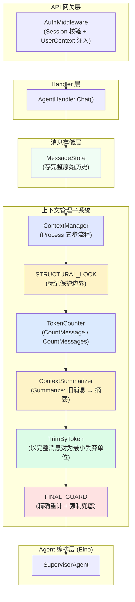
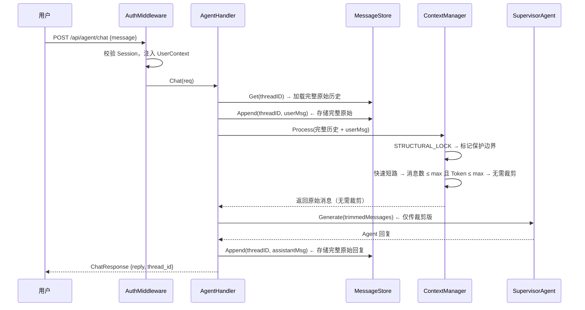
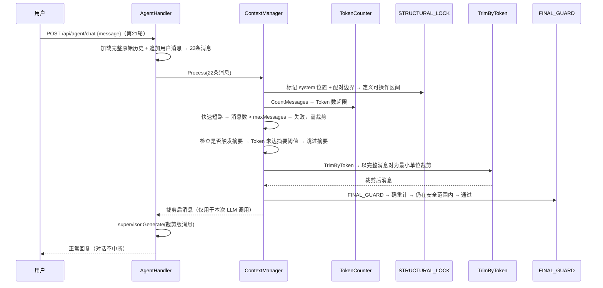
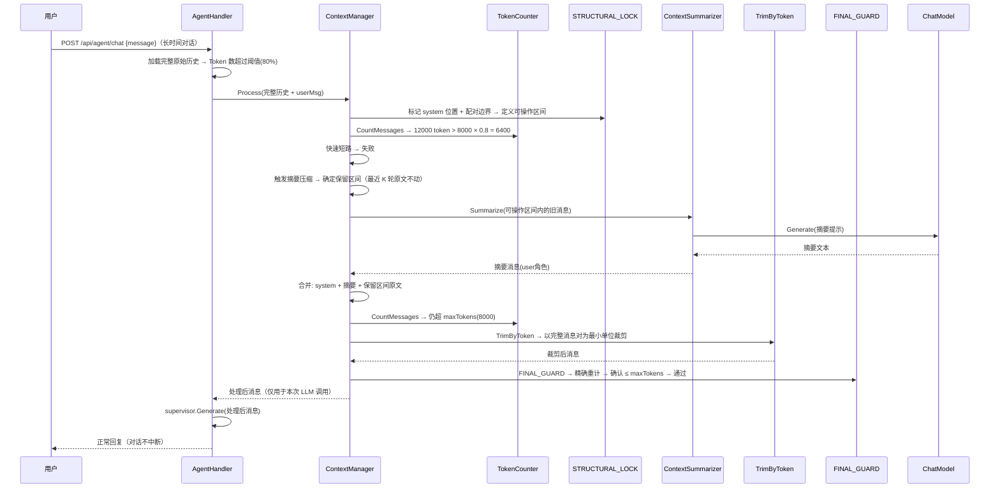
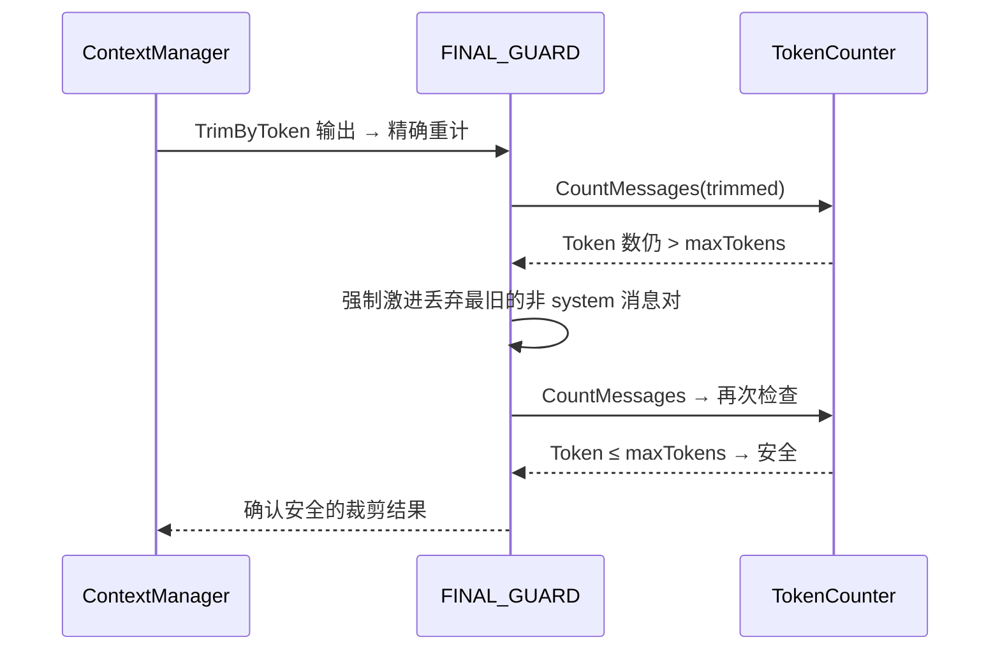
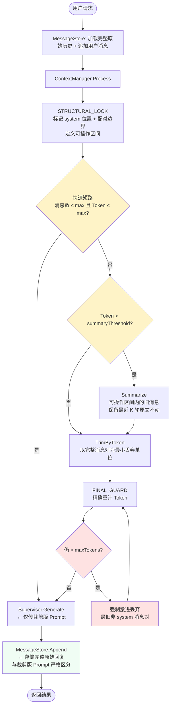

# 上下文窗口子系统

## 模块概述

上下文窗口子系统为通用 Agent 框架提供对话上下文管理能力。当消息历史持续膨胀，超出 LLM 上下文窗口时，本模块自动裁剪或压缩旧消息，保证请求不超限、对话不中断。

随着对话轮次不断累积，LLM 的上下文窗口面临三个严重问题：
1. **超窗口**：消息总量超出上下文窗口，请求被提供商直接拒绝并报错
2. **成本爆炸**：Token 用量随轮次近似线性增长，API 费用急剧攀升
3. **延迟升高**：输入 Token 越多，首 Token 延迟越高

本模块构建一个对业务透明的中间层，自动将过长的历史裁剪或摘要至窗口限制之内。

**设计原则**：
1. **复用 Eino 框架，不重复造轮子** — TokenCounter 估算逻辑参考 Eino ADK 默认实现（`len/4` 估算），摘要压缩调用 ChatModel 生成
2. **Handler 层介入** — ContextManager 在 Handler 层调用，对 Agent 编排层透明，不作为 Eino 中间件嵌入调用链
3. **Token 为统一度量衡** — 消息数裁剪和 Token 裁剪以 Token 串联而非并联，避免摘要后消息数裁剪浪费摘要成果
4. **结构性保护前置** — 所有裁剪操作前先标记 System 消息和 ToolCall/ToolOutput 配对边界，裁剪只在此结构约束下进行
5. **最终安全兜底** — 裁剪后精确重计 Token，若仍超限则强制激进丢弃，确保不触发 LLM API 400 错误
6. **Store 存全量、Prompt 用裁剪版** — MessageStore 始终存储完整原始历史，Process 输出的精简消息仅用于本次 LLM 调用，不回写 Store
7. **异常降级不中断** — 上下文管理的所有异常不中断对话流程

## 建设目标

| 目标 | 说明 |
| ---- | ---- |
| 按消息数裁剪 | 保留最近 N 条消息，system 永久保留，tool/tool_call 配对不拆散 |
| 按 Token 数裁剪 | 保留最近 N 个 token 的消息，同样保护 system 和配对 |
| Token 计数 | 支持单条及多条消息的 Token 数量估算，提供可替换接口 |
| 摘要压缩 | Token 占用超过阈值（如窗口 80%）时，将旧消息压缩为摘要后再裁剪 |
| 长对话演示 | 多轮持续对话中，当上下文超出窗口限制时自动裁剪旧消息，保证不超窗口、不报错 |

## 系统整体链路设计

```
用户请求 → AuthMiddleware(身份校验) → AgentHandler.Chat()
  → 从 MessageStore 加载完整原始历史（不裁剪）
  → 追加当前用户消息到 MessageStore（完整存储）
  → 构造 fullMessages = 原始历史 + userMsg（完整版，用于存储）
  → ContextManager.Process(ctx, fullMessages) → 得到 trimmedMessages（裁剪版，仅用于 LLM 调用）
    → STRUCTURAL_LOCK: 标记 system 位置 + ToolCall/ToolOutput 配对边界 → 定义"可操作区间"
    → TokenCounter.CountMessages(fullMessages) → 计算 Token 总量
    → 快速短路: 消息数 ≤ maxMessages 且 Token ≤ maxTokens → 无需裁剪，直接返回
    → if tokens > maxTokens × summaryThreshold → Summarize(可操作区间内的旧消息) → 摘要压缩
    → TrimByToken(messages, maxTokens) → 按 Token 数裁剪（在可操作区间内，以完整消息对为最小丢弃单位）
    → FINAL_GUARD: 精确重计 Token → 若仍超限 → 强制激进丢弃最旧消息对 → 确认安全
  → supervisor.Generate(ctx, trimmedMessages) ← 仅传入裁剪版，不回写 Store
  → MessageStore.Append(threadID, assistantMsg) ← 存储完整原始回复
  → 返回结果
```

**关键原则**：
1. ContextManager.Process 在 Handler 层调用，发生在 supervisor.Generate 之前
2. Process 五步执行顺序：STRUCTURAL_LOCK → 快速短路 → 摘要压缩 → Token 裁剪 → FINAL_GUARD
3. 以 Token 为统一度量衡串联摘要与裁剪，不做独立的"消息数裁剪"阶段（消息数仅作为快速短路判断）
4. STRUCTURAL_LOCK 在裁剪前标记所有不可拆散的边界，后续操作只能在"可操作区间"内进行
5. FINAL_GUARD 是最后防线：裁剪后精确重计 Token，若仍超限则强制激进丢弃直到安全
6. MessageStore 始终存储完整原始历史；Process 输出的裁剪版仅用于本次 LLM 调用，绝不回写 Store
7. 摘要仅针对"可操作区间内的旧消息"，保留最近 K 轮原文不动（默认 K = MaxTokens 的 50%）
8. 所有异常降级处理，不中断对话流程

## 整体架构设计



## 业务流程设计

### 1. 正常对话（上下文未超限）



### 2. 上下文超限 → 快速短路失败后 Token 裁剪



### 3. 上下文超限 → 摘要压缩 + Token 裁剪 + FINAL_GUARD



### 4. FINAL_GUARD 强制兜底（裁剪后仍超限）



### 5. 完整流程总览



## 数据模型设计

### ContextManagerConfig 配置

```go
// ContextManagerConfig 上下文管理配置
type ContextManagerConfig struct {
    // MaxMessages 最大保留消息数（0 = 不按消息数裁剪）
    MaxMessages int

    // MaxTokens 最大保留 Token 数（0 = 不按 Token 裁剪）
    // 代表 LLM 上下文窗口的 Token 上限
    MaxTokens int

    // SummaryThreshold 摘要触发阈值（Token 占比，如 0.8 表示 80%）
    // 当历史 Token 数超过 MaxTokens × SummaryThreshold 时触发摘要压缩
    SummaryThreshold float64

    // ChatModel 用于摘要压缩的 ChatModel（复用项目的 LLM 配置）
    ChatModel model.BaseChatModel
}
```

**默认配置**：

| 配置项 | 默认值 | 说明 |
| ------ | ------ | ---- |
| MaxMessages | 20 | 保留最近 20 条消息 |
| MaxTokens | 8000 | 假设 8K Token 窗口 |
| SummaryThreshold | 0.8 | Token 占用超过 80% 时触发摘要 |

### TokenCounter 接口

```go
// TokenCounter Token 计数器接口
type TokenCounter interface {
    // CountMessages 计算多条消息的总 Token 数
    CountMessages(ctx context.Context, messages []*schema.Message) (int, error)

    // CountMessage 计算单条消息的 Token 数
    CountMessage(ctx context.Context, msg *schema.Message) (int, error)
}
```

### DefaultTokenCounter 默认实现

粗粒度估算策略：将整条消息的文本总长度除以 4，不逐字段细分。多模态和 ToolCall 额外加固定估值。

```go
// DefaultTokenCounter 默认 Token 计数器（粗粒度估算）
// 策略：将消息可见文本总长度 ÷ 4，多模态和 ToolCall 额外加固定估值
// 精确度要求不高，仅用于裁剪判断和快速短路，不用于 API 计费
type DefaultTokenCounter struct{}

const charsPerToken = 4 // 约 4 字符 ≈ 1 token
const multimodalEstimate = 2000 // 每个多模态项固定估算 token 数
const toolCallEstimate = 300   // 每个 ToolCall 固定估算 token 数（含函数名 + 参数）

func (c *DefaultTokenCounter) CountMessage(ctx context.Context, msg *schema.Message) (int, error) {
    if msg == nil {
        return 0, nil
    }

    // 文本总量：Content + ReasoningContent 合计
    textLen := len(msg.Content) + len(msg.ReasoningContent)
    tokens := textLen / charsPerToken
    if textLen % charsPerToken > 0 {
        tokens++
    }

    // 多模态：每项固定估值
    tokens += len(msg.MultiContent) * multimodalEstimate
    tokens += len(msg.UserInputMultiContent) * multimodalEstimate

    // ToolCalls：每项固定估值
    tokens += len(msg.ToolCalls) * toolCallEstimate

    return tokens, nil
}

func (c *DefaultTokenCounter) CountMessages(ctx context.Context, messages []*schema.Message) (int, error) {
    total := 0
    for _, msg := range messages {
        count, err := c.CountMessage(ctx, msg)
        if err != nil {
            return 0, fmt.Errorf("count message failed: %w", err)
        }
        total += count
    }
    return total, nil
}
```

> **为什么不逐字段细分？** 本项目 Token 计数仅用于裁剪判断和快速短路，不用于 API 计费，精确度要求不高。将 Content + ReasoningContent 合计、ToolCalls 每项固定估值 300 token，足以满足裁剪阈值判断。粗粒度估算避免了逐字段（ToolName、ToolCallID、Function.Name、Function.Arguments）拆分计算的复杂度，实现简洁、可维护。

### ContextSummarizer 接口

```go
// ContextSummarizer 上下文摘要压缩器接口
type ContextSummarizer interface {
    // Summarize 将旧消息压缩为一段摘要
    // messages: 待摘要的旧消息列表
    // 返回: 摘要消息（user 角色，Extra 中标记为摘要类型）
    Summarize(ctx context.Context, messages []*schema.Message) (*schema.Message, error)
}
```

### LLMContextSummarizer 默认实现

基于 LLM 的摘要压缩器，调用 ChatModel 生成摘要文本。

```go
// LLMContextSummarizer 基于 LLM 的上下文摘要压缩器
type LLMContextSummarizer struct {
    chatModel model.BaseChatModel
}

func NewLLMContextSummarizer(chatModel model.BaseChatModel) *LLMContextSummarizer {
    return &LLMContextSummarizer{chatModel: chatModel}
}

const summarySystemPrompt = `你是一个对话摘要助手。请将以下对话历史压缩为一段简洁的摘要，要求：
1. 保留关键信息、决策和结论
2. 保留涉及的工具调用及其结果摘要
3. 丢弃冗余细节和重复内容
4. 摘要长度不超过 500 字
5. 使用清晰的中文表述`

const summaryUserPromptTemplate = `请对以下对话历史进行摘要压缩：

%s`

func (s *LLMContextSummarizer) Summarize(ctx context.Context, messages []*schema.Message) (*schema.Message, error) {
    // 构建对话文本
    conversationText := formatMessagesForSummary(messages)

    prompt := fmt.Sprintf(summaryUserPromptTemplate, conversationText)
    summaryMessages := []*schema.Message{
        schema.SystemMessage(summarySystemPrompt),
        schema.UserMessage(prompt),
    }

    result, err := s.chatModel.Generate(ctx, summaryMessages)
    if err != nil {
        return nil, fmt.Errorf("summarize generation failed: %w", err)
    }

    // 返回摘要消息（user 角色，Extra 标记为摘要类型）
    return &schema.Message{
        Role:    schema.User,
        Content: fmt.Sprintf("[对话历史摘要]\n%s", result.Content),
        Extra:   map[string]any{"_context_summary": true},
    }, nil
}

// formatMessagesForSummary 将消息列表格式化为摘要输入文本
func formatMessagesForSummary(messages []*schema.Message) string {
    var builder strings.Builder
    for _, msg := range messages {
        roleLabel := string(msg.Role)
        content := msg.Content
        if len(content) > 200 {
            content = content[:200] + "..."
        }
        builder.WriteString(fmt.Sprintf("[%s]: %s\n", roleLabel, content))

        // ToolCalls 信息
        for _, tc := range msg.ToolCalls {
            builder.WriteString(fmt.Sprintf("  [tool_call: %s(%s)]\n", tc.Function.Name, tc.Function.Arguments))
        }
    }
    return builder.String()
}
```

### ContextManager 接口

```go
// ContextManager 上下文管理器接口
type ContextManager interface {
    // Process 对消息历史执行结构性保护 + 摘要压缩 + Token 裁剪 + 安全兜底，返回处理后的消息列表
    // 五步执行顺序：STRUCTURAL_LOCK → 快速短路 → 摘要压缩 → Token 裁剪 → FINAL_GUARD
    // 注意：Process 输出仅用于本次 LLM 调用，不回写 MessageStore
    Process(ctx context.Context, messages []*schema.Message) ([]*schema.Message, error)
}
```

### defaultContextManager 实现

```go
// defaultContextManager 上下文管理器默认实现
type defaultContextManager struct {
    config     ContextManagerConfig
    counter    TokenCounter
    summarizer ContextSummarizer // 可为 nil（不启用摘要）
}

func NewContextManager(config ContextManagerConfig) ContextManager {
    counter := &DefaultTokenCounter{}

    var summarizer ContextSummarizer
    if config.ChatModel != nil && config.SummaryThreshold > 0 {
        summarizer = NewLLMContextSummarizer(config.ChatModel)
    }

    return &defaultContextManager{
        config:     config,
        counter:    counter,
        summarizer: summarizer,
    }
}

func (m *defaultContextManager) Process(ctx context.Context, messages []*schema.Message) ([]*schema.Message, error) {
    if len(messages) == 0 {
        return messages, nil
    }

    result := make([]*schema.Message, len(messages))
    copy(result, messages)

    // ===== Step 1: STRUCTURAL_LOCK =====
    // 标记 system 消息位置 + ToolCall/ToolOutput 配对边界，定义"可操作区间"
    structure := analyzeMessageStructure(result)

    // ===== Step 2: 快速短路 =====
    // 消息数 ≤ maxMessages 且 Token ≤ maxTokens → 无需裁剪，直接返回
    totalTokens, err := m.counter.CountMessages(ctx, result)
    if err != nil {
        log.Printf("[Context] Token 计数失败: %v，降级使用原始消息", err)
        return result, nil // 降级：不裁剪
    }

    msgCountOK := m.config.MaxMessages <= 0 || len(structure.nonSystemGroups) <= m.config.MaxMessages
    tokenOK := m.config.MaxTokens <= 0 || totalTokens <= m.config.MaxTokens
    if msgCountOK && tokenOK {
        return result, nil // 快速短路：无需裁剪
    }

    // ===== Step 3: 摘要压缩（Token 占用超过阈值时触发） =====
    // 摘要仅针对"可操作区间内的旧消息"，保留最近 K 轮原文不动
    if m.config.SummaryThreshold > 0 && m.config.MaxTokens > 0 && m.summarizer != nil {
        threshold := int(float64(m.config.MaxTokens) * m.config.SummaryThreshold)
        if totalTokens > threshold {
            summarized, err := m.summarizeAndTrim(ctx, result, structure)
            if err != nil {
                log.Printf("[Context] 摘要压缩失败: %v，跳过摘要，仅裁剪", err)
            } else {
                result = summarized
            }
        }
    }

    // ===== Step 4: TrimByToken（以完整消息对为最小丢弃单位） =====
    if m.config.MaxTokens > 0 {
        currentTokens, err := m.counter.CountMessages(ctx, result)
        if err != nil {
            log.Printf("[Context] Token 计数失败: %v，跳过 Token 裁剪", err)
        } else if currentTokens > m.config.MaxTokens {
            result = TrimByToken(result, m.config.MaxTokens, m.counter)
        }
    }

    // ===== Step 5: FINAL_GUARD =====
    // 精确重计 Token，若仍超限则强制激进丢弃，确保不触发 LLM API 400 错误
    if m.config.MaxTokens > 0 {
        result = m.finalGuard(ctx, result)
    }

    return result, nil
}

// ===== STRUCTURAL_LOCK: 消息结构分析 =====

// messageStructure 消息结构分析结果
type messageStructure struct {
    systemIndices   []int              // system 消息在原始列表中的位置（永久保留）
    nonSystemGroups []*messageGroup    // 非 system 消息分组（可操作区间）
    pairBoundaries  map[int]int        // ToolCall 消息索引 → 对应最后一个 ToolOutput 消息索引
}

// analyzeMessageStructure 分析消息结构，标记保护边界
func analyzeMessageStructure(messages []*schema.Message) *messageStructure {
    structure := &messageStructure{
        pairBoundaries: make(map[int]int),
    }

    var nonSystem []*schema.Message
    var currentPairStart int = -1
    var currentPairEnd int = -1

    for i, msg := range messages {
        if msg.Role == schema.System {
            structure.systemIndices = append(structure.systemIndices, i)
            // 如果之前有未关闭的配对组，先保存
            if currentPairStart >= 0 {
                structure.pairBoundaries[currentPairStart] = currentPairEnd
                currentPairStart = -1
            }
        } else {
            nonSystem = append(nonSystem, msg)

            if msg.Role == schema.Assistant && len(msg.ToolCalls) > 0 {
                // 新配对组起始
                if currentPairStart >= 0 {
                    structure.pairBoundaries[currentPairStart] = currentPairEnd
                }
                currentPairStart = i
                currentPairEnd = i
            } else if msg.Role == schema.Tool && currentPairStart >= 0 {
                // 配对组成员
                currentPairEnd = i
            } else {
                // 独立消息 → 关闭前一个配对组（如有）
                if currentPairStart >= 0 {
                    structure.pairBoundaries[currentPairStart] = currentPairEnd
                    currentPairStart = -1
                }
            }
        }
    }

    // 处理最后一个配对组
    if currentPairStart >= 0 {
        structure.pairBoundaries[currentPairStart] = currentPairEnd
    }

    // 构建非 system 消息分组
    structure.nonSystemGroups = groupMessages(nonSystem)

    return structure
}

// ===== FINAL_GUARD: 安全兜底校验 =====

// finalGuard 精确重计 Token，若仍超限则强制激进丢弃最旧消息对
// 这是防止 LLM API 返回 400 的最后防线
func (m *defaultContextManager) finalGuard(ctx context.Context, messages []*schema.Message) []*schema.Message {
    const maxGuardIterations = 10 // 防止无限循环

    for i := 0; i < maxGuardIterations; i++ {
        currentTokens, err := m.counter.CountMessages(ctx, messages)
        if err != nil {
            log.Printf("[Context] FINAL_GUARD: Token 计数失败: %v，放弃校验", err)
            return messages
        }

        if currentTokens <= m.config.MaxTokens {
            return messages // 安全通过
        }

        // 仍超限 → 强制激进丢弃最旧的非 system 消息对
        messages = aggressiveDropOldest(messages)
        if messages == nil {
            log.Printf("[Context] FINAL_GUARD: 无法再丢弃任何消息，放弃")
            return messages
        }

        log.Printf("[Context] FINAL_GUARD: 第 %d 轮强制丢弃，当前 Token=%d, 上限=%d",
            i+1, currentTokens, m.config.MaxTokens)
    }

    return messages
}

// aggressiveDropOldest 强制丢弃最旧的非 system 消息对
// 从头部找到第一个可丢弃的消息组（非 system），整组移除
func aggressiveDropOldest(messages []*schema.Message) []*schema.Message {
    structure := analyzeMessageStructure(messages)

    // 找到第一个非 system 消息组的起始和结束索引
    if len(structure.nonSystemGroups) == 0 {
        return nil // 没有可丢弃的消息
    }

    // 计算第一个非 system 组在原始 messages 中的范围
    // 分离 system 和非 system，丢弃第一个非 system 组
    systemMsgs, nonSystemMsgs := separateSystemMessages(messages)
    if len(nonSystemMsgs) == 0 {
        return messages
    }

    groups := groupMessages(nonSystemMsgs)
    if len(groups) <= 1 {
        return messages // 至少保留一个组
    }

    // 丢弃第一个组（最旧的）
    remainingNonSystem := make([]*schema.Message, 0, len(nonSystemMsgs)-groups[0].count())
    for _, g := range groups[1:] {
        remainingNonSystem = append(remainingNonSystem, g.messages...)
    }

    // 合并：system + 剩余非 system
    result := make([]*schema.Message, 0, len(systemMsgs)+len(remainingNonSystem))
    result = append(result, systemMsgs...)
    result = append(result, remainingNonSystem...)
    return result
}
```

### summarizeAndTrim 摘要压缩实现

```go
// summarizeAndTrim 摘要压缩：将可操作区间内的旧消息压缩为摘要，保留最近 K 轮原文不动
// 1. 利用 structure 标记的 system 位置和配对边界
// 2. 从尾部向前确定"保留区间"（最近的消息，Token 数不超过 maxTokens 的 50%）
// 3. 保留区间之前的旧消息（在可操作区间内）交给 Summarizer 压缩
// 4. 合并：system + 摘要 + 保留区间原文
func (m *defaultContextManager) summarizeAndTrim(
    ctx context.Context,
    messages []*schema.Message,
    structure *messageStructure,
) ([]*schema.Message, error) {
    // 分离 system 消息
    systemMsgs, nonSystemMsgs := separateSystemMessages(messages)

    // 从尾部向前确定"保留区间"（最近的消息，Token 数不超过 maxTokens 的 50%）
    retainTokenLimit := m.config.MaxTokens / 2
    retainStartIdx := len(nonSystemMsgs)
    accumulated := 0

    for i := len(nonSystemMsgs) - 1; i >= 0; i-- {
        count, _ := m.counter.CountMessage(ctx, nonSystemMsgs[i])
        accumulated += count
        if accumulated > retainTokenLimit {
            retainStartIdx = i + 1
            break
        }
    }

    // 旧消息交给摘要器
    oldMsgs := nonSystemMsgs[:retainStartIdx]
    if len(oldMsgs) == 0 {
        return messages, nil // 没有可摘要的旧消息
    }

    summaryMsg, err := m.summarizer.Summarize(ctx, oldMsgs)
    if err != nil {
        return nil, err
    }

    // 合并：system + 摘要 + 保留区间
    result := make([]*schema.Message, 0, len(systemMsgs)+1+(len(nonSystemMsgs)-retainStartIdx))
    result = append(result, systemMsgs...)
    result = append(result, summaryMsg)
    result = append(result, nonSystemMsgs[retainStartIdx:]...)

    return result, nil
}
```

**摘要范围说明**：

摘要仅针对"可操作区间内的旧消息"，明确排除以下内容：
1. **system 消息** — 永久保留，不参与摘要
2. **最近 K 轮原文** — 保留区间（默认 `maxTokens / 2`），原文不动，不参与摘要
3. **ToolCall/ToolOutput 配对** — 在摘要输入中整组出现，不拆散

摘要输出以单条 `user` 角色消息呈现（`Extra["_context_summary"] = true`），插入到 system 消息之后、保留区间之前。

### MessageStore 接口与实现

```go
// MessageStore 消息历史存储接口
type MessageStore interface {
    // Get 获取指定线程的消息历史
    Get(ctx context.Context, threadID string) ([]*schema.Message, error)

    // Append 追加消息到指定线程
    Append(ctx context.Context, threadID string, msg *schema.Message) error

    // Clear 清除指定线程的消息历史
    Clear(ctx context.Context, threadID string) error
}

// MemoryMessageStore 内存版消息历史存储
type MemoryMessageStore struct {
    mu       sync.RWMutex
    messages map[string][]*schema.Message // threadID → 消息列表
}

func NewMemoryMessageStore() *MemoryMessageStore {
    return &MemoryMessageStore{
        messages: make(map[string][]*schema.Message),
    }
}

func (s *MemoryMessageStore) Get(ctx context.Context, threadID string) ([]*schema.Message, error) {
    s.mu.RLock()
    defer s.mu.RUnlock()
    msgs, ok := s.messages[threadID]
    if !ok {
        return nil, nil // 空历史，不是错误
    }
    result := make([]*schema.Message, len(msgs))
    copy(result, msgs)
    return result, nil
}

func (s *MemoryMessageStore) Append(ctx context.Context, threadID string, msg *schema.Message) error {
    s.mu.Lock()
    defer s.mu.Unlock()
    s.messages[threadID] = append(s.messages[threadID], msg)
    return nil
}

func (s *MemoryMessageStore) Clear(ctx context.Context, threadID string) error {
    s.mu.Lock()
    defer s.mu.Unlock()
    delete(s.messages, threadID)
    return nil
}
```

**实现层级**：

| 层级 | 实现 | 说明 |
| ---- | ---- | ---- |
| 基础档 | `MemoryMessageStore` | 基于 `sync.RWMutex + map`，进程内存储，重启丢失 |
| 进阶档 | `RedisMessageStore` | 基于 Redis，支持分布式部署和持久化 |

## 裁剪算法设计

### 设计理念：Token 为统一度量衡

消息数裁剪和 Token 裁剪以 Token 串联而非并联。原因：
- 摘要压缩是为了减少 Token 占用，裁剪也是为了控制 Token 总量
- 如果摘要后执行独立的"消息数裁剪"阶段，可能恰好裁掉刚生成的摘要消息，导致 LLM 摘要调用的成本和延迟完全浪费
- 因此，`maxMessages` 仅作为"快速短路"的判断条件（消息数 ≤ max 且 Token ≤ max → 无需裁剪），而非独立裁剪阶段

### 消息分组模型

裁剪算法的核心是"消息分组"——将消息列表划分为不可拆散的单元。

**分组规则**：
1. **system 消息**：永久保留，单独分组，不计入裁剪范围
2. **配对组**：assistant 消息（含 ToolCalls）+ 其后连续的 tool 消息（`Role == schema.Tool`），作为一个不可拆散的单元
3. **独立组**：不含 ToolCalls 的 assistant 消息、user 消息，各自作为独立单元

**分组示例**：

```
原始消息列表：
  [system]       → system组（永久保留）
  [user]         → 独立组①（计数1）
  [assistant+TC] → 配对组②起始（含 ToolCall: calculator）
  [tool]         → 配对组②成员（calculator 结果）
  [user]         → 独立组③（计数1）
  [assistant+TC] → 配对组④起始（含 ToolCall: grep_files）
  [tool]         → 配对组④成员（grep_files 结果）
  [tool]         → 配对组④成员（grep_files 第二个结果）
  [user]         → 独立组⑤（计数1）
  [assistant]    → 独立组⑥（计数1）

分组结果：
  system组:  [system]
  独立组①:  [user]
  配对组②:  [assistant+TC, tool]
  独立组③:  [user]
  配对组④:  [assistant+TC, tool, tool]
  独立组⑤:  [user]
  独立组⑥:  [assistant]
```

### TrimByCount — 快速短路辅助（非独立裁剪阶段）

TrimByCount 不作为 Process 的独立裁剪阶段。其作用仅限于快速短路判断：

```
快速短路逻辑：
  if maxMessages > 0 && len(nonSystemGroups) <= maxMessages && totalTokens <= maxTokens {
      → 无需裁剪，直接返回原始消息
  }
```

当快速短路失败时，统一走 Token 裁剪路径（TrimByToken），不再单独执行 TrimByCount。

> **为什么去掉独立的消息数裁剪阶段？**
> 假设摘要将 Token 从 10000 降到 6000，但消息数从 25 条变为 26 条（摘要消息 + 原始消息）。如果 maxMessages=20，独立的 TrimByCount 会裁掉 6 条——可能恰好包含刚生成的摘要或摘要覆盖的原始消息，使摘要成本完全浪费。而 TrimByToken 会以 Token 为度量，从头部丢弃最旧的消息组，摘要消息位于 system 之后，不会被裁掉。

### TrimByToken 按 Token 数裁剪（核心裁剪算法）

**核心规则**：
1. **结构性保护** — system 消息永久保留，ToolCall/ToolOutput 配对不可拆散
2. **以完整消息对为最小丢弃单位** — 配对组要么整组保留，要么整组丢弃
3. **从尾部向前累加 Token** — 保留最近不超过 maxTokens 的消息组
4. **宁可多保留不可拆散** — 首个保留组即使超 maxTokens 也不拆

**算法实现**：

```go
// TrimByToken 按 Token 数裁剪：保留最近 N 个 token 的消息
// system 消息永久保留，tool/tool_call 配对不拆散
func TrimByToken(messages []*schema.Message, maxTokens int, counter TokenCounter) []*schema.Message {
    if maxTokens <= 0 {
        return messages
    }

    // 分离 system 消息和非 system 消息
    systemMsgs, nonSystemMsgs := separateSystemMessages(messages)

    // 将非 system 消息划分为消息组
    groups := groupMessages(nonSystemMsgs)

    // 从尾部向前累加 Token，保留不超过 maxTokens 的消息组
    retainedGroups := make([]*messageGroup, 0)
    totalTokens := 0

    for i := len(groups) - 1; i >= 0; i-- {
        groupTokens := groups[i].tokenCount(counter)
        if totalTokens + groupTokens <= maxTokens {
            retainedGroups = append([]*messageGroup{groups[i]}, retainedGroups...)
            totalTokens += groupTokens
        } else if totalTokens == 0 {
            // 首个保留组超出 maxTokens，宁可多保留不可拆散
            retainedGroups = append([]*messageGroup{groups[i]}, retainedGroups...)
            totalTokens += groupTokens
            break
        } else {
            break
        }
    }

    // 合并：system 消息 + 保留的消息组
    result := make([]*schema.Message, 0, len(systemMsgs)+len(nonSystemMsgs))
    result = append(result, systemMsgs...)
    for _, g := range retainedGroups {
        result = append(result, g.messages...)
    }

    return result
}
```

### 消息分组辅助结构

```go
// messageGroup 消息分组单元（不可拆散）
type messageGroup struct {
    messages []*schema.Message
    isPaired bool // 是否为 assistant+tool 配对组
}

func (g *messageGroup) count() int {
    return len(g.messages)
}

func (g *messageGroup) tokenCount(counter TokenCounter) int {
    total := 0
    for _, msg := range g.messages {
        count, _ := counter.CountMessage(context.Background(), msg)
        total += count
    }
    return total
}

// groupMessages 将非 system 消息划分为消息组
func groupMessages(messages []*schema.Message) []*messageGroup {
    var groups []*messageGroup
    var currentPair *messageGroup // 当前正在构建的配对组

    for _, msg := range messages {
        if msg.Role == schema.Assistant && len(msg.ToolCalls) > 0 {
            // assistant 消息含 ToolCalls → 新配对组起始
            if currentPair != nil {
                groups = append(groups, currentPair)
            }
            currentPair = &messageGroup{
                messages: []*schema.Message{msg},
                isPaired: true,
            }
        } else if msg.Role == schema.Tool && currentPair != nil {
            // tool 消息 → 归入当前配对组
            currentPair.messages = append(currentPair.messages, msg)
        } else {
            // 其他消息 → 独立组
            if currentPair != nil {
                groups = append(groups, currentPair)
                currentPair = nil
            }
            groups = append(groups, &messageGroup{
                messages: []*schema.Message{msg},
                isPaired: false,
            })
        }
    }

    // 处理最后一个配对组
    if currentPair != nil {
        groups = append(groups, currentPair)
    }

    return groups
}

// separateSystemMessages 分离 system 消息和非 system 消息
func separateSystemMessages(messages []*schema.Message) (systemMsgs, nonSystemMsgs []*schema.Message) {
    for _, msg := range messages {
        if msg.Role == schema.System {
            systemMsgs = append(systemMsgs, msg)
        } else {
            nonSystemMsgs = append(nonSystemMsgs, msg)
        }
    }
    return
}
```

## API 接口设计

### 现有接口变更

| 方法 | 路径 | 变更说明 |
| ---- | ---- | -------- |
| POST | `/api/agent/chat` | Handler 内部注入 ContextManager.Process 调用，接口不变 |

### 新增管理端接口

| 方法 | 路径 | 请求体 | 响应体 | 说明 |
| ---- | ---- | ------ | ------ | ---- |
| GET | `/api/context/stats` | _(Query: thread_id, Header: Authorization)_ | `{"thread_id":"xxx","message_count":15,"token_count":3200,"max_tokens":8000}` | 查询当前线程上下文统计 |
| GET | `/api/context/history` | _(Query: thread_id, Header: Authorization)_ | `{"thread_id":"xxx","messages":[...]}` | 获取当前线程消息历史（过滤系统/工具消息，合并连续 assistant，丰富中断元数据） |
| POST | `/api/context/config` | _(需 admin 角色)_ `{"max_messages":20,"max_tokens":8000,"summary_threshold":0.8}` | `{"message":"ok"}` | 更新上下文管理配置 |

### 上下文统计响应

```go
// ContextStatsResponse 上下文统计响应
type ContextStatsResponse struct {
    ThreadID     string `json:"thread_id"`
    MessageCount int    `json:"message_count"`  // 当前消息数
    TokenCount   int    `json:"token_count"`    // 当前 Token 数
    MaxTokens    int    `json:"max_tokens"`      // 配置的 Token 上限
    MaxMessages  int    `json:"max_messages"`    // 配置的消息数上限
    SummaryThreshold float64 `json:"summary_threshold"` // 摘要触发阈值
}
```

### 上下文配置请求

```go
// ContextConfigRequest 上下文配置更新请求
type ContextConfigRequest struct {
    MaxMessages      int     `json:"max_messages"`       // 最大消息数
    MaxTokens        int     `json:"max_tokens"`         // 最大 Token 数
    SummaryThreshold float64 `json:"summary_threshold"`  // 摘要触发阈值
}
```

### 错误响应

沿用项目统一错误格式：

| HTTP 状态码 | code | 说明 |
| ----------- | ---- | ---- |
| 401 | UNAUTHORIZED | Session 无效/过期 |
| 403 | FORBIDDEN | 非 admin 角色 |
| 400 | BAD_REQUEST | 参数错误 |
| 404 | NOT_FOUND | 线程不存在 |

## AgentHandler 变更

### Chat() 方法变更

**核心变更**：Handler 加载完整原始历史 → Process 得到裁剪版 Prompt → 仅用裁剪版调 LLM → 完整原始回复存入 Store

```go
func (h *AgentHandler) Chat(c *gin.Context) {
    var req ChatRequest
    if err := c.ShouldBindJSON(&req); err != nil {
        c.JSON(http.StatusBadRequest, ErrorResponse{Error: errBadRequest})
        return
    }

    // 验证 UserContext（已由 AuthMiddleware 注入）
    _, ok := pkgmodel.UserContextFromCtx(c.Request.Context())
    if !ok {
        c.JSON(http.StatusUnauthorized, ErrorResponse{Error: ErrorDetail{
            Code: "UNAUTHORIZED", Message: "session invalid or expired",
        }})
        return
    }

    // 创建超时 context
    ctx, cancel := context.WithTimeout(c.Request.Context(), AgentTimeout)
    defer cancel()

    // 注入 threadID 和原始消息到 context（供 HITL 中间件使用）
    ctx = hitl.WithThreadID(ctx, req.ThreadID)
    ctx = hitl.WithOriginalMessage(ctx, req.Message)

    // ★ 加载完整原始历史（MessageStore 存全量，不裁剪）
    history, err := h.messageStore.Get(ctx, req.ThreadID)
    if err != nil {
        log.Printf("[Context] 加载历史失败: %v", err)
        history = nil // 降级：使用空历史
    }

    // ★ 追加当前用户消息到 Store（完整存储，不裁剪）
    userMsg := schema.UserMessage(req.Message)
    _ = h.messageStore.Append(ctx, req.ThreadID, userMsg)

    // 构造完整消息列表（用于 Process 输入）
    var fullMessages []*schema.Message
    if history != nil {
        fullMessages = append(history, userMsg)
    } else {
        fullMessages = []*schema.Message{userMsg}
    }

    // ★ 上下文管理：Process 输出仅用于本次 LLM 调用，不回写 Store
    trimmedPrompt, err := h.contextManager.Process(ctx, fullMessages)
    if err != nil {
        log.Printf("[Context] 上下文处理失败: %v，降级使用原始消息", err)
        trimmedPrompt = fullMessages // 降级：使用原始消息
    }

    // 读取 supervisor
    h.mu.RLock()
    supervisor := h.supervisor
    h.mu.RUnlock()

    // ★ 调用 Supervisor 时仅传裁剪版 Prompt
    result, err := supervisor.Generate(ctx, trimmedPrompt)
    if err != nil {
        // 检测是否为 HITL 中断错误
        if info, existed := compose.ExtractInterruptInfo(err); existed {
            h.handleInterrupt(c, req, info)
            return
        }

        if ctx.Err() == context.DeadlineExceeded {
            c.JSON(http.StatusGatewayTimeout, ErrorResponse{Error: errAgentTimeout})
            return
        }

        log.Printf("[Agent] 执行失败: %v", err)
        agentErr := formatAgentError(err.Error())
        c.JSON(http.StatusInternalServerError, ErrorResponse{Error: ErrorDetail{
            Code:    "AGENT_ERROR",
            Message: agentErr,
        }})
        return
    }

    // ★ 存储 Agent 完整原始回复到 MessageStore（不裁剪）
    if result != nil {
        _ = h.messageStore.Append(ctx, req.ThreadID, result)
    }

    // 提取回复内容
    reply := ""
    if result != nil {
        reply = result.Content
    }

    c.JSON(http.StatusOK, ChatResponse{
        Reply:    reply,
        ThreadID: req.ThreadID,
    })
}
```

**关键区分**：

| 数据 | 存储位置 | 内容 | 用途 |
| ---- | -------- | ---- | ---- |
| `fullMessages` | MessageStore | 完整原始历史 + 新消息 | 长期记忆、下次对话输入 |
| `trimmedPrompt` | 仅本次请求内存 | 裁剪/摘要后的精简版 | 本次 LLM 调用输入 |
| Agent 回复 | MessageStore | 完整原始回复 | 下次对话的历史输入 |

### Resume() 方法变更

恢复时也需要对消息列表执行上下文管理：

```go
func (h *AgentHandler) Resume(c *gin.Context) {
    // ... 现有逻辑：校验身份、获取审批卡片 ...

    // 构造引导消息
    guidance := buildGuidance(req, card)
    messages := []*schema.Message{
        schema.UserMessage(card.OriginalMessage + "\n\n" + guidance),
    }

    // 上下文管理（恢复时也需裁剪）
    trimmed, err := h.contextManager.Process(resumeCtx, messages)
    if err != nil {
        log.Printf("[Context] 恢复时上下文处理失败: %v", err)
        trimmed = messages
    }

    // 调用 Supervisor
    result, err := supervisor.Generate(resumeCtx, trimmed)
    // ... 现有逻辑 ...
}
```

### Handler 构造变更

```go
// AgentHandler 构造器新增 MessageStore 和 ContextManager 参数
func NewAgentHandler(
    supervisor *host.MultiAgent,
    toolRegistry *toolreg.ToolRegistry,
    aclChecker auth.ACLChecker,
    agentDefs []*SpecialistDef,
    approvalStore *hitl.ApprovalStore,
    messageStore MessageStore,     // [新增]
    contextManager ContextManager, // [新增]
) *AgentHandler {
    return &AgentHandler{
        supervisor:      supervisor,
        toolRegistry:    toolRegistry,
        aclChecker:      aclChecker,
        agentDefs:       agentDefs,
        approvalStore:   approvalStore,
        messageStore:    messageStore,
        contextManager:  contextManager,
    }
}
```

## 与前序模块的集成关系

| 集成点 | 前序模块提供 | DOC-04 使用 |
| ------ | ----------- | ----------- |
| 身份校验 | AuthMiddleware + UserContext | Handler 层前置校验 |
| Agent 编排 | supervisor.Generate() | Process() 后再调用 Generate() |
| HITL 中断 | InterruptInfo + Checkpoint | 恢复时也需 Process() |
| LLM 配置 | ChatModel（settings 管理） | ContextSummarizer 使用同一 ChatModel |
| 消息结构 | schema.Message | 裁剪/摘要基于 Message 操作 |
| 系统提示词 | react.Agent MessageModifier | system 消息由 Agent 注入，裁剪时永久保留 |

### Eino 生态复用清单

| Eino 能力 | 包路径 | 本项目使用方式 |
| --------- | ------ | -------------- |
| `schema.Message` | `schema/message.go` | 裁剪/摘要/计数的操作对象 |
| `schema.RoleType` | `schema/message.go` | 区分 system/user/assistant/tool 角色 |
| `schema.ToolCall` | `schema/message.go` | 配对分组：assistant+ToolCalls 与 tool 结果 |
| `model.BaseChatModel` | `components/model` | LLMContextSummarizer 调用 Generate() |
| `react.Agent` | `flow/agent/react` | Handler 调用 Generate() 前执行 Process() |
| Token 估算策略 | ADK `len/4` 默认实现 | DefaultTokenCounter 粗粒度估算（文本总长÷4 + 固定估值） |
| `compose.ExtractInterruptInfo` | `compose/interrupt.go` | Resume 时检测新中断 |

## 异常处理设计

### 异常分类与处理策略

| 异常类型 | 触发场景 | 处理策略 | 返回给用户 |
| -------- | -------- | -------- | ---------- |
| Token 计数失败 | Counter 返回错误 | 降级：跳过该步骤，使用原始消息 | 不影响对话 |
| 摘要压缩失败 | LLM 调用摘要时出错 | 降级：跳过摘要，仅执行 Token 裁剪 | 不影响对话 |
| TrimByToken 后仍超限 | 估算不精确或摘要产生意外 Token | FINAL_GUARD 精确重计，强制激进丢弃最旧消息对 | 不影响对话（最多丢弃旧消息） |
| FINAL_GUARD 循环超限 | 极端情况无法在 10 轮内降到安全线 | 放弃校验，发送当前结果 | 可能收到 LLM API 400 错误 |
| MessageStore 读取失败 | 存储异常 | 降级：使用空历史，仅发送当前消息 | 对话从当前开始 |
| MessageStore 写入失败 | Append 异常 | 忽略写入错误，不影响当前回复 | 不影响对话 |
| 首个保留组超限 | 最近配对组 Token 已超 maxTokens | 宁可多保留不可拆散，FINAL_GUARD 兜底 | 可能被 LLM 拒绝 |

**设计原则**：上下文管理的所有异常不中断对话流程，降级策略为"跳过处理步骤，使用原始/部分消息"。FINAL_GUARD 是防止 API 报错的最后防线。日志记录异常原因供运维排查。

### 降级 vs 中断 vs 兜底策略

```
Token 计数失败    → 降级（跳过裁剪，使用原始消息）
摘要压缩失败    → 降级（跳过摘要，仅 Token 裁剪）
裁剪后仍超限    → FINAL_GUARD 兜底（精确重计 + 强制激进丢弃）
FINAL_GUARD 超限 → 放弃（极端情况，可能收到 LLM 400 错误）
存储读取失败    → 降级（空历史）
存储写入失败    → 忽略（不影响当前）
```

## 安全设计

### 身份上下文隔离
- 上下文管理不改变 UserContext 传递方式，仍通过 `context.Context` 透传
- 摘要消息不包含身份信息，仅包含对话要点
- MessageStore 按 threadID 隔离，不同用户/线程的消息互不干扰

### 消息内容安全
- 摘要提示词中不包含原始密码、Token 等敏感信息
- 裁剪丢弃的消息仅从内存移除，不持久化到日志
- 上下文统计接口仅返回 Token 数量等元信息，不暴露消息内容

### 日志脱敏
- 延续前序模块的脱敏策略：sessionId 脱敏
- 摘要压缩的 LLM 输入/输出日志中，消息内容截断处理（超过 200 字符截断）
- 上下文统计日志仅记录 Token 数和消息数，不记录消息内容

## 项目目录结构（新增/变更）

```
kingsoft-agent/
├── internal/
│   ├── context/                     # [新增] 上下文管理子系统
│   │   ├── manager.go              # ContextManager 接口 + defaultContextManager + Process 五步流程
│   │   ├── structure.go            # messageStructure + analyzeMessageStructure + STRUCTURAL_LOCK
│   │   ├── trim.go                 # TrimByToken 裁剪算法 + FINAL_GUARD + aggressiveDropOldest + 消息分组
│   │   ├── counter.go              # TokenCounter 接口 + DefaultTokenCounter 实现
│   │   ├── summarizer.go           # ContextSummarizer 接口 + LLMContextSummarizer 实现
│   │   └── store.go                # MessageStore 接口 + MemoryMessageStore 实现
│   ├── agent/                       # Agent 编排
│   │   ├── handler.go              # [变更] 注入 MessageStore + ContextManager，Chat() 存全量用裁剪版
│   │   ├── react.go                # ReAct Agent 工厂
│   │   ├── supervisor.go           # Supervisor Agent 工厂
│   │   └── ...
│   ├── hitl/                        # [DOC-03] 中断-恢复子系统
│   ├── auth/                        # [DOC-01] 认证与权限
│   ├── toolreg/                     # [DOC-02] 工具注册与调用
│   └── memory/                      # [DOC-05] 记忆管理（待建）
├── api/
│   └── router.go                    # [变更] 新增 /api/context/* 路由
└── ...
```

## 长对话演示设计

### 演示场景

在 Web 前端提供"长对话压力测试"快捷提问，模拟持续对话场景：

1. **连续对话**：前端连续发送多条消息（每条包含较多文本），模拟长对话
2. **自动裁剪**：Handler 层自动加载历史 → Process → Generate
3. **观测上下文**：通过 `/api/context/stats` 观察消息数和 Token 数变化
4. **不中断对话**：消息超过窗口限制时，ContextManager 自动裁剪，对话始终正常
5. **摘要演示**：Token 占用超阈值时触发摘要压缩，Agent 能基于摘要保持上下文连贯性

### 前端交互

新增快捷提问：

```typescript
{ label: '📝 长对话测试', message: '这是一条用于测试上下文管理的消息，包含较长的文本内容。' }
```

新增上下文统计面板（可选）：

```
┌──────────────────────────────────┐
│ 📊 上下文统计                      │
│                                   │
│ 线程ID: thread-abc123             │
│ 消息数: 15 / 20 (上限)             │
│ Token数: 3200 / 8000 (上限)        │
│ 摘要阈值: 80% (6400 token)         │
│                                   │
│ [🔄 刷新]                         │
└──────────────────────────────────┘
```

### 演示验收标准

| 场景 | 验收标准 |
| ---- | -------- |
| 消息数快速短路 | 消息数 ≤ maxMessages 且 Token ≤ maxTokens 时，Process 直接返回原始消息，零裁剪开销 |
| Token 裁剪 | 对话 Token 超过 maxTokens 时，自动裁剪至 maxTokens 以下，对话不中断 |
| 摘要压缩 | Token 占用超过阈值（如 80%）时，可操作区间内的旧消息被压缩为摘要，最近 K 轮原文不动 |
| 配对保护 | STRUCTURAL_LOCK 标记的 ToolCall/ToolOutput 配对在裁剪中始终不拆散 |
| FINAL_GUARD | 裁剪后 Token 仍超限时，FINAL_GUARD 强制激进丢弃直到安全，不触发 LLM API 400 |
| Store 存全量 | MessageStore 始终存储完整原始历史，裁剪版 Prompt 不回写 Store |
| 上下文统计 | `/api/context/stats` 正确返回消息数、Token 数和配置信息 |
| 降级保护 | Token 计数或摘要压缩异常时，对话不中断，降级使用原始/部分消息 |

## 交付物清单与验收标准

### 代码结构要求

- ContextManager、TokenCounter、ContextSummarizer 均为接口，内存版与持久化版可替换
- Process 五步流程：STRUCTURAL_LOCK → 快速短路 → 摘要压缩 → TrimByToken → FINAL_GUARD
- STRUCTURAL_LOCK 在裁剪前标记 system 位置和 ToolCall/ToolOutput 配对边界，后续操作只能在"可操作区间"内进行
- TrimByToken 以完整消息对为最小丢弃单位，system 消息和配对组不可拆散
- FINAL_GUARD 精确重计 Token，若仍超限则强制激进丢弃最旧消息对，确保不触发 LLM API 400
- 摘要仅针对"可操作区间内的旧消息"，保留最近 K 轮原文不动
- MessageStore 始终存储完整原始历史，Process 输出的裁剪版仅用于本次 LLM 调用，绝不回写 Store
- 摘要压缩使用 LLM 生成，复用项目 ChatModel 配置
- TokenCounter 默认实现为粗粒度估算（文本总长 ÷ 4 + ToolCall/多模态固定估值），仅用于裁剪判断，不用于 API 计费
- 异常降级不中断对话流程
