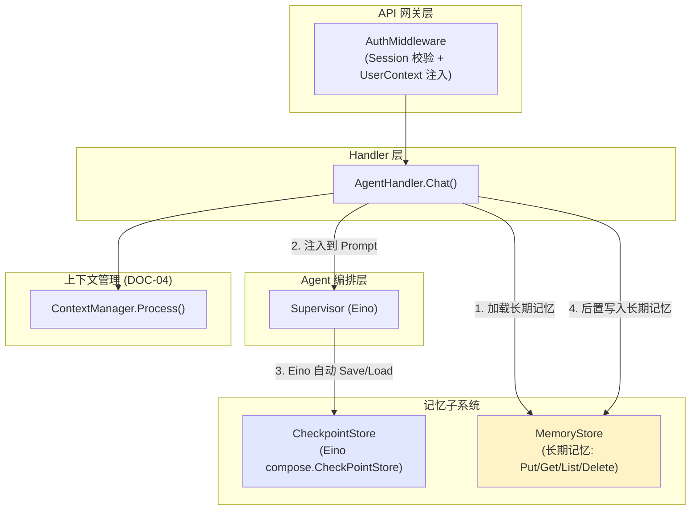
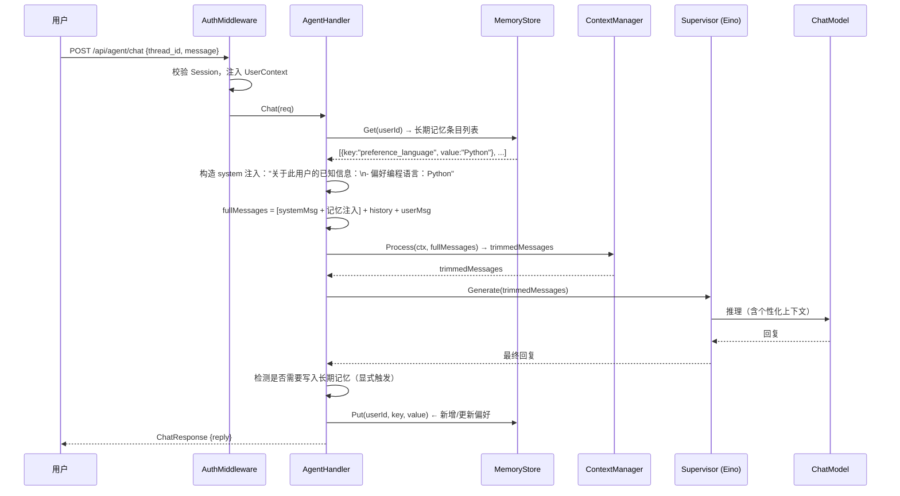
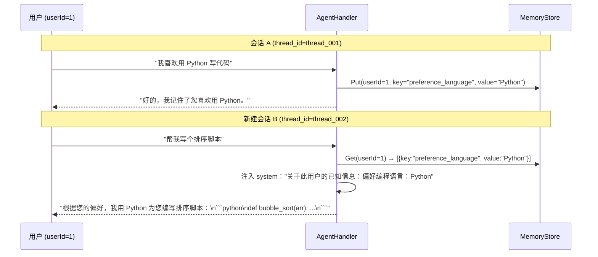
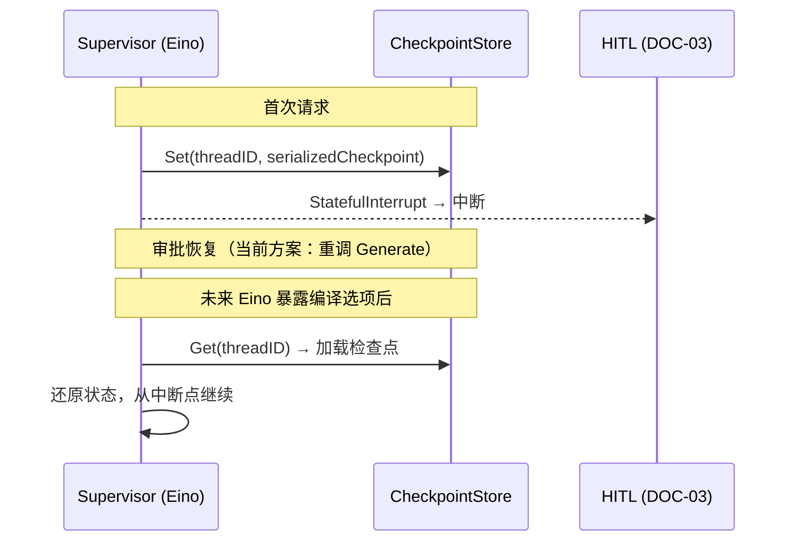
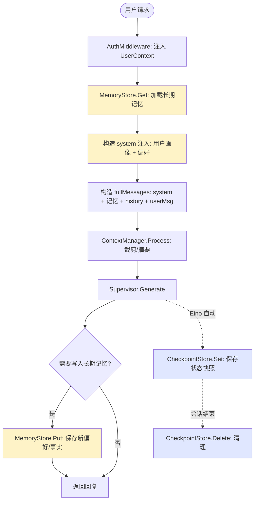

# 记忆子系统

## 模块概述

记忆子系统为通用 Agent 框架提供短期记忆与长期记忆能力。前四个模块已搭建出能登录、能中断恢复、能管理上下文、能多 Agent 协作的 Agent 框架，但它仍有一个致命短板：记不住历史。

1. **进程级失忆**：单次会话聊天若出现进程重启或设备更换，Agent 就把刚刚说过的话全部忘掉——缺少会话状态检查点
2. **跨会话失忆**：同一用户在上一个会话提供的信息开启新会话后失效，必须重新自我介绍——缺少跨会话的用户画像和偏好沉淀
3. **多用户串读**：多用户共用一个框架时，A 的记忆可能泄露给 B——缺少按用户隔离的记忆命名空间

记忆分为两层，性质截然不同，不可混淆：

- **短期记忆（Short-Term Memory）**——会话内的状态检查点。以"线程/会话"为粒度，保存 Agent 运行至某一时刻的完整状态（消息历史、中间变量、待执行节点等）。它让单次会话可中断、可恢复（与 DOC-03 配合），并能从崩溃中续跑，生命周期与会话绑定。
- **长期记忆（Long-Term Memory）**——跨会话持久化的用户画像、事实与规则。以"用户/命名空间"为粒度，在多次会话中持续沉淀对用户的认知。它让 Agent 具备"换个会话仍记得你"的个性化能力，生命周期远超单次会话。

**设计原则**：
1. **短期与长期分层抽象** — CheckpointStore（状态检查点）与 MemoryStore（事实条目）为两套独立接口，数据模型与生命周期截然不同，不可混用
2. **复用 Eino CheckpointStore 接口** — 短期记忆直接实现 `compose.CheckPointStore`（Get/Set）+ `compose.CheckPointDeleter`（Delete），不自研检查点抽象
3. **userId 作为长期记忆命名空间** — 从 DOC-01 AuthContext 中获取 userId，从源头保障多用户隔离，此为隐私与安全红线
4. **thread_id 作为短期隔离键** — 从请求参数中获取 thread_id，同一会话内多次调用可续接状态，不同会话互不干扰
5. **存储后端可替换** — CheckpointStore 与 MemoryStore 均通过接口抽象，内存版与持久化版可平滑切换，业务代码无需改动
6. **复用前四个模块成果** — 身份校验、会话管理、ACL 拦截、中断恢复、上下文管理直接沿用，不重复造轮子

### 短期记忆 vs 长期记忆对比

| 维度 | 短期记忆（CheckpointStore） | 长期记忆（MemoryStore） |
| ---- | --------------------------- | ----------------------- |
| 数据性质 | 状态快照（二进制 blob） | 结构化事实条目（key-value） |
| 隔离键 | thread_id | userId |
| 生命周期 | 与会话绑定，会话结束可清理 | 跨会话持久，长期有效 |
| 典型内容 | Eino Graph 运行状态、消息历史 | "用户喜欢简洁回答""用户是 Java 开发者" |
| 存储粒度 | 按线程整体存取 | 按用户 + 键值对存取 |
| 与 DOC-03 关系 | 为 HITL 中断-恢复提供状态持久化 | 独立于 HITL，纯用户画像 |
| 与 DOC-04 关系 | 可被 ContextManager 引用为历史来源 | 注入到 LLM Prompt 作为个性化上下文 |

## 建设目标

| 目标 | 说明 |
| ---- | ---- |
| CheckpointStore 实现 | 实现 Eino `compose.CheckPointStore`（Get/Set）+ `CheckPointDeleter`（Delete），按 thread_id 隔离，同一会话内可续接状态 |
| MemoryStore 实现 | 实现 `MemoryStore`（Put/Get/List/Delete），按 userId 存取用户画像与偏好事实 |
| 内存版存储后端 | 提供 `InMemoryCheckpointStore` 与 `InMemoryMemoryStore` 两种默认实现，无需任何外部依赖即可运行 |
| 跨会话偏好演示 | 会话 A 中用户告知偏好并写入长期记忆，新建会话 B（不同 thread_id）可读取该偏好并据此回答 |
| 多用户隔离 | userId 从 AuthContext 获取，thread_id 从请求参数获取，二者均由服务端控制，禁止前端直传 userId |

## 系统整体链路设计

```
短期记忆（CheckpointStore）:
  Agent 执行 → compose.WithCheckPointStore(store) → Eino Graph 引擎自动 Save/Load
  → 按 thread_id 隔离存取 → 同一会话可续接状态
  → 会话结束/过期 → CheckPointDeleter.Delete 清理

长期记忆（MemoryStore）:
  用户消息 → AgentHandler.Chat()
    → 从 MemoryStore.Get(userId) 加载该用户的长期记忆条目
    → 注入到 LLM Prompt 的 system 区段（"关于此用户的已知信息：..."）
    → Agent 生成回复（可利用长期记忆进行个性化回答）
    → 后置提取：从对话内容中提取新的用户偏好/事实
    → MemoryStore.Put(userId, key, value) 写入/更新长期记忆
  → 跨会话：新 thread_id 共享同一 userId → 可读取之前的偏好
```

**关键原则**：
1. CheckpointStore 由 Eino Graph 引擎自动调用，业务代码不直接操作
2. MemoryStore 由 AgentHandler 在 Chat/ChatStream 中调用，长期记忆注入 LLM Prompt 作为个性化上下文
3. 长期记忆注入位置在 system 消息之后、用户消息之前，以"关于此用户的已知信息"格式呈现
4. 长期记忆的提取目前采用显式写入策略（用户说"请记住我喜欢 Python"时触发写入），未来可扩展为 LLM 自动提取

## 整体架构设计



## 业务流程设计

### 1. 长期记忆注入流程



### 2. 跨会话偏好记忆演示



### 3. 短期记忆（CheckpointStore）流程



### 4. 完整流程总览



## 数据模型设计

### MemoryEntry 长期记忆条目

```go
// MemoryEntry 长期记忆条目
// 以 key-value 形式存储用户画像、偏好和事实
// 按 userId 隔离，同一用户下 key 唯一
type MemoryEntry struct {
    ID        int64     `json:"id"`         // 条目 ID（自增）
    UserID    int64     `json:"user_id"`    // 归属用户 ID（命名空间）
    Key       string    `json:"key"`        // 条目键（如 "preference_language"）
    Value     string    `json:"value"`      // 条目值（如 "Python"）
    Category  string    `json:"category"`   // 分类（preference / fact / rule）
    CreatedAt time.Time `json:"created_at"` // 创建时间
    UpdatedAt time.Time `json:"updated_at"` // 最后更新时间
}
```

**Key 命名规范**：

| 分类 | Key 格式 | 示例 |
| ---- | -------- | ---- |
| 偏好 | `preference_{领域}` | `preference_language`, `preference_response_style` |
| 事实 | `fact_{领域}` | `fact_role`, `fact_team` |
| 规则 | `rule_{领域}` | `rule_no_email_forwarding` |

### CheckpointStore 数据（短期记忆）

CheckpointStore 存储的是 Eino Graph 引擎的序列化状态（`[]byte`），业务代码不直接操作其内部结构。隔离键为 `thread_id`。

```go
// Eino 原生接口
type CheckPointStore interface {
    Get(ctx context.Context, id string) (data []byte, existed bool, err error)
    Set(ctx context.Context, id string, data []byte) error
}

type CheckPointDeleter interface {
    Delete(ctx context.Context, id string) error
}
```

## CheckpointStore 设计（短期记忆）

### 接口定义

CheckpointStore 直接实现 Eino `compose.CheckPointStore` + `compose.CheckPointDeleter` 接口，不自研抽象。

```go
// === Eino 原生接口（compose/checkpoint.go）===
// 本项目直接实现，不自研

type CheckPointStore interface {
    Get(ctx context.Context, id string) (data []byte, existed bool, err error)
    Set(ctx context.Context, id string, data []byte) error
}

type CheckPointDeleter interface {
    Delete(ctx context.Context, id string) error
}
```

### InMemoryCheckpointStore 实现

> 注：当前项目中 `internal/hitl/store.go` 已有 `MemoryCheckpointStore` 实现。DOC-05 将其正式纳入记忆子系统文档，并补充 `List` 能力供管理和清理使用。

```go
// InMemoryCheckpointStore 内存版检查点存储
// 实现 Eino compose.CheckPointStore + CheckPointDeleter
type InMemoryCheckpointStore struct {
    mu   sync.RWMutex
    data map[string][]byte  // threadID → 序列化状态
    meta map[string]*CheckpointMeta // 业务元数据（与 Eino Checkpoint 平行存储）
}

// CheckpointMeta 检查点业务元数据
type CheckpointMeta struct {
    ThreadID  string    `json:"thread_id"`
    UserID    int64     `json:"user_id"`     // 归属用户（安全校验用）
    CreatedAt time.Time `json:"created_at"`  // 创建时间
    UpdatedAt time.Time `json:"updated_at"`  // 最后更新时间
    Size      int       `json:"size"`        // 数据大小（字节）
}
```

### 方法列表

| 方法 | 接口来源 | 说明 |
| ---- | -------- | ---- |
| `Get(ctx, id)` | Eino `CheckPointStore` | 按 threadID 获取序列化状态 |
| `Set(ctx, id, data)` | Eino `CheckPointStore` | 按 threadID 保存序列化状态 |
| `Delete(ctx, id)` | Eino `CheckPointDeleter` | 按 threadID 删除检查点 |
| `ListByUser(ctx, userID)` | 扩展方法 | 列出指定用户的所有检查点（管理/清理用） |
| `CleanupBefore(ctx, before)` | 扩展方法 | 清理指定时间之前的检查点（定期维护） |

### 与 DOC-03 的关系

DOC-03 的 `ApprovalStore` 管理的是**审批状态**（业务语义），而 CheckpointStore 管理的是**运行状态**（引擎语义）。二者数据模型和生命周期截然不同：

| 维度 | ApprovalStore (DOC-03) | CheckpointStore (DOC-05) |
| ---- | ---------------------- | ------------------------ |
| 数据 | InterruptCard（审批卡片） | []byte（Eino 序列化状态） |
| 隔离键 | threadID | threadID |
| 生命周期 | 30 分钟 TTL，审批后删除 | 与会话绑定，可长期保留 |
| 调用者 | HumanApprovalMiddleware | Eino Graph 引擎自动调用 |

当前 DOC-03 的 `ApprovalStore` 和 DOC-05 的 `CheckpointStore` 共存于 `internal/hitl/store.go`，未来可拆分到各自的包中。

## MemoryStore 设计（长期记忆）

### 接口定义

```go
// MemoryStore 长期记忆存储接口
// 按 userId 隔离，存储用户画像、偏好和事实
// 内存版与持久化版可平滑切换，业务代码无需改动
type MemoryStore interface {
    // Put 写入或更新一条长期记忆
    // 同一 userId + key 下，新值覆盖旧值
    Put(ctx context.Context, userID int64, entry *MemoryEntry) error

    // Get 获取指定用户的指定 key 的长期记忆
    // 不存在返回 nil, nil（空记忆不是错误）
    Get(ctx context.Context, userID int64, key string) (*MemoryEntry, error)

    // List 列出指定用户的所有长期记忆条目
    // 按 category 过滤（空字符串表示不过滤）
    List(ctx context.Context, userID int64, category string) ([]*MemoryEntry, error)

    // Delete 删除指定用户的指定 key 的长期记忆
    Delete(ctx context.Context, userID int64, key string) error
}
```

### InMemoryMemoryStore 实现

```go
// InMemoryMemoryStore 内存版长期记忆存储
// 基于 sync.RWMutex + map，进程内存储，重启丢失
// 无需任何外部依赖即可运行
type InMemoryMemoryStore struct {
    mu      sync.RWMutex
    entries map[string]*MemoryEntry  // key: "{userID}:{entryKey}" → MemoryEntry
    nextID  int64                    // 自增 ID 生成器
}

// NewInMemoryMemoryStore 创建内存版长期记忆存储
func NewInMemoryMemoryStore() *InMemoryMemoryStore {
    return &InMemoryMemoryStore{
        entries: make(map[string]*MemoryEntry),
        nextID:  1,
    }
}

// storageKey 生成存储键："{userID}:{entryKey}"
func storageKey(userID int64, key string) string {
    return fmt.Sprintf("%d:%s", userID, key)
}
```

### 方法实现要点

- **Put**：`storageKey = "{userID}:{entryKey}"`，同一 key 覆盖更新（UpdatedAt 更新为当前时间），新 key 插入
- **Get**：按 `storageKey` 查找，不存在返回 `nil, nil`
- **List**：遍历所有 `storageKey`，过滤 `userID` 前缀匹配的条目；`category` 非空时额外过滤
- **Delete**：按 `storageKey` 删除

### 多用户隔离保障

1. **存储键隔离**：`storageKey = "{userID}:{entryKey}"`，不同用户即使 entryKey 相同也不会冲突
2. **API 层校验**：userId 从 `UserContext`（AuthMiddleware 注入）获取，不从请求参数获取，杜绝伪造
3. **List 限制**：`List(ctx, userID, ...)` 只能查自己的记忆，无法查其他用户
4. **一致性**：与 DOC-01 的 SessionStore、DOC-04 的 MessageStore、DOC-03 的 ApprovalStore 隔离策略一致

## 长期记忆注入设计

### 注入位置

长期记忆注入到 LLM Prompt 的 system 区段之后、用户消息之前，格式为：

```
[System Message]
关于此用户的已知信息：
- 偏好编程语言：Python
- 偏好回答风格：简洁
- 角色：Java 开发者

[用户消息历史 + 当前消息]
```

### 注入实现

```go
// buildMemoryInjection 构造长期记忆注入消息
func buildMemoryInjection(entries []*MemoryEntry) *schema.Message {
    if len(entries) == 0 {
        return nil
    }

    var sb strings.Builder
    sb.WriteString("关于此用户的已知信息：\n")
    for _, e := range entries {
        switch e.Category {
        case "preference":
            sb.WriteString(fmt.Sprintf("- 偏好%s：%s\n", humanizeKey(e.Key), e.Value))
        case "fact":
            sb.WriteString(fmt.Sprintf("- %s：%s\n", humanizeKey(e.Key), e.Value))
        case "rule":
            sb.WriteString(fmt.Sprintf("- 规则：%s（%s）\n", e.Value, humanizeKey(e.Key)))
        default:
            sb.WriteString(fmt.Sprintf("- %s：%s\n", e.Key, e.Value))
        }
    }

    return schema.SystemMessage(sb.String())
}

// humanizeKey 将 key 转为人类可读形式
// "preference_language" → "编程语言"
// "fact_role" → "角色"
func humanizeKey(key string) string {
    // 移除前缀后按映射表转换
    parts := strings.SplitN(key, "_", 2)
    if len(parts) < 2 {
        return key
    }
    suffix := parts[1]
    if label, ok := keyLabelMap[suffix]; ok {
        return label
    }
    return suffix
}
```

### 注入流程（在 AgentHandler.Chat 中）

```go
func (h *AgentHandler) Chat(c *gin.Context) {
    // ... 现有逻辑：绑定请求、校验身份、注入 threadID ...

    // [新增] 加载长期记忆
    uc, _ := pkgmodel.UserContextFromCtx(ctx)
    memoryEntries, _ := h.memoryStore.List(ctx, uc.UserID, "")
    memoryMsg := buildMemoryInjection(memoryEntries)

    // 构造 fullMessages：system + 记忆注入 + history + userMsg
    var fullMessages []*schema.Message
    if memoryMsg != nil {
        fullMessages = append(fullMessages, memoryMsg)
    }
    if history != nil {
        fullMessages = append(fullMessages, history...)
    }
    fullMessages = append(fullMessages, userMsg)

    // ... ContextManager.Process → supervisor.Generate ...

    // [新增] 后置：检测是否需要写入长期记忆
    if shouldSaveMemory(result.Content) {
        entries := extractMemoryFromConversation(userMsg.Content, result.Content)
        for _, entry := range entries {
            entry.UserID = uc.UserID
            h.memoryStore.Put(ctx, uc.UserID, entry)
        }
    }
}
```

### 显式触发写入策略

当前采用**显式触发**策略：当用户的对话内容中包含明确的偏好声明或事实告知时，写入长期记忆。

触发条件（基于关键词匹配）：
- "请记住..." / "记住我..." / "我偏好..." / "我喜欢..." / "我是..."
- "以后都用..." / "默认用..." / "每次都..."

```go
// shouldSaveMemory 检测用户消息是否包含需要保存长期记忆的意图
func shouldSaveMemory(userMessage string) bool {
    triggers := []string{"请记住", "记住我", "我偏好", "我喜欢", "我是", "以后都用", "默认用", "每次都"}
    lower := strings.ToLower(userMessage)
    for _, t := range triggers {
        if strings.Contains(lower, t) {
            return true
        }
    }
    return false
}

// extractMemoryFromConversation 从对话中提取长期记忆条目
// 当前为规则匹配实现，未来可扩展为 LLM 自动提取
func extractMemoryFromConversation(userMsg, assistantReply string) []*MemoryEntry {
    var entries []*MemoryEntry

    // 编程语言偏好
    if lang := extractLanguagePreference(userMsg); lang != "" {
        entries = append(entries, &MemoryEntry{
            Key:      "preference_language",
            Value:    lang,
            Category: "preference",
        })
    }

    // 回答风格偏好
    if style := extractResponseStyle(userMsg); style != "" {
        entries = append(entries, &MemoryEntry{
            Key:      "preference_response_style",
            Value:    style,
            Category: "preference",
        })
    }

    // 角色/身份事实
    if role := extractRoleFact(userMsg); role != "" {
        entries = append(entries, &MemoryEntry{
            Key:      "fact_role",
            Value:    role,
            Category: "fact",
        })
    }

    return entries
}
```

## AgentHandler 变更

### 新增字段

```go
type AgentHandler struct {
    // ... 现有字段 ...
    memoryStore     MemoryStore          // [新增] 长期记忆存储
}
```

### Chat/ChatStream 变更

在现有 Chat 和 ChatStream 方法中插入长期记忆的加载和注入逻辑：

1. **加载**：`memoryStore.List(ctx, uc.UserID, "")` → 获取该用户的所有长期记忆
2. **注入**：`buildMemoryInjection(entries)` → 构造 system 消息注入到 fullMessages
3. **后置写入**：检测用户消息是否包含偏好声明 → `memoryStore.Put()` 写入长期记忆

### 新增 MemoryHandler HTTP 处理器

```go
// MemoryHandler 长期记忆 HTTP 处理器
type MemoryHandler struct {
    memoryStore MemoryStore
}

// ListMemories 列出当前用户的长期记忆
// GET /api/memory/list?category=
func (h *MemoryHandler) ListMemories(c *gin.Context) {
    uc, ok := pkgmodel.UserContextFromCtx(c.Request.Context())
    if !ok { return 401 }

    category := c.Query("category")
    entries, _ := h.memoryStore.List(c.Request.Context(), uc.UserID, category)
    c.JSON(200, MemoryListResponse{Entries: entries})
}

// PutMemory 写入一条长期记忆
// POST /api/memory/put
func (h *MemoryHandler) PutMemory(c *gin.Context) {
    uc, ok := pkgmodel.UserContextFromCtx(c.Request.Context())
    if !ok { return 401 }

    var req MemoryPutRequest
    // ... 绑定请求 ...

    entry := &MemoryEntry{
        UserID:   uc.UserID,  // 从 AuthContext 获取，不从请求体获取
        Key:      req.Key,
        Value:    req.Value,
        Category: req.Category,
    }
    h.memoryStore.Put(c.Request.Context(), uc.UserID, entry)
    c.JSON(200, gin.H{"message": "ok"})
}

// DeleteMemory 删除一条长期记忆
// DELETE /api/memory/:key
func (h *MemoryHandler) DeleteMemory(c *gin.Context) {
    uc, ok := pkgmodel.UserContextFromCtx(c.Request.Context())
    if !ok { return 401 }

    key := c.Param("key")
    h.memoryStore.Delete(c.Request.Context(), uc.UserID, key)
    c.JSON(200, gin.H{"message": "ok"})
}
```

## API 接口设计

### 新增接口

| 方法 | 路径 | 请求体 | 响应体 | 说明 |
| ---- | ---- | ------ | ------ | ---- |
| GET | `/api/memory/list` | _(Query: category)_ | `{"entries":[...]}` | 列出当前用户的长期记忆 |
| POST | `/api/memory/put` | `{"key":"...","value":"...","category":"..."}` | `{"message":"ok"}` | 写入一条长期记忆 |
| DELETE | `/api/memory/:key` | _(无)_ | `{"message":"ok"}` | 删除一条长期记忆 |

### 安全约束

- 所有接口需经 AuthMiddleware 校验，userId 从 `UserContext` 获取
- **禁止前端直传 userId**：写入/删除操作的 userId 一律从服务端 `UserContext` 获取
- **读写隔离**：用户只能读写自己的长期记忆，无法访问其他用户的数据
- **无 admin 跨用户访问**：admin 角色也不能查看其他用户的长期记忆（隐私红线）

### 请求/响应示例

**写入长期记忆**：

```json
// POST /api/memory/put
{
    "key": "preference_language",
    "value": "Python",
    "category": "preference"
}
```

**列出长期记忆**：

```json
// GET /api/memory/list
{
    "entries": [
        {
            "id": 1,
            "user_id": 1,
            "key": "preference_language",
            "value": "Python",
            "category": "preference",
            "created_at": "2026-07-28T10:00:00Z",
            "updated_at": "2026-07-28T10:00:00Z"
        },
        {
            "id": 2,
            "user_id": 1,
            "key": "fact_role",
            "value": "后端开发者",
            "category": "fact",
            "created_at": "2026-07-28T10:05:00Z",
            "updated_at": "2026-07-28T10:05:00Z"
        }
    ]
}
```

## 前端交互设计

### ChatPage 扩展

1. **偏好自动提取**：当用户消息中包含"我喜欢""请记住"等关键词时，前端可在消息发送后提示"已记录您的偏好"
2. **记忆面板**：在 Settings 旁增加"🧠 记忆"按钮，点击弹出记忆管理面板
3. **记忆管理面板**：
   - 列出当前用户的所有长期记忆条目（分类展示）
   - 支持手动添加/删除记忆条目
   - 展示"此信息将在所有会话中用于个性化回答"提示

### 消息气泡提示

当长期记忆被注入到当前对话时，可在助手回复中显示小标签：

```
🤖 根据您的偏好（编程语言：Python），我用 Python 为您编写了排序脚本：
```python
def bubble_sort(arr): ...
```
💡 已根据您保存的偏好回答
```

## 身份上下文与安全设计

### 多用户隔离

| 隔离维度 | 隔离键 | 来源 |
| -------- | ------ | ---- |
| 短期记忆 | thread_id | 请求参数 |
| 长期记忆 | userId | AuthMiddleware → UserContext |
| 会话 (DOC-01) | sessionId | AuthMiddleware → Cookie/Header |
| ACL 权限 (DOC-01) | roleId | AuthMiddleware → UserContext |
| 审批状态 (DOC-03) | threadID + userId | 中间件 + UserContext |
| 上下文 (DOC-04) | thread_id | 请求参数 |

### 安全红线

1. **userId 不出前端**：所有涉及 userId 的操作从服务端 `UserContext` 获取，禁止前端直传
2. **长期记忆不跨用户**：API 层强制 userId 隔离，admin 也无法查看其他用户记忆
3. **长期记忆不进日志**：用户画像和偏好信息属于个人数据，日志中不记录具体条目内容
4. **thread_id 与 userId 双重隔离**：短期记忆按 thread_id 隔离，长期记忆按 userId 隔离，二者互不干扰

## 与 DOC-01~DOC-04 的集成关系

| 集成点 | 已有模块提供 | DOC-05 使用 |
| ------ | ------------ | ----------- |
| 身份校验 | `AuthMiddleware` + `UserContext` | userId 从 UserContext 获取，保障记忆隔离 |
| 会话管理 | `SessionStore` | CheckpointStore 与 Session 生命周期关联 |
| 权限检查 | `ACLToolMiddleware` | 记忆管理 API 需经 AuthMiddleware 校验 |
| 中断恢复 | `ApprovalStore` (DOC-03) | CheckpointStore 为 HITL 提供状态持久化（Eino 原生） |
| 上下文管理 | `ContextManager` (DOC-04) | 长期记忆注入在 ContextManager.Process 之前；MessageStore 存全量 |
| 消息历史 | `MessageStore` (DOC-04) | 短期记忆与 MessageStore 互补：MessageStore 存对话，CheckpointStore 存运行状态 |

### 复用清单

| 已有能力 | 来源 | 本模块使用方式 |
| -------- | ---- | -------------- |
| `UserContext` / `UserContextFromCtx` | DOC-01 | 从请求 context 获取 userId |
| `AuthMiddleware` | DOC-01 | 记忆 API 的身份校验 |
| `MemoryCheckpointStore` | DOC-03 (`internal/hitl/store.go`) | 已实现 Eino CheckPointStore + CheckPointDeleter，直接复用 |
| `MessageStore` | DOC-04 (`internal/context/store.go`) | 短期记忆的对话历史来源 |
| `ContextManager.Process` | DOC-04 | 长期记忆注入消息后统一裁剪 |
| `schema.Message` | Eino | 记忆注入使用 `schema.SystemMessage` |

## 异常处理设计

| 异常类型 | 触发场景 | 处理策略 | 返回给用户 |
| -------- | -------- | -------- | ---------- |
| 长期记忆加载失败 | MemoryStore.Get/List 出错 | 降级：不注入记忆，正常对话 | 无感知 |
| 长期记忆写入失败 | MemoryStore.Put 出错 | 降级：跳过写入，不影响对话 | 无感知 |
| 长期记忆删除失败 | MemoryStore.Delete 出错 | 降级：返回 500 错误 | 提示删除失败 |
| Checkpoint 加载失败 | CheckPointStore.Get 出错 | 降级：空状态启动新会话 | 无感知 |
| 记忆注入导致超窗口 | 注入后 Token 超限 | ContextManager.Process 自动裁剪 | 无感知 |
| 记忆提取误判 | 用户语句包含触发词但非偏好 | 写入错误条目，用户可手动删除 | 可通过记忆面板管理 |

**降级原则**：记忆子系统的所有异常不中断对话流程。长期记忆加载/写入失败时降级为无记忆对话，保证核心功能可用。

## 项目目录结构（新增/变更）

```
kingsoft-agent/
├── internal/
│   ├── memory/                      # [新增] 记忆子系统
│   │   ├── store.go                 # MemoryStore 接口 + InMemoryMemoryStore 实现 + MemoryEntry 定义
│   │   ├── handler.go               # [新增] MemoryHandler HTTP 处理器（List/Put/Delete）
│   │   └── inject.go                # [新增] 长期记忆注入逻辑（buildMemoryInjection + extractMemoryFromConversation）
│   ├── hitl/                        # 中断-恢复（DOC-03）
│   │   ├── store.go                 # ApprovalStore + MemoryCheckpointStore（短期记忆实现，已有）
│   │   └── ...
│   ├── agent/                       # Agent 编排
│   │   ├── handler.go               # [变更] Chat/ChatStream 新增长期记忆加载/注入/后置写入
│   │   └── ...
│   └── ...
├── api/
│   └── router.go                    # [变更] 新增 /api/memory/* 路由
└── pkg/
    └── model/
        └── ...
```

## 交付物清单与验收标准

### 可运行 Demo 验收场景

| 场景 | 验收标准 |
| ---- | -------- |
| 跨会话偏好记忆 | 会话 A 中用户说"我喜欢用 Python" → 写入长期记忆 → 新建会话 B（不同 thread_id）→ 用户说"帮我写个脚本" → Agent 默认使用 Python |
| 长期记忆 API | GET `/api/memory/list` 可查看已保存的偏好条目，POST `/api/memory/put` 可手动写入，DELETE `/api/memory/:key` 可删除 |
| 多用户隔离 | 用户 A 写入的偏好（userId=1），用户 B（userId=2）的 `/api/memory/list` 看不到 |
| 短期记忆 CheckpointStore | 实现 Eino `compose.CheckPointStore` + `CheckPointDeleter`，按 thread_id 隔离 |
| 降级容错 | MemoryStore 加载/写入失败时，对话不中断，正常返回（无记忆降级） |
| 隐私安全 | userId 从服务端 UserContext 获取，前端无法伪造；admin 无法查看其他用户记忆 |

### 代码结构要求

- `CheckpointStore` 实现 Eino `compose.CheckPointStore` + `CheckPointDeleter` 接口，不自研检查点抽象
- `MemoryStore` 定义为独立接口，内存版与持久化版可平滑切换
- 长期记忆注入在 Handler 层执行，对 Agent 编排层透明
- userId 从 `UserContext` 获取，不出现在请求参数中
- 记忆子系统的所有异常降级处理，不中断对话流程
